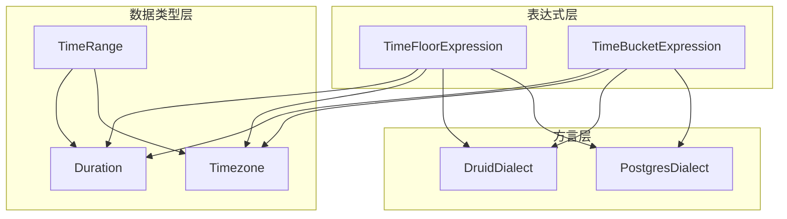
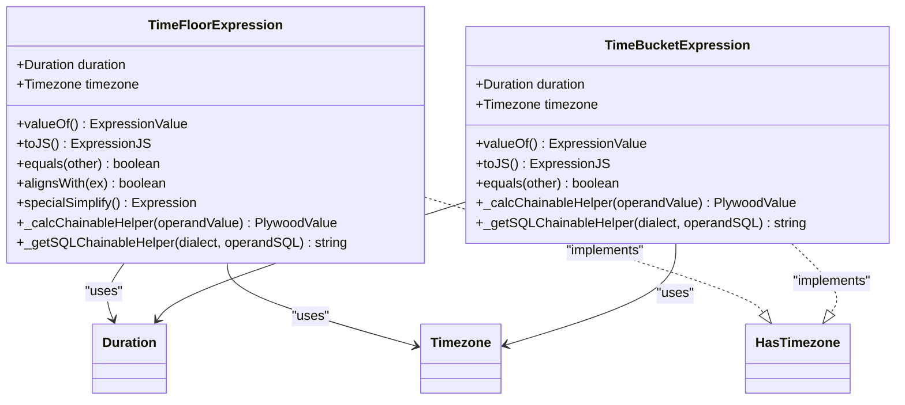
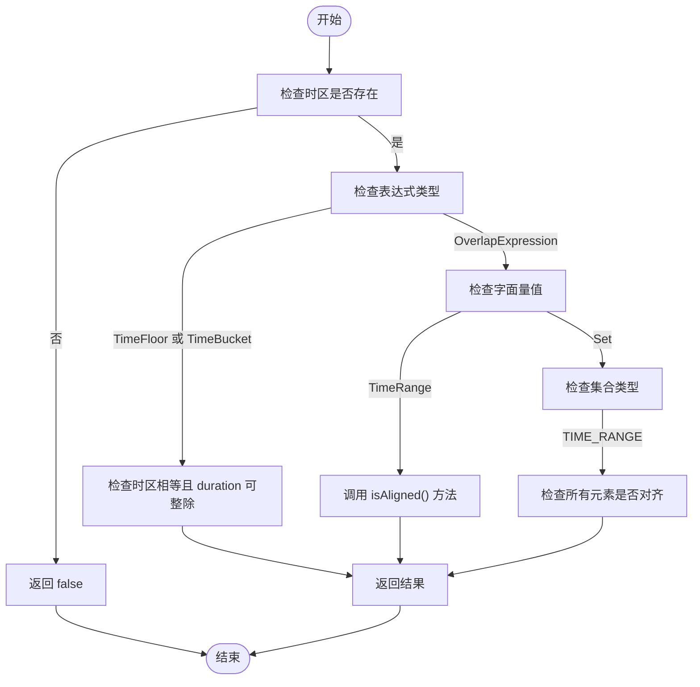
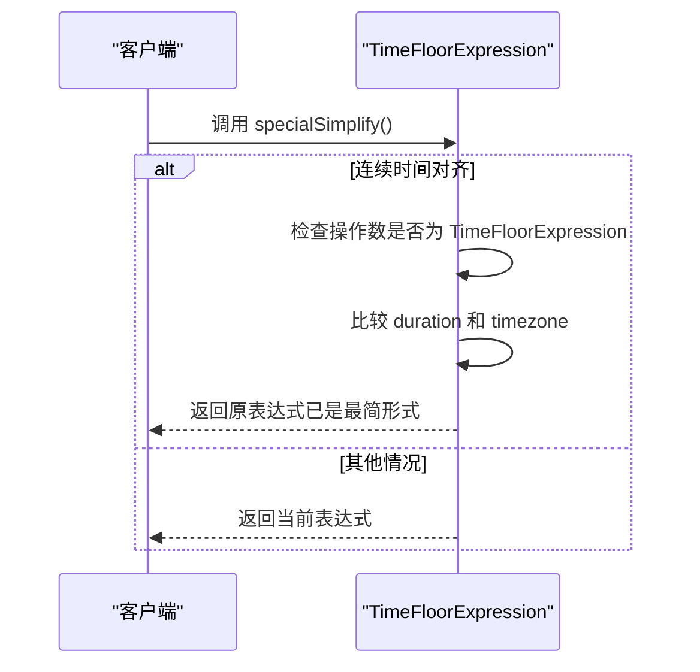
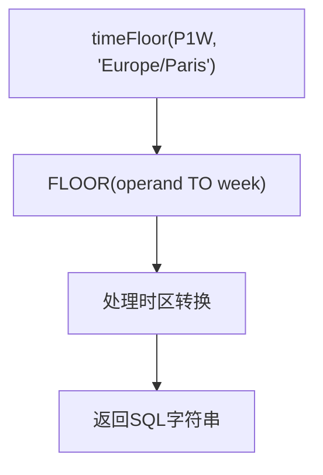
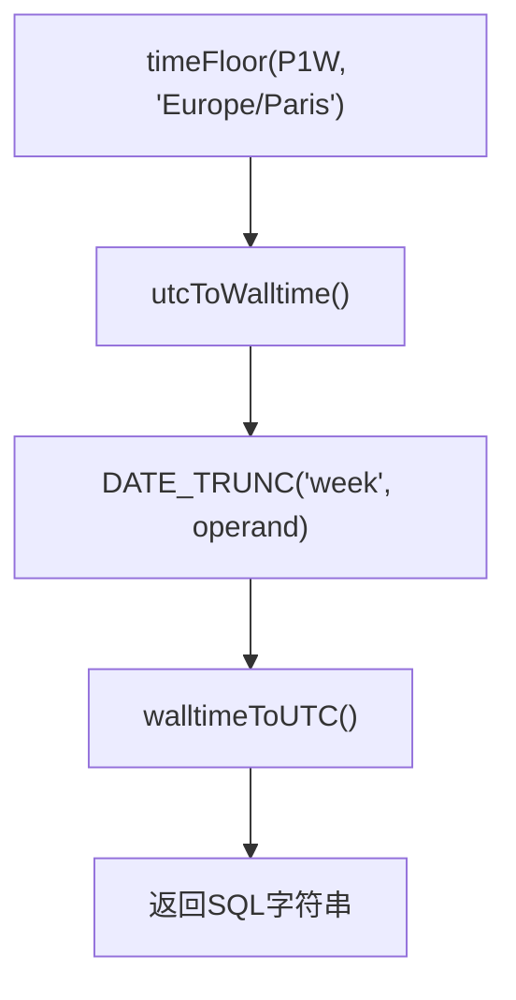
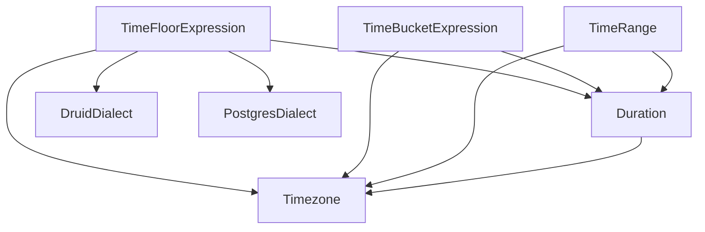

# 时间对齐

<cite>
**Referenced Files in This Document**  
- [timeFloorExpression.ts](file://src/expressions/timeFloorExpression.ts)
- [timeBucketExpression.ts](file://src/expressions/timeBucketExpression.ts)
- [druidDialect.ts](file://src/dialect/druidDialect.ts)
- [postgresDialect.ts](file://src/dialect/postgresDialect.ts)
- [timeRange.ts](file://src/datatypes/timeRange.ts)
- [duration.d.ts](file://node_modules/@topgames/chronoshift/build/duration/duration.d.ts)
- [timezone.d.ts](file://node_modules/@topgames/chronoshift/build/timezone/timezone.d.ts)
</cite>

## 目录
1. [简介](#简介)
2. [核心组件](#核心组件)
3. [架构概述](#架构概述)
4. [详细组件分析](#详细组件分析)
5. [依赖分析](#依赖分析)
6. [性能考虑](#性能考虑)
7. [故障排除指南](#故障排除指南)
8. [结论](#结论)

## 简介
本文档详细阐述了Plywood中时间对齐功能的实现机制，重点分析TimeFloorExpression类如何将时间值向下取整到指定的时间单位。文档还比较了TimeFloorExpression与TimeBucketExpression的异同，并解释了在不同数据库方言中生成SQL的差异。

## 核心组件
TimeFloorExpression类是实现时间对齐功能的核心组件，它通过_duration_字段定义对齐的时间单位，并利用_timezone_参数处理时区转换。该类实现了alignsWith()方法用于判断对齐基准的一致性，以及specialSimplify()方法用于优化连续的时间对齐操作。

**Section sources**
- [timeFloorExpression.ts](file://src/expressions/timeFloorExpression.ts#L25-L130)
- [timeBucketExpression.ts](file://src/expressions/timeBucketExpression.ts#L24-L93)

## 架构概述
Plywood的时间对齐功能通过表达式系统与方言系统协同工作实现。TimeFloorExpression作为链式表达式，其计算逻辑由_duration_字段的floor方法执行，并通过方言系统生成特定数据库的SQL语句。

**Diagram sources**
- [timeFloorExpression.ts](file://src/expressions/timeFloorExpression.ts#L25-L130)
- [timeBucketExpression.ts](file://src/expressions/timeBucketExpression.ts#L24-L93)
- [druidDialect.ts](file://src/dialect/druidDialect.ts#L20-L175)
- [postgresDialect.ts](file://src/dialect/postgresDialect.ts#L20-L158)

## 详细组件分析
### TimeFloorExpression 类分析
TimeFloorExpression类实现了将时间值向下取整到指定时间单位的功能。其核心是_duration_字段，该字段必须满足isFloorable()条件才能进行时间对齐操作。

#### 类结构

**Diagram sources**
- [timeFloorExpression.ts](file://src/expressions/timeFloorExpression.ts#L25-L130)
- [timeBucketExpression.ts](file://src/expressions/timeBucketExpression.ts#L24-L93)
- [duration.d.ts](file://node_modules/@topgames/chronoshift/build/duration/duration.d.ts#L12-L38)
- [timezone.d.ts](file://node_modules/@topgames/chronoshift/build/timezone/timezone.d.ts#L1-L14)

#### alignsWith() 方法实现逻辑
alignsWith()方法用于判断两个时间表达式是否具有相同的对齐基准，这对于查询优化和结果合并至关重要。

**Diagram sources**
- [timeFloorExpression.ts](file://src/expressions/timeFloorExpression.ts#L92-L113)
- [timeRange.ts](file://src/datatypes/timeRange.ts#L170-L173)

**Section sources**
- [timeFloorExpression.ts](file://src/expressions/timeFloorExpression.ts#L92-L113)
- [timeRange.ts](file://src/datatypes/timeRange.ts#L170-L173)

#### specialSimplify() 方法实现逻辑
specialSimplify()方法用于简化连续的时间对齐操作，避免不必要的重复计算。

**Diagram sources**
- [timeFloorExpression.ts](file://src/expressions/timeFloorExpression.ts#L115-L125)

**Section sources**
- [timeFloorExpression.ts](file://src/expressions/timeFloorExpression.ts#L115-L125)

### TimeFloorExpression 与 TimeBucketExpression 的异同点
#### 相同点
- 都实现了HasTimezone接口，支持时区处理
- 都使用Duration对象作为时间单位
- 都需要满足isFloorable()条件
- 在Druid和PostgreSQL方言中都使用相似的SQL生成逻辑

#### 不同点
| 特性 | TimeFloorExpression | TimeBucketExpression |
|------|-------------------|-------------------|
| 返回类型 | TIME | TIME_RANGE |
| 计算结果 | 时间点 | 时间范围 |
| 主要用途 | 时间对齐 | 时间分桶 |
| SQL生成 | timeFloorExpression | timeBucketExpression |

**Section sources**
- [timeFloorExpression.ts](file://src/expressions/timeFloorExpression.ts#L25-L130)
- [timeBucketExpression.ts](file://src/expressions/timeBucketExpression.ts#L24-L93)

### 底层SQL生成差异与兼容性处理
#### Druid方言中的实现

**Diagram sources**
- [druidDialect.ts](file://src/dialect/druidDialect.ts#L135-L137)

#### PostgreSQL方言中的实现

**Diagram sources**
- [postgresDialect.ts](file://src/dialect/postgresDialect.ts#L116-L120)

**Section sources**
- [druidDialect.ts](file://src/dialect/druidDialect.ts#L135-L137)
- [postgresDialect.ts](file://src/dialect/postgresDialect.ts#L116-L120)

## 依赖分析
时间对齐功能依赖于多个核心组件，包括Duration、Timezone、TimeRange等数据类型，以及DruidDialect和PostgresDialect等方言实现。

**Diagram sources**
- [timeFloorExpression.ts](file://src/expressions/timeFloorExpression.ts#L25-L130)
- [timeBucketExpression.ts](file://src/expressions/timeBucketExpression.ts#L24-L93)
- [timeRange.ts](file://src/datatypes/timeRange.ts#L61-L184)
- [druidDialect.ts](file://src/dialect/druidDialect.ts#L20-L175)
- [postgresDialect.ts](file://src/dialect/postgresDialect.ts#L20-L158)

**Section sources**
- [timeFloorExpression.ts](file://src/expressions/timeFloorExpression.ts#L25-L130)
- [timeBucketExpression.ts](file://src/expressions/timeBucketExpression.ts#L24-L93)
- [timeRange.ts](file://src/datatypes/timeRange.ts#L61-L184)
- [druidDialect.ts](file://src/dialect/druidDialect.ts#L20-L175)
- [postgresDialect.ts](file://src/dialect/postgresDialect.ts#L20-L158)

## 性能考虑
- 使用specialSimplify()方法避免重复的时间对齐操作
- 合理选择时间单位，避免过于频繁的对齐操作
- 在查询优化时利用alignsWith()方法判断对齐基准的一致性
- 考虑时区转换的性能开销，尽量在应用层处理时区问题

## 故障排除指南
- 确保_duration_字段满足isFloorable()条件
- 检查时区参数是否正确设置
- 验证时间表达式的对齐基准是否一致
- 检查SQL生成是否符合预期

**Section sources**
- [timeFloorExpression.ts](file://src/expressions/timeFloorExpression.ts#L25-L130)
- [duration.d.ts](file://node_modules/@topgames/chronoshift/build/duration/duration.d.ts#L33-L33)
- [timezone.d.ts](file://node_modules/@topgames/chronoshift/build/timezone/timezone.d.ts#L8-L8)

## 结论
Plywood的时间对齐功能通过TimeFloorExpression类实现了灵活的时间值向下取整。该功能与TimeBucketExpression既有相似之处又有明显区别，在不同数据库方言中有相应的SQL生成策略。通过alignsWith()和specialSimplify()等方法，系统能够进行有效的查询优化和性能提升。
</>