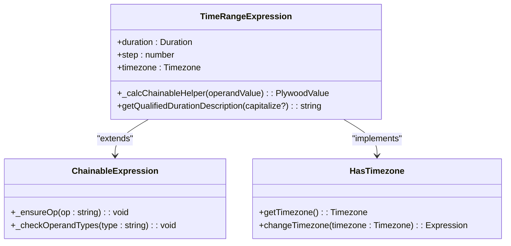
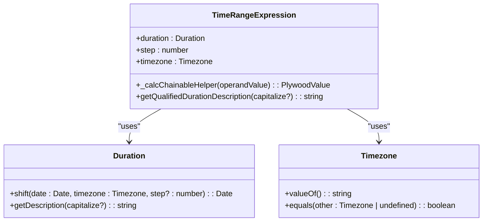
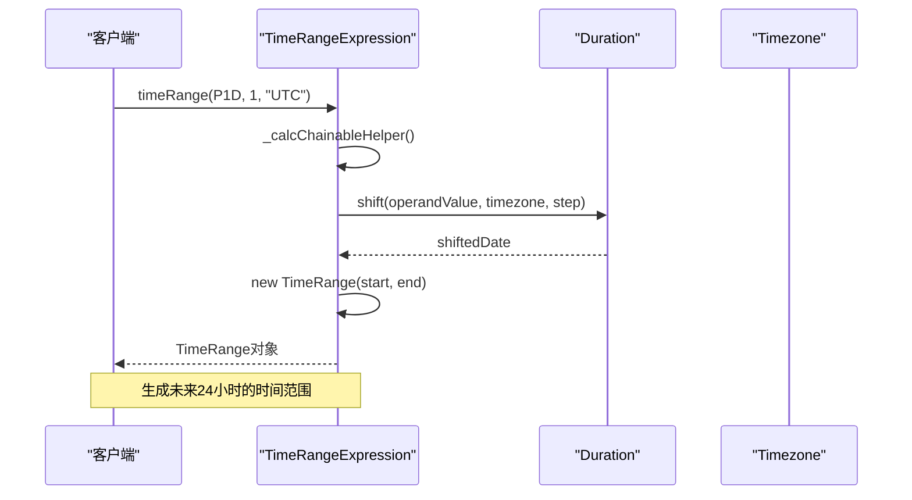
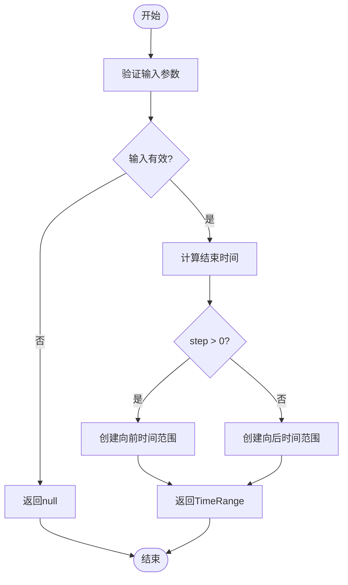
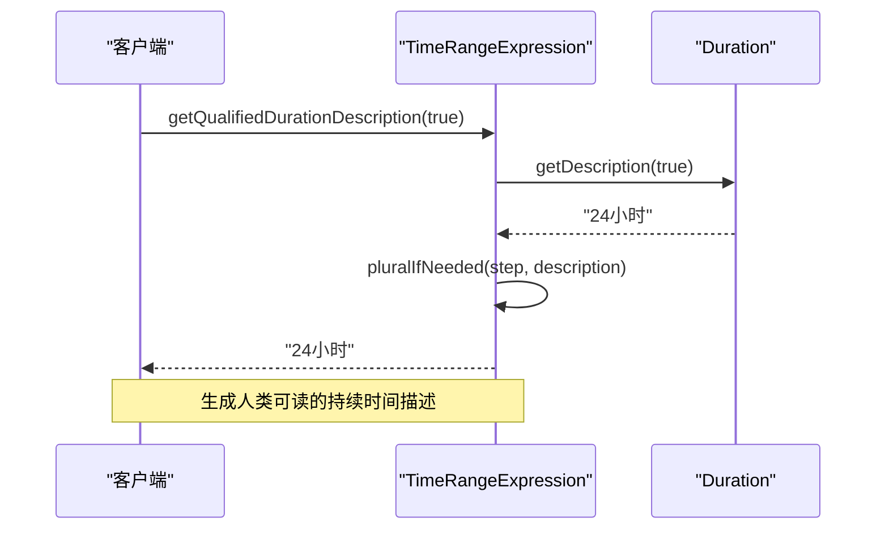
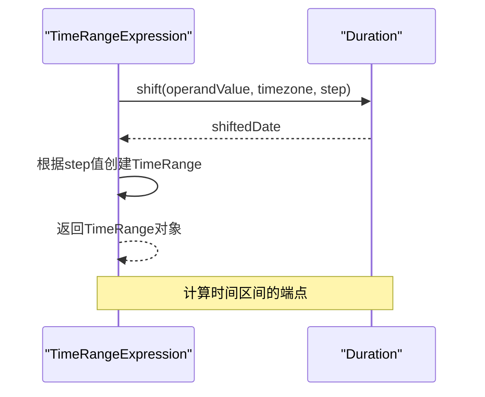
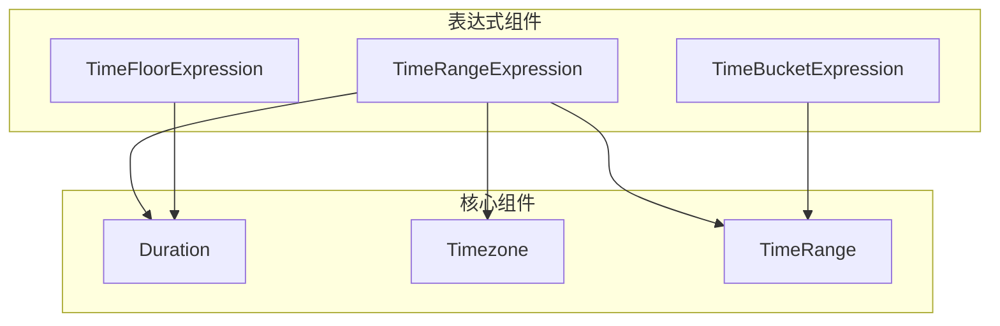

# 时间范围生成

<cite>
**Referenced Files in This Document**   
- [timeRangeExpression.ts](file://src/expressions/timeRangeExpression.ts)
- [timeRange.ts](file://src/datatypes/timeRange.ts)
- [hasTimezone.ts](file://src/expressions/mixins/hasTimezone.ts)
- [duration.d.ts](file://node_modules/@topgames/chronoshift/build/duration/duration.d.ts)
- [timezone.d.ts](file://node_modules/@topgames/chronoshift/build/timezone/timezone.d.ts)
- [timeBucketExpression.ts](file://src/expressions/timeBucketExpression.ts)
- [timeFloorExpression.ts](file://src/expressions/timeFloorExpression.ts)
</cite>

## 目录
1. [简介](#简介)
2. [核心组件分析](#核心组件分析)
3. [架构概述](#架构概述)
4. [详细组件分析](#详细组件分析)
5. [依赖关系分析](#依赖关系分析)
6. [性能考虑](#性能考虑)
7. [故障排除指南](#故障排除指南)
8. [结论](#结论)

## 简介
本文档深入剖析Plywood中的时间范围生成器，重点分析`TimeRangeExpression`类如何基于起始时间戳和持续时间（Duration）生成时间区间（TimeRange）。文档详细解释了_duration_、_step_和_timezone_三个核心参数的协同工作机制，以及如何通过正负_step_值控制时间区间的扩展方向（向前或向后）。同时，文档还涵盖了`getQualifiedDurationDescription()`方法如何生成人类可读的持续时间描述，以及`_calcChainableHelper`中如何调用`Duration.shift()`计算区间端点。

## 核心组件分析
`TimeRangeExpression`类是Plywood中用于生成时间范围的核心组件。它通过`_calcChainableHelper`方法实现时间范围的计算逻辑，利用`Duration.shift()`方法根据起始时间和持续时间偏移量来确定时间区间的终点。该类还实现了`HasTimezone`混入，以支持时区处理。

**Section sources**
- [timeRangeExpression.ts](file://src/expressions/timeRangeExpression.ts#L25-L114)
- [timeRange.ts](file://src/datatypes/timeRange.ts#L61-L184)

## 架构概述
`TimeRangeExpression`类继承自`ChainableExpression`，并实现了`HasTimezone`接口。它通过`duration`、`step`和`timezone`三个参数来定义时间范围的生成规则。`duration`参数定义了时间区间的长度，`step`参数控制时间区间的扩展方向，而`timezone`参数则用于处理时区相关的计算。

**Diagram sources **
- [timeRangeExpression.ts](file://src/expressions/timeRangeExpression.ts#L25-L114)
- [hasTimezone.ts](file://src/expressions/mixins/hasTimezone.ts#L20-L60)

## 详细组件分析

### TimeRangeExpression 类分析
`TimeRangeExpression`类是时间范围生成的核心实现。它通过`_calcChainableHelper`方法计算时间区间的端点，利用`Duration.shift()`方法根据起始时间和持续时间偏移量来确定时间区间的终点。`step`参数的正负值决定了时间区间的扩展方向。

#### 对象导向组件

**Diagram sources **
- [timeRangeExpression.ts](file://src/expressions/timeRangeExpression.ts#L25-L114)
- [duration.d.ts](file://node_modules/@topgames/chronoshift/build/duration/duration.d.ts#L12-L38)
- [timezone.d.ts](file://node_modules/@topgames/chronoshift/build/timezone/timezone.d.ts#L1-L14)

#### API/服务组件

**Diagram sources **
- [timeRangeExpression.ts](file://src/expressions/timeRangeExpression.ts#L70-L75)
- [duration.d.ts](file://node_modules/@topgames/chronoshift/build/duration/duration.d.ts#L30-L30)

#### 复杂逻辑组件

**Diagram sources **
- [timeRangeExpression.ts](file://src/expressions/timeRangeExpression.ts#L70-L75)
- [timeRange.ts](file://src/datatypes/timeRange.ts#L61-L184)

**Section sources**
- [timeRangeExpression.ts](file://src/expressions/timeRangeExpression.ts#L25-L114)
- [timeRange.ts](file://src/datatypes/timeRange.ts#L61-L184)

### getQualifiedDurationDescription 方法分析
`getQualifiedDurationDescription()`方法用于生成人类可读的持续时间描述。它通过调用`Duration.getDescription()`方法获取持续时间的基本描述，然后根据`step`值的绝对值来决定是否需要添加复数形式。

**Diagram sources **
- [timeRangeExpression.ts](file://src/expressions/timeRangeExpression.ts#L54-L60)
- [duration.d.ts](file://node_modules/@topgames/chronoshift/build/duration/duration.d.ts#L35-L35)

**Section sources**
- [timeRangeExpression.ts](file://src/expressions/timeRangeExpression.ts#L54-L60)

### _calcChainableHelper 方法分析
`_calcChainableHelper`方法是`TimeRangeExpression`类的核心计算逻辑。它通过调用`Duration.shift()`方法计算时间区间的端点，然后根据`step`值的正负来决定时间区间的扩展方向。

**Diagram sources **
- [timeRangeExpression.ts](file://src/expressions/timeRangeExpression.ts#L70-L75)
- [duration.d.ts](file://node_modules/@topgames/chronoshift/build/duration/duration.d.ts#L30-L30)

**Section sources**
- [timeRangeExpression.ts](file://src/expressions/timeRangeExpression.ts#L70-L75)

## 依赖关系分析
`TimeRangeExpression`类依赖于多个核心组件，包括`Duration`、`Timezone`和`TimeRange`。这些组件共同构成了时间范围生成的基础。

**Diagram sources **
- [timeRangeExpression.ts](file://src/expressions/timeRangeExpression.ts#L25-L114)
- [timeBucketExpression.ts](file://src/expressions/timeBucketExpression.ts#L24-L93)
- [timeFloorExpression.ts](file://src/expressions/timeFloorExpression.ts#L25-L130)

**Section sources**
- [timeRangeExpression.ts](file://src/expressions/timeRangeExpression.ts#L25-L114)
- [timeBucketExpression.ts](file://src/expressions/timeBucketExpression.ts#L24-L93)
- [timeFloorExpression.ts](file://src/expressions/timeFloorExpression.ts#L25-L130)

## 性能考虑
`TimeRangeExpression`类的性能主要取决于`Duration.shift()`方法的执行效率。由于该方法需要进行日期计算和时区转换，因此在处理大量数据时可能会成为性能瓶颈。建议在使用时尽量减少不必要的计算，并考虑缓存常用的时间范围。

## 故障排除指南
在使用`TimeRangeExpression`时，可能会遇到以下常见问题：
- `duration`参数必须是`Duration`类型的实例
- `step`参数为0时会导致生成无效的时间范围
- 时区设置不正确可能导致时间计算错误

**Section sources**
- [timeRangeExpression.ts](file://src/expressions/timeRangeExpression.ts#L25-L114)

## 结论
`TimeRangeExpression`类是Plywood中用于生成时间范围的强大工具。通过`duration`、`step`和`timezone`三个核心参数的协同工作，可以灵活地生成各种时间范围。该类的设计充分考虑了可扩展性和易用性，为数据分析和查询提供了坚实的基础。