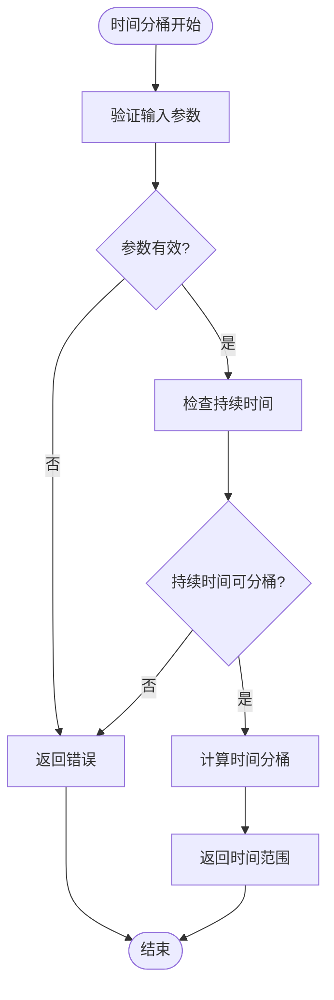
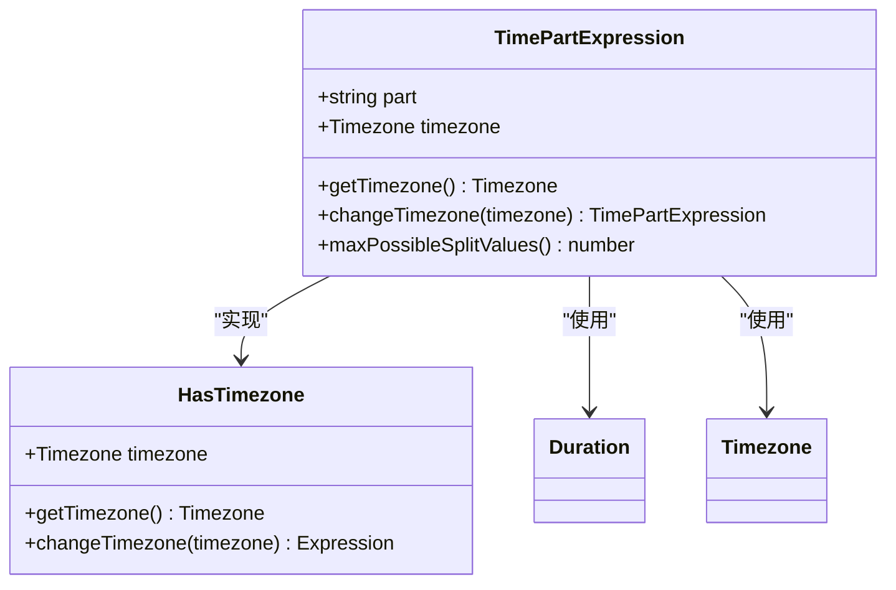
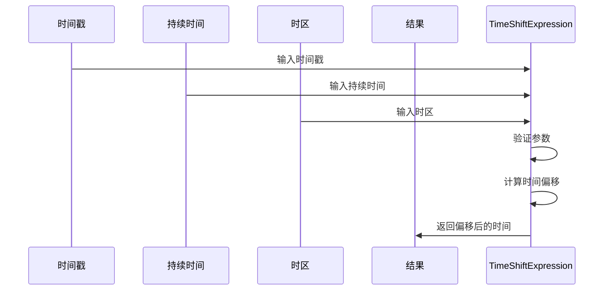
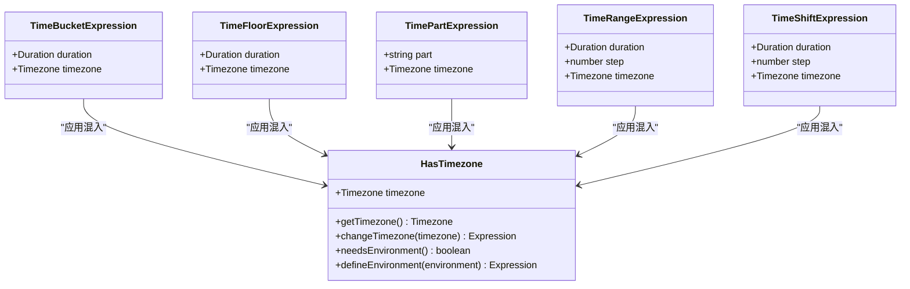
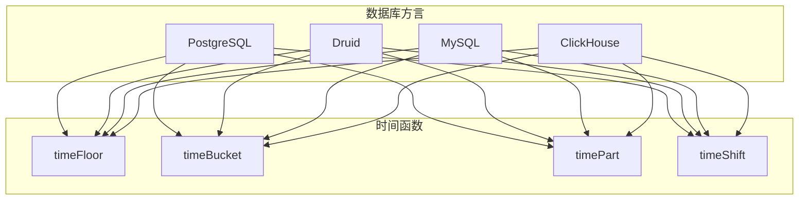

# 时间表达式

<cite>
**本文档引用的文件**   
- [hasTimezone.ts](file://src/expressions/mixins/hasTimezone.ts)
- [timeBucketExpression.ts](file://src/expressions/timeBucketExpression.ts)
- [timeFloorExpression.ts](file://src/expressions/timeFloorExpression.ts)
- [timePartExpression.ts](file://src/expressions/timePartExpression.ts)
- [timeRangeExpression.ts](file://src/expressions/timeRangeExpression.ts)
- [timeShiftExpression.ts](file://src/expressions/timeShiftExpression.ts)
- [postgresDialect.ts](file://src/dialect/postgresDialect.ts)
- [druidDialect.ts](file://src/dialect/druidDialect.ts)
- [mySqlDialect.ts](file://src/dialect/mySqlDialect.ts)
- [clickHouseDialect.ts](file://src/dialect/clickHouseDialect.ts)
</cite>

## 目录
1. [引言](#引言)
2. [时间分桶与对齐](#时间分桶与对齐)
3. [时间部分提取](#时间部分提取)
4. [时间范围生成与偏移](#时间范围生成与偏移)
5. [时区处理机制](#时区处理机制)
6. [数据库方言差异](#数据库方言差异)
7. [时间精度与复杂场景处理](#时间精度与复杂场景处理)
8. [时间序列数据分析应用](#时间序列数据分析应用)
9. [最佳实践](#最佳实践)

## 引言

Plywood的时间表达式系统为时间序列数据分析提供了强大的功能支持。该系统通过一系列表达式操作，实现了时间分桶、时间对齐、时间部分提取、时间范围生成和时间偏移等核心功能。这些表达式在时间维度分组和趋势分析中发挥着关键作用，支持跨时区数据聚合和复杂的时间序列计算。本文档将深入解析这些时间表达式的实现机制和应用方法。

## 时间分桶与对齐

时间分桶操作通过`timeBucket`方法实现，将时间戳按指定时间间隔进行分组。该操作在`TimeBucketExpression`类中定义，接受持续时间（Duration）和时区（Timezone）作为参数。分桶操作将连续的时间点映射到离散的时间区间，便于进行时间维度的聚合分析。

**图表来源**
- [timeBucketExpression.ts](file://src/expressions/timeBucketExpression.ts#L24-L93)

时间对齐功能通过`alignsWith`方法实现，用于判断两个时间表达式是否在相同的时间边界上对齐。这对于确保时间序列数据的一致性和可比性至关重要。对齐检查考虑了时区和持续时间的兼容性，确保不同时间表达式在相同的时区和时间粒度下进行比较。

**本节来源**
- [timeFloorExpression.ts](file://src/expressions/timeFloorExpression.ts#L25-L130)
- [timeBucketExpression.ts](file://src/expressions/timeBucketExpression.ts#L24-L93)

## 时间部分提取

时间部分提取操作通过`timePart`方法实现，从时间戳中提取特定的时间组成部分，如小时、分钟、星期几等。该功能在`TimePartExpression`类中定义，支持多种时间部分的提取，包括秒、分钟、小时、日、周、月、年等。

**图表来源**
- [timePartExpression.ts](file://src/expressions/timePartExpression.ts#L24-L164)

时间部分提取考虑了闰秒和夏令时等复杂情况，通过`PART_TO_FUNCTION`映射表定义了各种时间部分的计算逻辑。例如，`SECOND_OF_MINUTE`的最大值为61，以支持闰秒的处理。该功能还提供了`maxPossibleSplitValues`方法，用于确定特定时间部分可能的取值数量。

**本节来源**
- [timePartExpression.ts](file://src/expressions/timePartExpression.ts#L24-L164)

## 时间范围生成与偏移

时间范围生成通过`timeRange`方法实现，创建指定持续时间和步长的时间范围。该操作在`TimeRangeExpression`类中定义，支持正向和反向的时间范围生成。时间偏移操作通过`timeShift`方法实现，将时间戳向前或向后移动指定的时间间隔。

**图表来源**
- [timeShiftExpression.ts](file://src/expressions/timeShiftExpression.ts#L24-L121)

时间偏移操作支持简化优化，如`specialSimplify`方法可以合并连续的时间偏移操作。当偏移步长为0时，直接返回原始时间戳；当存在连续的时间偏移时，可以将它们合并为一个单一的偏移操作，提高计算效率。

**本节来源**
- [timeRangeExpression.ts](file://src/expressions/timeRangeExpression.ts#L25-L114)
- [timeShiftExpression.ts](file://src/expressions/timeShiftExpression.ts#L24-L121)

## 时区处理机制

时区处理功能在`mixins/hasTimezone.ts`文件中定义，通过`HasTimezone`混入类实现。该机制为所有时间表达式提供了统一的时区处理接口，包括`getTimezone`和`changeTimezone`方法。时区处理考虑了环境配置，当表达式未指定时区时，会从环境变量中获取默认时区。

**图表来源**
- [hasTimezone.ts](file://src/expressions/mixins/hasTimezone.ts#L20-L60)

时区处理机制支持字符串格式的时区输入，并通过`Timezone.fromJS`方法进行解析。当环境变量中未指定时区时，默认使用UTC时区。该机制还支持表达式的环境定义，允许在运行时动态设置时区配置。

**本节来源**
- [hasTimezone.ts](file://src/expressions/mixins/hasTimezone.ts#L20-L60)

## 数据库方言差异

不同的数据库系统对时间函数的支持存在差异，Plywood通过方言适配器模式处理这些差异。PostgreSQL、Druid、MySQL和ClickHouse等数据库的时间函数实现各不相同，需要特定的SQL生成逻辑。

**图表来源**
- [postgresDialect.ts](file://src/dialect/postgresDialect.ts#L20-L158)
- [druidDialect.ts](file://src/dialect/druidDialect.ts#L20-L175)
- [mySqlDialect.ts](file://src/dialect/mySqlDialect.ts#L21-L172)
- [clickHouseDialect.ts](file://src/dialect/clickHouseDialect.ts#L4-L161)

例如，PostgreSQL使用`DATE_TRUNC`函数实现时间向下取整，而Druid使用`FLOOR`函数。MySQL需要特殊处理周和季度的分桶操作，使用`DATE_FORMAT`和`DATE_SUB`函数组合。ClickHouse则使用`toStartOf*`系列函数来实现时间对齐。

**本节来源**
- [postgresDialect.ts](file://src/dialect/postgresDialect.ts#L20-L158)
- [druidDialect.ts](file://src/dialect/druidDialect.ts#L20-L175)
- [mySqlDialect.ts](file://src/dialect/mySqlDialect.ts#L21-L172)
- [clickHouseDialect.ts](file://src/dialect/clickHouseDialect.ts#L4-L161)

## 时间精度与复杂场景处理

时间表达式系统需要处理多种复杂场景，包括时间精度、闰秒和夏令时转换。系统通过`Duration`类的`isFloorable`方法验证持续时间是否支持分桶操作，确保时间间隔的合理性。

对于闰秒处理，`TimePartExpression`类在`PART_TO_MAX_VALUES`映射表中为`SECOND_OF_MINUTE`设置了61的最大值，以支持闰秒的存在。夏令时转换通过时区处理机制自动处理，确保在夏令时切换期间时间计算的准确性。

时间精度处理考虑了不同数据库系统的限制，例如在生成SQL时需要根据目标数据库的精度要求进行调整。系统还支持时间表达式的简化优化，如`specialSimplify`方法可以消除冗余的时间操作，提高查询性能。

**本节来源**
- [timePartExpression.ts](file://src/expressions/timePartExpression.ts#L24-L164)
- [duration.d.ts](file://node_modules/@topgames/chronoshift/build/duration/duration.d.ts#L12-L38)

## 时间序列数据分析应用

时间表达式在时间序列数据分析中有着广泛的应用。通过`$timestamp.timeBucket(P1D, "America/Los_Angeles")`这样的表达式，可以将时间戳按天为单位在洛杉矶时区进行分桶，便于进行每日趋势分析。

在趋势分析中，时间偏移操作可以用于计算同比或环比指标。例如，使用`timeShift`方法将当前时间向前移动一年，可以计算去年同期的数据进行比较。时间部分提取可以用于分析特定时间段的模式，如提取小时部分来分析一天中不同时间段的用户行为。

时间范围生成功能支持创建动态的时间窗口，用于滚动平均计算或移动总和分析。这些功能的组合使用可以实现复杂的时间序列分析，如季节性分解、趋势预测和异常检测。

**本节来源**
- [timeBucketExpression.ts](file://src/expressions/timeBucketExpression.ts#L24-L93)
- [timeShiftExpression.ts](file://src/expressions/timeShiftExpression.ts#L24-L121)
- [timePartExpression.ts](file://src/expressions/timePartExpression.ts#L24-L164)

## 最佳实践

在使用Plywood时间表达式时，应遵循以下最佳实践：

1. **明确指定时区**：始终在时间表达式中明确指定时区，避免依赖默认时区设置，确保结果的可预测性和一致性。

2. **合理选择时间粒度**：根据分析需求选择合适的时间分桶粒度，避免过细或过粗的时间划分影响分析效果。

3. **利用表达式简化**：充分利用系统提供的表达式简化功能，如`specialSimplify`方法，减少不必要的计算开销。

4. **考虑数据库方言差异**：在跨数据库使用时，注意不同数据库对时间函数的支持差异，必要时进行适配。

5. **处理边界情况**：特别注意闰秒、夏令时转换等边界情况的处理，确保时间计算的准确性。

6. **性能优化**：对于大规模数据集，考虑使用索引和分区策略优化时间查询性能。

**本节来源**
- [hasTimezone.ts](file://src/expressions/mixins/hasTimezone.ts#L20-L60)
- [timeBucketExpression.ts](file://src/expressions/timeBucketExpression.ts#L24-L93)
- [timeShiftExpression.ts](file://src/expressions/timeShiftExpression.ts#L24-L121)