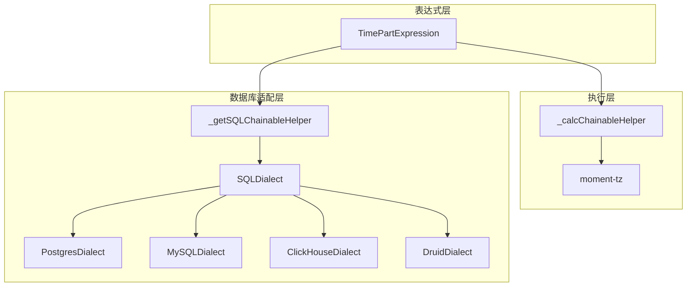
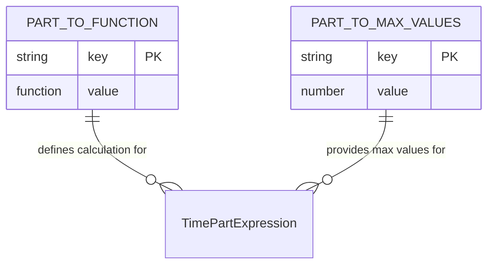
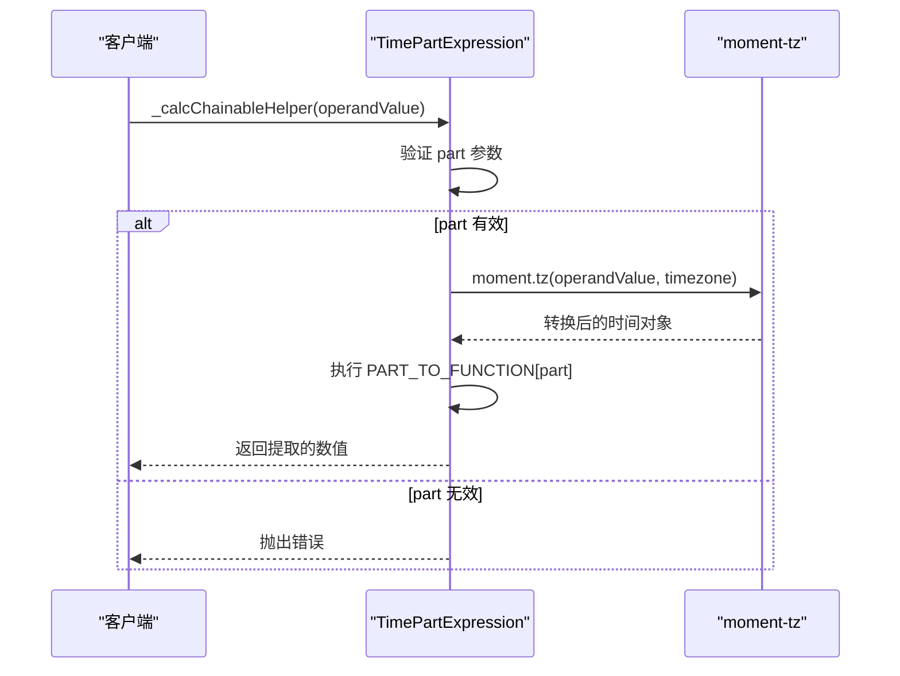
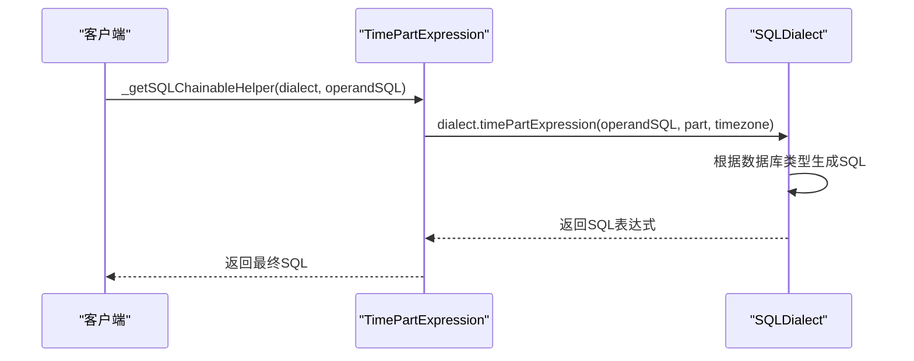
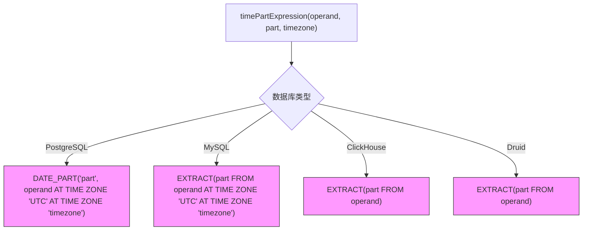
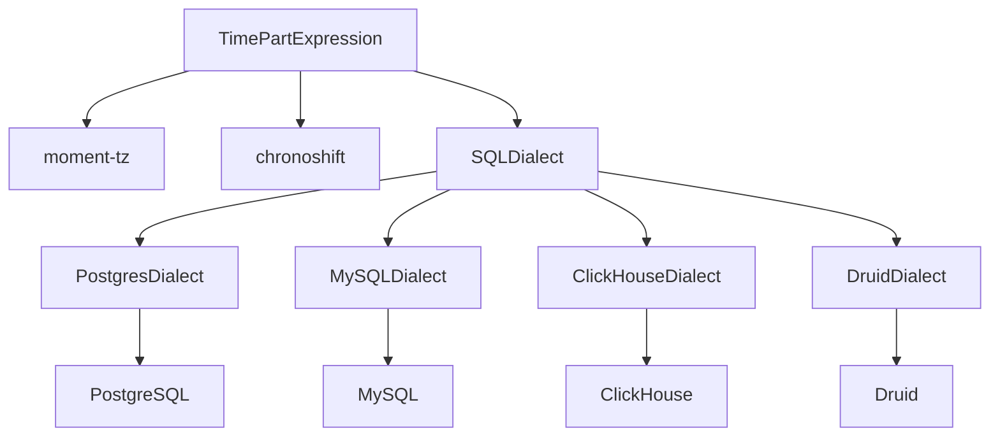

# 时间部分提取

<cite>
**Referenced Files in This Document**   
- [timePartExpression.ts](file://src/expressions/timePartExpression.ts)
- [baseDialect.ts](file://src/dialect/baseDialect.ts)
- [hasTimezone.ts](file://src/expressions/mixins/hasTimezone.ts)
- [postgresDialect.ts](file://src/dialect/postgresDialect.ts)
- [mySqlDialect.ts](file://src/dialect/mySqlDialect.ts)
- [clickHouseDialect.ts](file://src/dialect/clickHouseDialect.ts)
- [druidDialect.ts](file://src/dialect/druidDialect.ts)
- [baseExpression.ts](file://src/expressions/baseExpression.ts)
</cite>

## 目录
1. [简介](#简介)
2. [核心组件](#核心组件)
3. [架构概述](#架构概述)
4. [详细组件分析](#详细组件分析)
5. [依赖分析](#依赖分析)
6. [性能考虑](#性能考虑)
7. [故障排除指南](#故障排除指南)
8. [结论](#结论)

## 简介
本文档详细介绍了Plywood系统中时间部分提取功能的实现机制。该功能通过`TimePartExpression`类实现，允许从时间戳中提取特定的时间单元，如小时、月份、季度等。文档将深入分析`PART_TO_FUNCTION`和`PART_TO_MAX_VALUES`静态映射表的设计原理与用途，解释`_calcChainableHelper`和`_getSQLChainableHelper`方法的实现细节，并说明`maxPossibleSplitValues()`方法在查询优化中的应用。

## 核心组件
`TimePartExpression`类是实现时间部分提取功能的核心组件。它继承自`ChainableExpression`并实现了`HasTimezone`混入，使其能够处理时区相关的操作。该类通过`_calcChainableHelper`方法在JavaScript环境中执行时间计算，通过`_getSQLChainableHelper`方法生成针对不同数据库的SQL表达式。`PART_TO_FUNCTION`映射表定义了各种时间单元的计算函数，而`PART_TO_MAX_VALUES`映射表则提供了各时间单元的最大可能值，用于查询优化。

**Section sources**
- [timePartExpression.ts](file://src/expressions/timePartExpression.ts#L24-L164)

## 架构概述
时间部分提取功能的架构设计遵循了分层和抽象的原则。在表达式层，`TimePartExpression`类负责定义时间部分提取的操作语义。在执行层，通过`_calcChainableHelper`方法利用moment-tz库进行时区转换和时间计算。在数据库适配层，通过`_getSQLChainableHelper`方法委托给具体的`SQLDialect`实现生成特定数据库的时间提取函数。这种分层设计使得功能既能在JavaScript环境中执行，又能高效地转换为各种数据库的原生SQL查询。



**Diagram sources **
- [timePartExpression.ts](file://src/expressions/timePartExpression.ts#L24-L164)
- [baseDialect.ts](file://src/dialect/baseDialect.ts#L21-L172)

## 详细组件分析

### TimePartExpression类分析
`TimePartExpression`类实现了从时间戳中提取特定时间单元的功能。它通过`part`参数指定要提取的时间单元，通过`timezone`参数处理时区转换。类的构造函数验证输入参数的类型和有效性，确保`part`参数为字符串类型且`operand`的类型为TIME。

#### 类图
```mermaid
classDiagram
class TimePartExpression {
+static op : string
+static PART_TO_FUNCTION : Record<string, (d : any) => number>
+static PART_TO_MAX_VALUES : Record<string, number>
+part : string
+timezone : Timezone
+_calcChainableHelper(operandValue : any) : PlywoodValue
+_getJSChainableHelper(operandJS : string) : string
+_getSQLChainableHelper(dialect : SQLDialect, operandSQL : string) : string
+maxPossibleSplitValues() : number
+getTimezone() : Timezone
+changeTimezone(timezone : Timezone) : TimePartExpression
}
class ChainableExpression {
+operand : Expression
+_calcChainableHelper(operandValue : any) : PlywoodValue
+_getJSChainableHelper(operandJS : string) : string
+_getSQLChainableHelper(dialect : SQLDialect, operandSQL : string) : string
}
class HasTimezone {
+timezone : Timezone
+getTimezone() : Timezone
+changeTimezone(timezone : Timezone) : Expression
}
TimePartExpression --|> ChainableExpression
TimePartExpression ..> HasTimezone : implements
```

**Diagram sources **
- [timePartExpression.ts](file://src/expressions/timePartExpression.ts#L24-L164)
- [baseExpression.ts](file://src/expressions/baseExpression.ts#L2191-L2466)
- [hasTimezone.ts](file://src/expressions/mixins/hasTimezone.ts#L20-L60)

#### 时间单元映射表分析
`PART_TO_FUNCTION`和`PART_TO_MAX_VALUES`是`TimePartExpression`类中两个关键的静态映射表，它们的设计体现了对时间计算的系统化抽象。



**Diagram sources **
- [timePartExpression.ts](file://src/expressions/timePartExpression.ts#L33-L95)

### 表达式执行流程分析
时间部分提取功能的执行流程分为JavaScript执行和SQL生成两个主要路径。在JavaScript环境中，通过`_calcChainableHelper`方法执行计算；在数据库查询场景中，通过`_getSQLChainableHelper`方法生成SQL表达式。

#### JavaScript执行流程


**Diagram sources **
- [timePartExpression.ts](file://src/expressions/timePartExpression.ts#L126-L130)

#### SQL生成流程


**Diagram sources **
- [timePartExpression.ts](file://src/expressions/timePartExpression.ts#L140-L144)
- [baseDialect.ts](file://src/dialect/baseDialect.ts#L165-L165)

### 数据库方言实现分析
不同的数据库系统对时间部分提取有不同的SQL语法。Plywood通过`SQLDialect`的各个子类实现对不同数据库的支持。

#### 数据库方言对比


**Diagram sources **
- [postgresDialect.ts](file://src/dialect/postgresDialect.ts#L126-L130)
- [mySqlDialect.ts](file://src/dialect/mySqlDialect.ts#L141-L145)
- [clickHouseDialect.ts](file://src/dialect/clickHouseDialect.ts#L131-L135)
- [druidDialect.ts](file://src/dialect/druidDialect.ts#L139-L143)

## 依赖分析
时间部分提取功能依赖于多个核心组件和外部库。主要依赖包括`moment-tz`库用于时区转换和时间计算，`@topgames/chronoshift`库提供`Timezone`类，以及各种`SQLDialect`实现提供数据库适配能力。



**Diagram sources **
- [timePartExpression.ts](file://src/expressions/timePartExpression.ts#L1-L10)
- [baseDialect.ts](file://src/dialect/baseDialect.ts#L1-L20)

**Section sources**
- [timePartExpression.ts](file://src/expressions/timePartExpression.ts#L1-L164)
- [baseDialect.ts](file://src/dialect/baseDialect.ts#L1-L172)

## 性能考虑
`maxPossibleSplitValues()`方法在查询优化中起着重要作用。该方法通过查询`PART_TO_MAX_VALUES`映射表获取指定时间单元的最大可能值，并加1以考虑null值的情况，从而为查询规划器提供结果集大小的预估信息。这种预估有助于优化查询执行计划，特别是在处理大规模数据集时。

**Section sources**
- [timePartExpression.ts](file://src/expressions/timePartExpression.ts#L151-L153)

## 故障排除指南
在使用时间部分提取功能时，可能会遇到以下常见问题：

1. **不支持的时间单元**：如果`part`参数指定了`PART_TO_FUNCTION`映射表中不存在的时间单元，会抛出"unsupported part"错误。
2. **时区处理问题**：在处理夏令时边界情况时，需要确保时区信息正确无误。
3. **闰秒处理**：`SECOND_OF_MINUTE`的最大值设置为61，以考虑闰秒的情况。
4. **数据库兼容性**：不同数据库对时间部分提取的支持程度不同，需要根据具体数据库的文档进行调整。

**Section sources**
- [timePartExpression.ts](file://src/expressions/timePartExpression.ts#L126-L130)
- [timePartExpression.ts](file://src/expressions/timePartExpression.ts#L140-L144)

## 结论
Plywood的时间部分提取功能通过`TimePartExpression`类提供了一种灵活且高效的方式从时间戳中提取特定时间单元。该功能的设计充分考虑了跨平台兼容性，既能在JavaScript环境中执行，又能生成针对不同数据库的优化SQL查询。通过`PART_TO_FUNCTION`和`PART_TO_MAX_VALUES`映射表的系统化设计，以及对时区处理的完善支持，该功能能够满足各种复杂的时间分析需求。未来可以考虑扩展支持更多的时间单元类型，并优化对边界情况的处理。