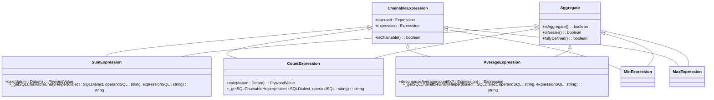
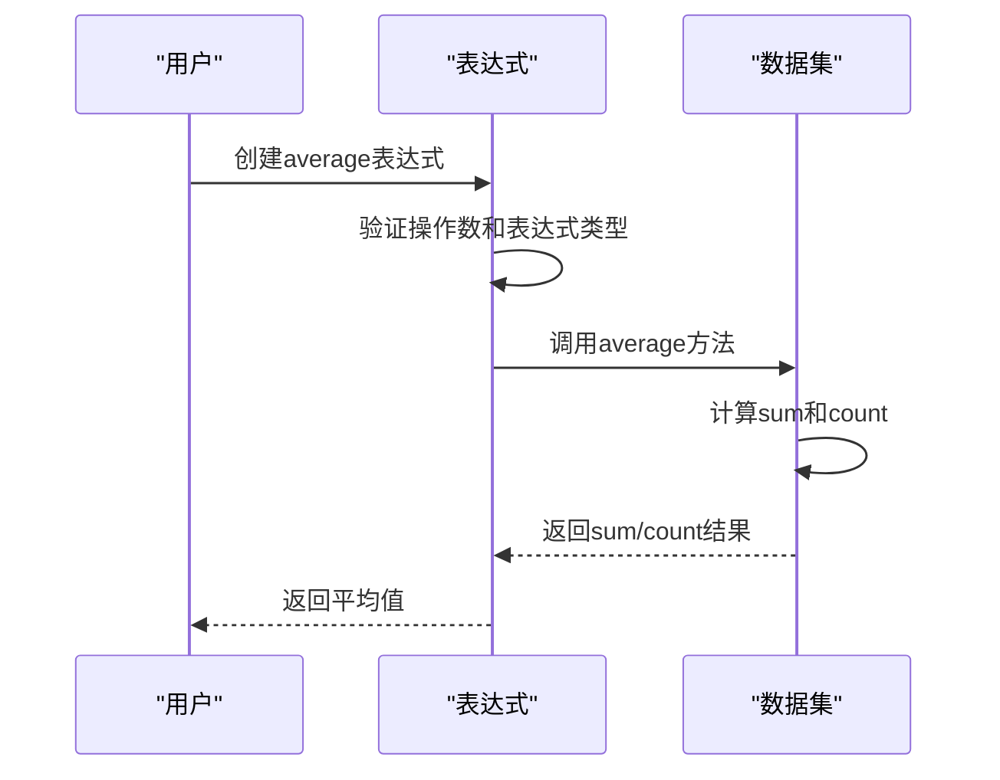
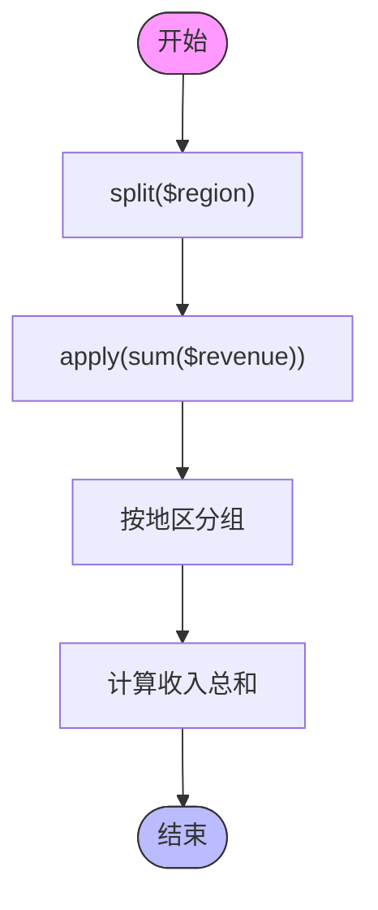

# 基础聚合表达式

<cite>
**本文档中引用的文件**  
- [sumExpression.ts](file://src/expressions/sumExpression.ts)
- [countExpression.ts](file://src/expressions/countExpression.ts)
- [averageExpression.ts](file://src/expressions/averageExpression.ts)
- [minExpression.ts](file://src/expressions/minExpression.ts)
- [maxExpression.ts](file://src/expressions/maxExpression.ts)
- [aggregate.ts](file://src/expressions/mixins/aggregate.ts)
- [baseExpression.ts](file://src/expressions/baseExpression.ts)
- [dataset.ts](file://src/datatypes/dataset.ts)
</cite>

## 目录
1. [简介](#简介)
2. [核心聚合函数概述](#核心聚合函数概述)
3. [继承与混入机制](#继承与混入机制)
4. [sum表达式](#sum表达式)
5. [count表达式](#count表达式)
6. [average表达式](#average表达式)
7. [min和max表达式](#min和max表达式)
8. [SQL生成策略](#sql生成策略)
9. [内存计算实现](#内存计算实现)
10. [常见用法示例](#常见用法示例)

## 简介
本文档详细介绍了Plywood中基础聚合表达式的实现机制和使用场景。这些表达式包括sum、count、average、min和max等，它们在数据分析和处理中扮演着核心角色。文档深入探讨了这些表达式如何继承自ChainableExpression并混入Aggregate特性，以及它们在数据集上的计算逻辑。

## 核心聚合函数概述
Plywood提供了多种基础聚合函数，用于对数据集进行统计分析。这些函数包括：
- **sum**: 计算数值字段的总和
- **count**: 统计数据行数
- **average**: 计算数值字段的平均值
- **min**: 找出数值或时间字段的最小值
- **max**: 找出数值或时间字段的最大值

这些聚合函数都遵循统一的设计模式，通过继承和混入机制实现功能复用。

**Section sources**
- [sumExpression.ts](file://src/expressions/sumExpression.ts#L1-L82)
- [countExpression.ts](file://src/expressions/countExpression.ts#L1-L47)
- [averageExpression.ts](file://src/expressions/averageExpression.ts#L1-L52)
- [minExpression.ts](file://src/expressions/minExpression.ts#L1-L47)
- [maxExpression.ts](file://src/expressions/maxExpression.ts#L1-L47)

## 继承与混入机制
所有基础聚合表达式都继承自ChainableExpression类，并混入Aggregate特性。这种设计模式实现了功能的模块化和代码复用。

ChainableExpression提供了链式调用的基础能力，而Aggregate混入则为表达式添加了聚合相关的属性和方法。通过Expression.applyMixins方法，聚合表达式获得了isAggregate和isNester等方法，表明它们是聚合操作且可以嵌套。

**Diagram sources**
- [baseExpression.ts](file://src/expressions/baseExpression.ts#L1000-L1500)
- [aggregate.ts](file://src/expressions/mixins/aggregate.ts#L1-L35)

## sum表达式
sum表达式用于计算数值字段的总和。它继承自ChainableUnaryExpression并混入Aggregate特性。

在初始化时，sum表达式会进行类型检查，确保操作数类型为DATASET，表达式类型为NUMBER。计算结果的类型也被设置为NUMBER。

内存中的计算通过_calcChainableUnaryHelper方法实现，该方法调用数据集的sum方法。SQL生成则通过_getSQLChainableUnaryHelper方法完成，使用标准的SUM函数。

sum表达式还实现了distribute方法，用于优化表达式树。例如，当遇到常量乘法时，可以将常量提取到外部进行乘法运算。

**Section sources**
- [sumExpression.ts](file://src/expressions/sumExpression.ts#L1-L82)
- [dataset.ts](file://src/datatypes/dataset.ts#L500-L520)

## count表达式
count表达式用于统计数据行数。与其他聚合函数不同，它继承自ChainableExpression而非ChainableUnaryExpression，因为它不需要额外的表达式参数。

count表达式的特殊之处在于其SQL生成策略。当操作数SQL中不包含WHERE条件时，使用标准的COUNT(*)；当包含WHERE条件时，则转换为SUM配合条件判断，以确保正确处理过滤后的数据。

这种优化策略避免了在已有WHERE条件的基础上再添加HAVING条件的复杂性，提高了查询效率和可读性。

**Section sources**
- [countExpression.ts](file://src/expressions/countExpression.ts#L1-L47)
- [dataset.ts](file://src/datatypes/dataset.ts#L480-L490)

## average表达式
average表达式用于计算数值字段的平均值。它通过sum和count的组合来实现，体现了聚合函数之间的协作关系。

一个关键的特性是decomposeAverage方法，它将平均值计算分解为sum除以count的操作。这不仅提供了计算的灵活性，还允许在需要时使用不同的计数表达式。

在SQL生成方面，average表达式直接使用AVG函数，这是大多数数据库系统都支持的标准聚合函数。

**Diagram sources**
- [averageExpression.ts](file://src/expressions/averageExpression.ts#L1-L52)
- [dataset.ts](file://src/datatypes/dataset.ts#L520-L540)

## min和max表达式
min和max表达式用于找出数值或时间字段的最小值和最大值。它们都继承自ChainableUnaryExpression并混入Aggregate特性。

这两个表达式的实现非常相似，主要区别在于计算逻辑。min表达式寻找最小值，而max表达式寻找最大值。

类型检查方面，它们都接受NUMBER和TIME类型的表达式。结果类型通过Set.unwrapSetType方法从表达式类型中推导出来。

在性能方面，这些表达式通过一次遍历完成计算，时间复杂度为O(n)，其中n是数据集的大小。

**Section sources**
- [minExpression.ts](file://src/expressions/minExpression.ts#L1-L47)
- [maxExpression.ts](file://src/expressions/maxExpression.ts#L1-L47)
- [dataset.ts](file://src/datatypes/dataset.ts#L540-L580)

## SQL生成策略
所有聚合表达式都通过_getSQLChainableHelper或_getSQLChainableUnaryHelper方法生成SQL。这些方法利用SQLDialect对象的aggregateFilterIfNeeded方法来处理条件聚合。

对于sum、average、min和max表达式，它们都使用相应的SQL聚合函数（SUM、AVG、MIN、MAX），并将表达式SQL作为参数。count表达式的处理更为特殊，根据是否存在WHERE条件选择不同的生成策略。

这种设计确保了生成的SQL既符合标准，又能正确处理各种复杂的查询场景。

**Section sources**
- [sumExpression.ts](file://src/expressions/sumExpression.ts#L60-L70)
- [countExpression.ts](file://src/expressions/countExpression.ts#L40-L45)
- [averageExpression.ts](file://src/expressions/averageExpression.ts#L45-L50)
- [minExpression.ts](file://src/expressions/minExpression.ts#L40-L45)
- [maxExpression.ts](file://src/expressions/maxExpression.ts#L40-L45)

## 内存计算实现
在内存中，所有聚合表达式的计算都委托给Dataset类的相应方法。Dataset类提供了sum、count、average、min和max等方法，这些方法通过遍历数据集来完成计算。

计算过程通常涉及以下步骤：
1. 获取操作数的计算结果
2. 验证结果是否为有效数据集
3. 调用相应的聚合方法
4. 返回计算结果

对于空值处理，大多数聚合函数返回null，而count表达式返回0，这符合常见的数据库行为。

**Section sources**
- [dataset.ts](file://src/datatypes/dataset.ts#L480-L580)
- [sumExpression.ts](file://src/expressions/sumExpression.ts#L50-L58)
- [countExpression.ts](file://src/expressions/countExpression.ts#L30-L38)

## 常见用法示例
基础聚合表达式通常与其他表达式组合使用。常见的用法包括：

- `split($region).apply(sum($revenue))`: 按地区分组并计算收入总和
- `apply(count())`: 统计数据集的行数
- `filter($revenue > 1000).apply(average($profit))`: 过滤高收入记录后计算平均利润
- `apply(min($timestamp))`: 找出最早的记录时间

这些表达式可以通过链式调用组合成复杂的分析查询，满足各种数据分析需求。

**Diagram sources**
- [sumExpression.ts](file://src/expressions/sumExpression.ts#L1-L82)
- [baseExpression.ts](file://src/expressions/baseExpression.ts#L200-L300)