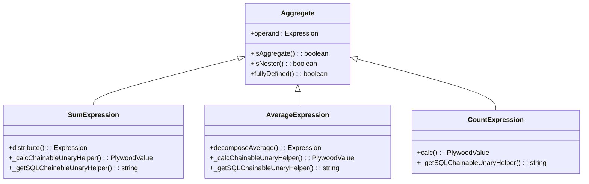
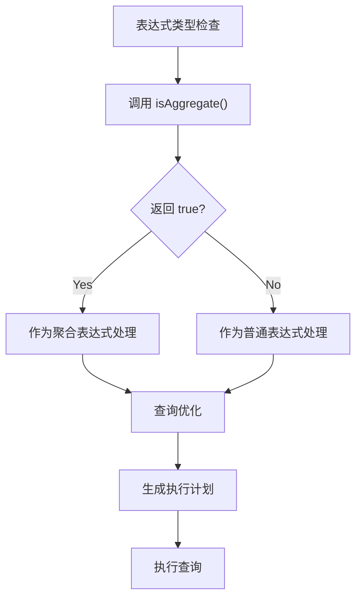
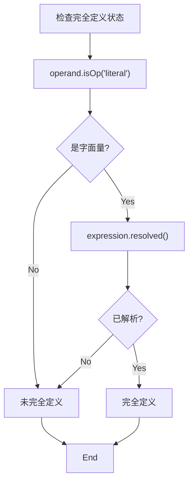
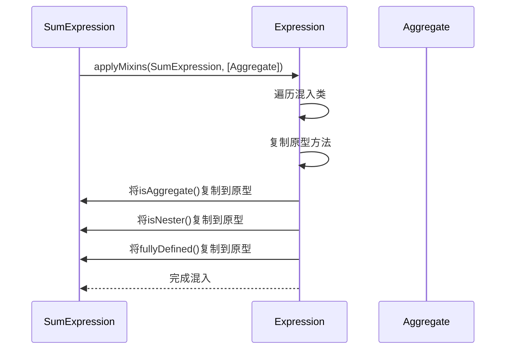
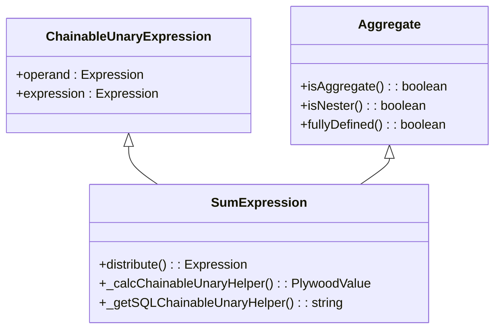
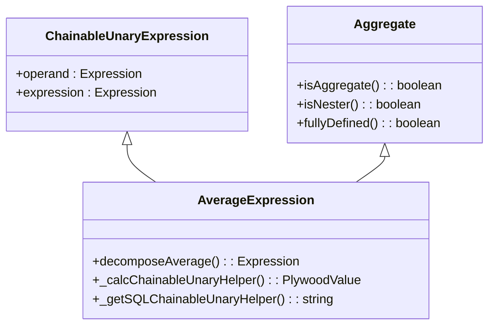
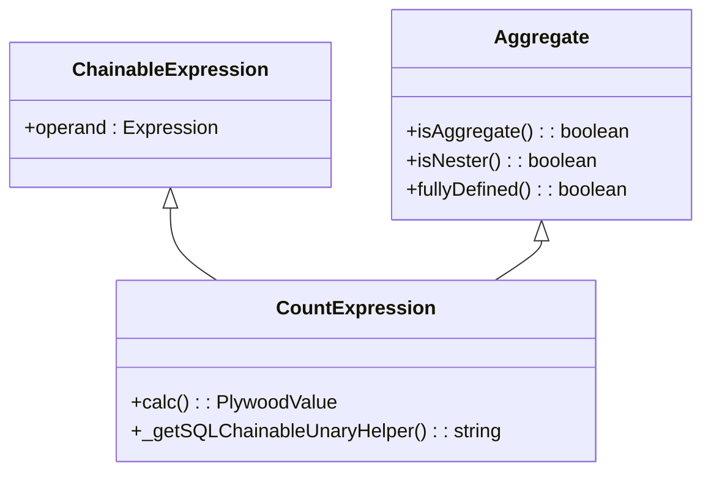
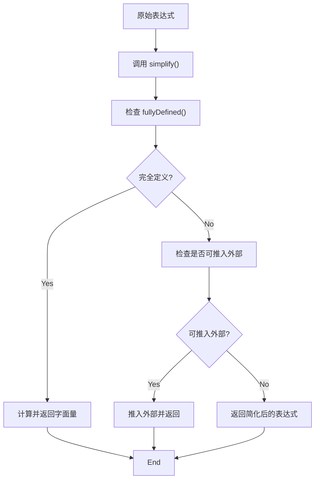
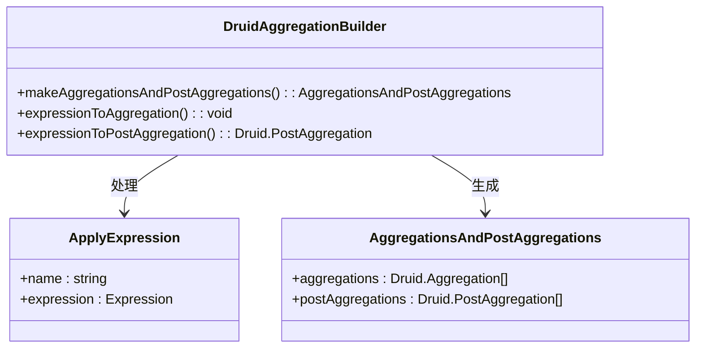
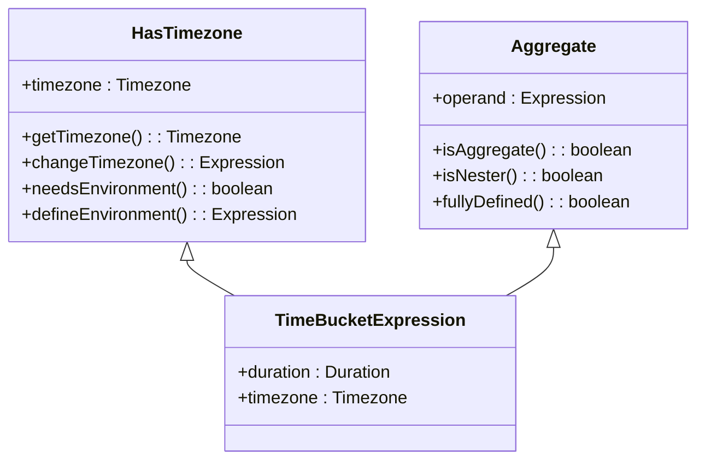

# 聚合功能扩展体系

<cite>
**本文档引用的文件**   
- [aggregate.ts](file://src/expressions/mixins/aggregate.ts)
- [baseExpression.ts](file://src/expressions/baseExpression.ts)
- [hasTimezone.ts](file://src/expressions/mixins/hasTimezone.ts)
- [sumExpression.ts](file://src/expressions/sumExpression.ts)
- [averageExpression.ts](file://src/expressions/averageExpression.ts)
- [countExpression.ts](file://src/expressions/countExpression.ts)
- [minExpression.ts](file://src/expressions/minExpression.ts)
- [maxExpression.ts](file://src/expressions/maxExpression.ts)
- [splitExpression.ts](file://src/expressions/splitExpression.ts)
- [filterExpression.ts](file://src/expressions/filterExpression.ts)
- [applyExpression.ts](file://src/expressions/applyExpression.ts)
- [druidAggregationBuilder.ts](file://src/external/utils/druidAggregationBuilder.ts)
- [dataset.ts](file://src/datatypes/dataset.ts)

## 目录
1. [引言](#引言)
2. [聚合体系设计原理](#聚合体系设计原理)
3. [核心方法分析](#核心方法分析)
4. [混入模式实现](#混入模式实现)
5. [聚合表达式实现](#聚合表达式实现)
6. [查询优化与执行](#查询优化与执行)
7. [与其他混入的协同](#与其他混入的协同)
8. [总结](#总结)

## 引言
Plywood的聚合功能扩展体系通过混入模式为各类聚合表达式提供统一的语义标识和行为规范。该体系基于TypeScript的混入机制，将聚合语义与具体表达式实现解耦，实现了高度的可扩展性和代码复用性。

## 聚合体系设计原理
聚合体系的核心是`Aggregate`混入类，它定义了所有聚合表达式共有的行为特征。通过混入模式，各类聚合表达式（如求和、计数、平均值等）可以继承这些通用行为，同时保持各自特定的计算逻辑。

**Diagram sources**
- [aggregate.ts](file://src/expressions/mixins/aggregate.ts#L18-L33)
- [sumExpression.ts](file://src/expressions/sumExpression.ts#L25-L77)
- [averageExpression.ts](file://src/expressions/averageExpression.ts#L21-L47)
- [countExpression.ts](file://src/expressions/countExpression.ts#L21-L42)

## 核心方法分析
### isAggregate() 方法
`isAggregate()`方法是聚合表达式类型系统的核心标识，它返回`true`以表明该表达式具有聚合语义。这个方法被所有继承`Aggregate`混入的表达式使用，用于在类型检查和查询优化过程中识别聚合操作。

**Diagram sources**
- [aggregate.ts](file://src/expressions/mixins/aggregate.ts#L21-L23)

### isNester() 方法
`isNester()`方法标识表达式是否具有嵌套作用域的特性。在Plywood中，聚合表达式通常会创建新的作用域层次，`isNester()`返回`true`表明该表达式会增加作用域嵌套深度，这对于变量解析和作用域管理至关重要。

### fullyDefined() 方法
`fullyDefined()`方法用于判断聚合表达式的完全定义状态。它检查操作数是否为字面量且表达式是否已解析，这对于表达式简化和优化决策非常重要。

**Diagram sources**
- [aggregate.ts](file://src/expressions/mixins/aggregate.ts#L29-L32)

## 混入模式实现
Plywood使用TypeScript的混入模式来实现聚合功能的扩展。`Expression.applyMixins()`方法是混入机制的核心，它将混入类的方法复制到目标类的原型上。

**Diagram sources**
- [baseExpression.ts](file://src/expressions/baseExpression.ts#L675-L719)
- [sumExpression.ts](file://src/expressions/sumExpression.ts#L81-L82)

## 聚合表达式实现
### 求和表达式 (SumExpression)
`SumExpression`是`Aggregate`混入的具体实现之一，它提供了求和操作的计算逻辑和SQL生成。

**Section sources**
- [sumExpression.ts](file://src/expressions/sumExpression.ts#L25-L77)
- [baseExpression.ts](file://src/expressions/baseExpression.ts#L441-L2189)

### 平均值表达式 (AverageExpression)
`AverageExpression`实现了平均值计算，并提供了将平均值分解为求和与计数的优化方法。

**Section sources**
- [averageExpression.ts](file://src/expressions/averageExpression.ts#L21-L47)
- [baseExpression.ts](file://src/expressions/baseExpression.ts#L441-L2189)

### 计数表达式 (CountExpression)
`CountExpression`实现了计数操作，包括对数据集的行数统计。

**Section sources**
- [countExpression.ts](file://src/expressions/countExpression.ts#L21-L42)
- [dataset.ts](file://src/datatypes/dataset.ts#L714-L723)

## 查询优化与执行
### 表达式简化
聚合表达式通过`simplify()`方法进行优化，将复杂的表达式转换为更简单的等价形式。

### 执行计划生成
聚合表达式在执行时会生成相应的查询计划，包括聚合和后聚合操作。

**Diagram sources**
- [druidAggregationBuilder.ts](file://src/external/utils/druidAggregationBuilder.ts#L185-L213)
- [applyExpression.ts](file://src/expressions/applyExpression.ts#L26-L150)

## 与其他混入的协同
聚合混入与其他混入（如`hasTimezone`）可以协同工作，为表达式提供多重语义特征。

**Section sources**
- [hasTimezone.ts](file://src/expressions/mixins/hasTimezone.ts#L18-L61)
- [aggregate.ts](file://src/expressions/mixins/aggregate.ts#L18-L33)

## 总结
Plywood的聚合功能扩展体系通过混入模式实现了高度模块化和可扩展的架构设计。`Aggregate`混入类为所有聚合表达式提供了统一的接口和行为规范，而具体的聚合实现则专注于各自的计算逻辑。这种设计模式不仅提高了代码的可维护性，还为未来的功能扩展提供了便利。

该体系在表达式类型检查、查询优化和执行计划生成等方面发挥着关键作用，确保了聚合操作的正确性和高效性。通过与其他混入的协同工作，Plywood能够支持复杂的分析场景，满足多样化的数据分析需求。
</>