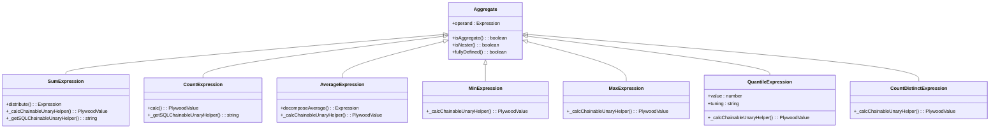
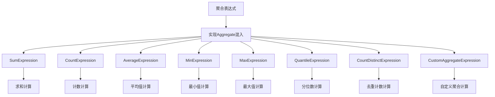
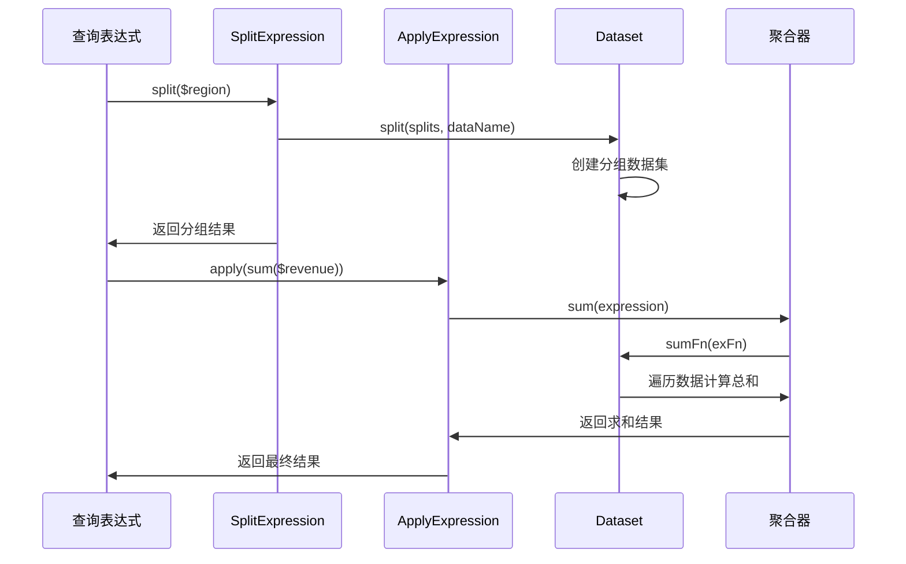
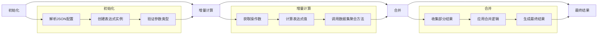
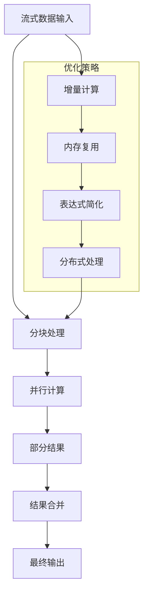
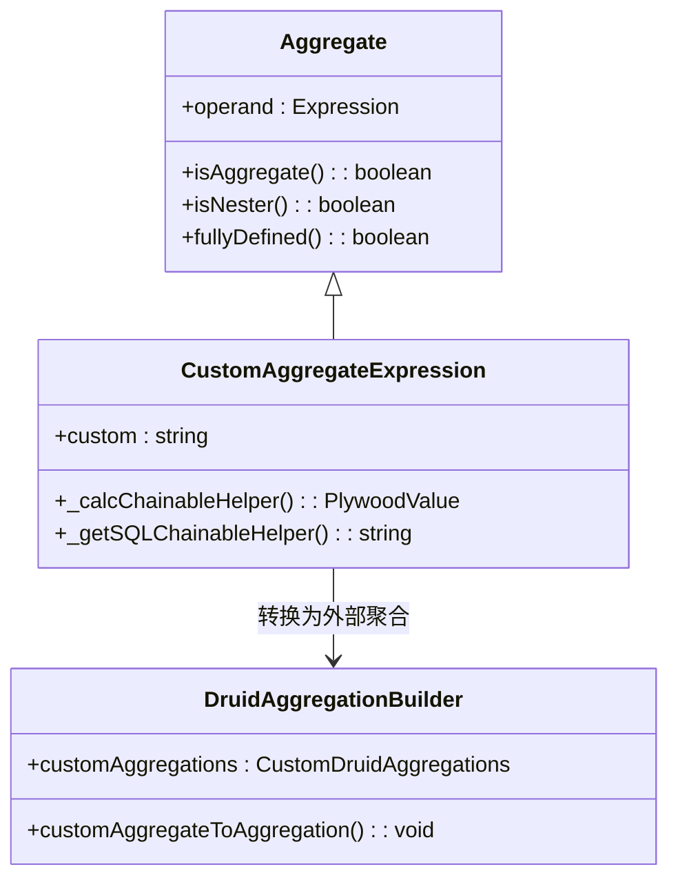
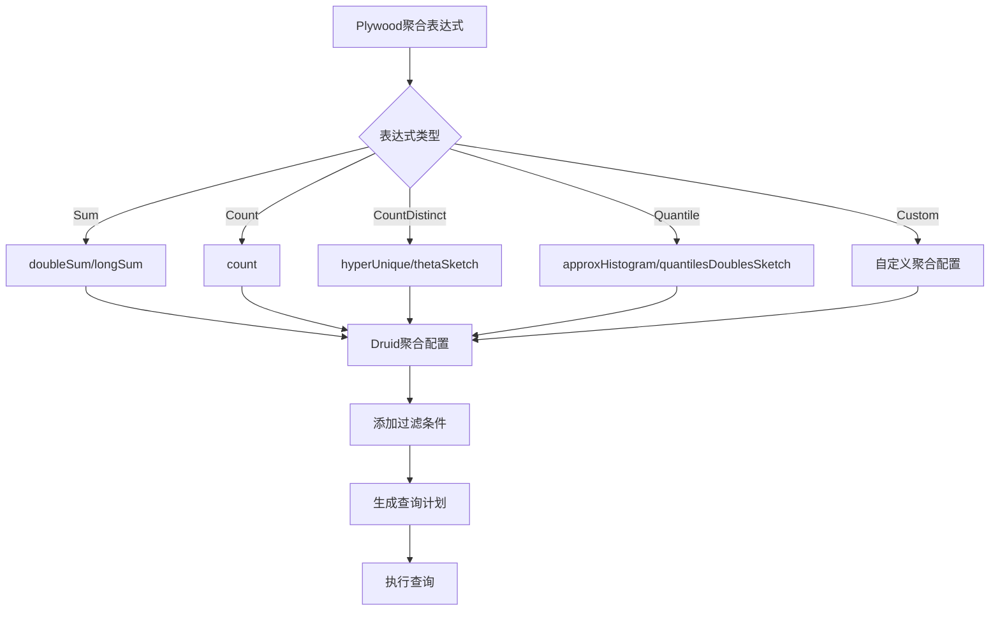

# 聚合表达式

<cite>
**本文档引用的文件**
- [aggregate.ts](file://src/expressions/mixins/aggregate.ts)
- [sumExpression.ts](file://src/expressions/sumExpression.ts)
- [countExpression.ts](file://src/expressions/countExpression.ts)
- [averageExpression.ts](file://src/expressions/averageExpression.ts)
- [minExpression.ts](file://src/expressions/minExpression.ts)
- [maxExpression.ts](file://src/expressions/maxExpression.ts)
- [quantileExpression.ts](file://src/expressions/quantileExpression.ts)
- [countDistinctExpression.ts](file://src/expressions/countDistinctExpression.ts)
- [customAggregateExpression.ts](file://src/expressions/customAggregateExpression.ts)
- [dataset.ts](file://src/datatypes/dataset.ts)
- [druidAggregationBuilder.ts](file://src/external/utils/druidAggregationBuilder.ts)
- [splitExpression.ts](file://src/expressions/splitExpression.ts)
</cite>

## 目录
1. [聚合表达式概述](#聚合表达式概述)
2. [核心聚合函数实现机制](#核心聚合函数实现机制)
3. [聚合功能扩展体系](#聚合功能扩展体系)
4. [分组操作与多层级聚合](#分组操作与多层级聚合)
5. [聚合表达式生命周期](#聚合表达式生命周期)
6. [流式处理优化](#流式处理优化)
7. [自定义聚合函数扩展](#自定义聚合函数扩展)
8. [外部数据源查询转换](#外部数据源查询转换)

## 聚合表达式概述

聚合表达式是Plywood中用于对数据集进行统计计算的核心机制。这些表达式通过`mixins/aggregate.ts`中定义的`Aggregate`类提供统一的聚合功能接口。聚合表达式通常在数据分组（split）操作后应用，用于计算求和、计数、平均值等统计指标。聚合表达式的设计支持在内存中进行增量计算和合并，特别适用于大数据集的流式处理场景。

**Section sources**
- [aggregate.ts](file://src/expressions/mixins/aggregate.ts#L1-L35)
- [dataset.ts](file://src/datatypes/dataset.ts#L400-L1200)

## 核心聚合函数实现机制

Plywood提供了多种内置的聚合函数，每种函数都有其特定的计算逻辑和优化策略。

### 求和（Sum）
`SumExpression`类实现了求和功能，通过`_calcChainableUnaryHelper`方法调用数据集的`sum`方法进行计算。该实现支持分布式计算的`distribute`方法，可以将复杂的求和表达式分解为更简单的子表达式。

### 计数（Count）
`CountExpression`类实现了计数功能，其`calc`方法直接返回数据集的记录数。对于过滤后的数据集，该实现会根据SQL方言选择`COUNT(*)`或`SUM`函数。

### 平均值（Average）
`AverageExpression`类通过`decomposeAverage`方法将平均值计算分解为求和与计数的组合，支持在不同数据源上进行优化。

### 最小值与最大值（Min/Max）
`MinExpression`和`MaxExpression`类分别实现了最小值和最大值的计算，支持数值和时间类型的数据。

### 分位数（Quantile）
`QuantileExpression`类实现了分位数计算，支持通过`tuning`参数进行性能调优。

### 去重计数（Count Distinct）
`CountDistinctExpression`类实现了去重计数功能，支持多种去重算法，包括hyperUnique、thetaSketch等。



**Diagram sources**
- [sumExpression.ts](file://src/expressions/sumExpression.ts#L0-L82)
- [countExpression.ts](file://src/expressions/countExpression.ts#L0-L47)
- [averageExpression.ts](file://src/expressions/averageExpression.ts#L0-L52)
- [minExpression.ts](file://src/expressions/minExpression.ts#L0-L47)
- [maxExpression.ts](file://src/expressions/maxExpression.ts#L0-L47)
- [quantileExpression.ts](file://src/expressions/quantileExpression.ts#L0-L76)
- [countDistinctExpression.ts](file://src/expressions/countDistinctExpression.ts#L0-L46)

**Section sources**
- [sumExpression.ts](file://src/expressions/sumExpression.ts#L0-L82)
- [countExpression.ts](file://src/expressions/countExpression.ts#L0-L47)
- [averageExpression.ts](file://src/expressions/averageExpression.ts#L0-L52)
- [minExpression.ts](file://src/expressions/minExpression.ts#L0-L47)
- [maxExpression.ts](file://src/expressions/maxExpression.ts#L0-L47)
- [quantileExpression.ts](file://src/expressions/quantileExpression.ts#L0-L76)
- [countDistinctExpression.ts](file://src/expressions/countDistinctExpression.ts#L0-L46)

## 聚合功能扩展体系

Plywood通过`mixins/aggregate.ts`文件中的`Aggregate`类定义了聚合功能的扩展体系。该体系采用混入（mixin）模式，允许各种聚合表达式继承统一的聚合接口。

`Aggregate`类定义了三个核心方法：
- `isAggregate()`: 标识表达式为聚合类型
- `isNester()`: 标识表达式为嵌套类型
- `fullyDefined()`: 判断表达式是否完全定义

所有具体的聚合表达式类（如`SumExpression`、`CountExpression`等）都通过`Expression.applyMixins()`方法应用`Aggregate`混入，从而获得聚合功能。这种设计模式实现了功能的复用和接口的统一，同时保持了类的单一职责。



**Diagram sources**
- [aggregate.ts](file://src/expressions/mixins/aggregate.ts#L1-L35)
- [sumExpression.ts](file://src/expressions/sumExpression.ts#L0-L82)
- [countExpression.ts](file://src/expressions/countExpression.ts#L0-L47)

**Section sources**
- [aggregate.ts](file://src/expressions/mixins/aggregate.ts#L1-L35)
- [sumExpression.ts](file://src/expressions/sumExpression.ts#L0-L82)
- [countExpression.ts](file://src/expressions/countExpression.ts#L0-L47)

## 分组操作与多层级聚合

聚合表达式通常与分组（split）操作结合使用，形成`split($region).apply(sum($revenue))`这样的查询模式。

### 分组操作
`SplitExpression`类实现了分组功能，通过`split`方法将数据集按照指定维度进行分组。分组后的数据集包含原始数据的子集，并为每个分组创建新的数据集。

### 多层级聚合
Plywood支持多层级的聚合操作，可以通过嵌套的`apply`表达式实现复杂的聚合逻辑。例如，可以先按地区分组，再按产品类别进行二次分组，最后计算每个组合的统计指标。



**Diagram sources**
- [splitExpression.ts](file://src/expressions/splitExpression.ts#L35-L292)
- [dataset.ts](file://src/datatypes/dataset.ts#L800-L1000)

**Section sources**
- [splitExpression.ts](file://src/expressions/splitExpression.ts#L35-L292)
- [dataset.ts](file://src/datatypes/dataset.ts#L800-L1000)

## 聚合表达式生命周期

聚合表达式的生命周期包括初始化、增量计算和合并三个阶段。

### 初始化
聚合表达式通过`fromJS`静态方法从JSON配置初始化，设置操作数和表达式参数。

### 增量计算
通过`_calcChainableUnaryHelper`或`_calcChainableHelper`方法实现增量计算。这些方法调用数据集对应的聚合方法（如`sum`、`count`等）进行计算。

### 合并策略
聚合表达式支持合并操作，可以在分布式计算环境中将多个部分结果合并为最终结果。例如，多个分片的求和结果可以直接相加得到全局总和。



**Diagram sources**
- [sumExpression.ts](file://src/expressions/sumExpression.ts#L0-L82)
- [dataset.ts](file://src/datatypes/dataset.ts#L600-L800)

**Section sources**
- [sumExpression.ts](file://src/expressions/sumExpression.ts#L0-L82)
- [dataset.ts](file://src/datatypes/dataset.ts#L600-L800)

## 流式处理优化

Plywood的聚合表达式针对大数据集的流式处理进行了多项优化。

### 内存效率
聚合计算采用增量方式，不需要将所有数据加载到内存中。数据集的聚合方法（如`sumFn`、`countDistinctFn`等）通过单次遍历完成计算。

### 分布式计算
通过`distribute`方法支持分布式计算，可以将复杂的聚合表达式分解为可以在不同节点并行执行的子表达式。

### 缓存与简化
聚合表达式实现了`simplify`方法，可以在计算前对表达式进行简化，减少不必要的计算开销。



**Diagram sources**
- [sumExpression.ts](file://src/expressions/sumExpression.ts#L0-L82)
- [dataset.ts](file://src/datatypes/dataset.ts#L600-L800)

**Section sources**
- [sumExpression.ts](file://src/expressions/sumExpression.ts#L0-L82)
- [dataset.ts](file://src/datatypes/dataset.ts#L600-L800)

## 自定义聚合函数扩展

Plywood通过`CustomAggregateExpression`类支持自定义聚合函数的扩展。

### 扩展机制
自定义聚合函数通过`custom`属性指定具体的聚合操作名称，该名称对应于外部数据源中预定义的聚合配置。

### 实现方式
自定义聚合函数的实现分为两个部分：
1. 在Plywood中定义`CustomAggregateExpression`实例
2. 在外部数据源（如Druid）中配置相应的聚合规则

### 使用示例
```typescript
// 创建自定义聚合表达式
const customAgg = $('dataset').customAggregate('myCustomSum');

// 在Druid中配置对应的聚合规则
const customAggregations = {
  myCustomSum: {
    aggregations: [{
      type: 'doubleSum',
      fieldName: '{{fieldName}}'
    }]
  }
};
```



**Diagram sources**
- [customAggregateExpression.ts](file://src/expressions/customAggregateExpression.ts#L0-L72)
- [druidAggregationBuilder.ts](file://src/external/utils/druidAggregationBuilder.ts#L0-L743)

**Section sources**
- [customAggregateExpression.ts](file://src/expressions/customAggregateExpression.ts#L0-L72)
- [druidAggregationBuilder.ts](file://src/external/utils/druidAggregationBuilder.ts#L0-L743)

## 外部数据源查询转换

Plywood的聚合表达式可以转换为外部数据源（如Druid）的查询语句。

### Druid查询转换
`DruidAggregationBuilder`类负责将Plywood聚合表达式转换为Druid的聚合配置。

### 转换规则
- `SumExpression` → `doubleSum` 或 `longSum` 聚合
- `CountExpression` → `count` 聚合
- `CountDistinctExpression` → `hyperUnique`、`thetaSketch` 或 `cardinality` 聚合
- `QuantileExpression` → `approxHistogram` 或 `quantilesDoublesSketch` 聚合

### 转换流程
1. 解析聚合表达式
2. 根据表达式类型选择相应的聚合器
3. 生成Druid聚合配置
4. 处理过滤条件
5. 生成最终的查询计划



**Diagram sources**
- [druidAggregationBuilder.ts](file://src/external/utils/druidAggregationBuilder.ts#L0-L743)
- [sumExpression.ts](file://src/expressions/sumExpression.ts#L0-L82)
- [countExpression.ts](file://src/expressions/countExpression.ts#L0-L47)

**Section sources**
- [druidAggregationBuilder.ts](file://src/external/utils/druidAggregationBuilder.ts#L0-L743)
- [sumExpression.ts](file://src/expressions/sumExpression.ts#L0-L82)
- [countExpression.ts](file://src/expressions/countExpression.ts#L0-L47)