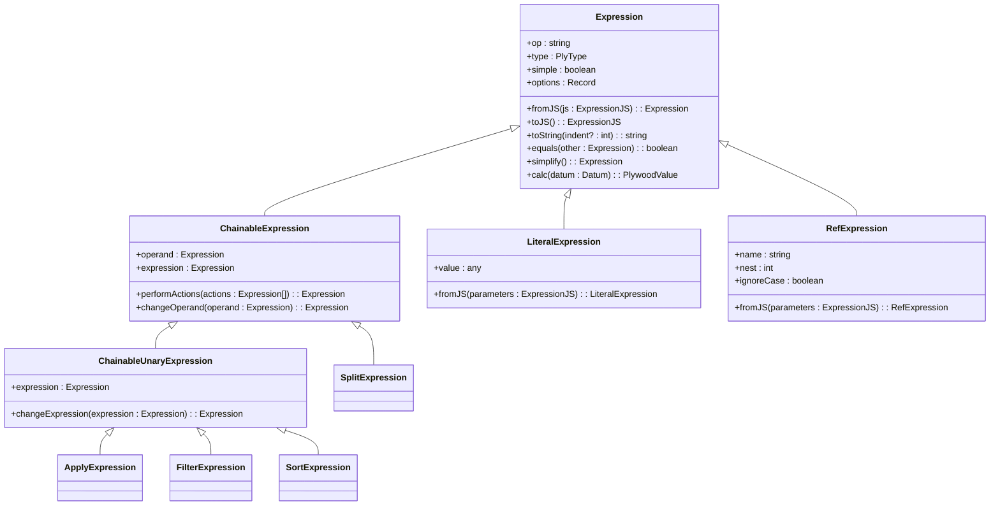
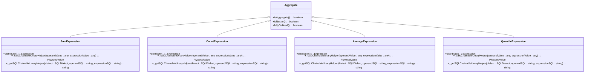
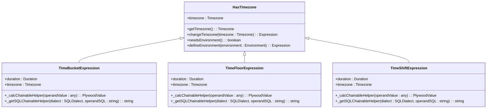
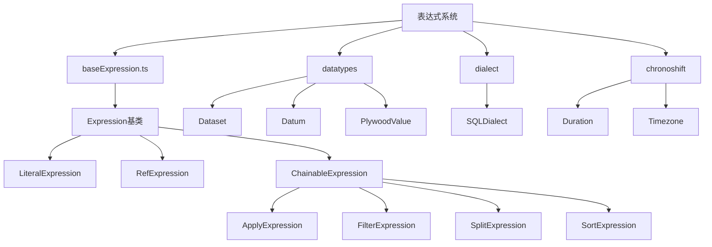

# 表达式系统

<cite>
**本文档中引用的文件**  
- [baseExpression.ts](file://src/expressions/baseExpression.ts)
- [literalExpression.ts](file://src/expressions/literalExpression.ts)
- [refExpression.ts](file://src/expressions/refExpression.ts)
- [addExpression.ts](file://src/expressions/addExpression.ts)
- [multiplyExpression.ts](file://src/expressions/multiplyExpression.ts)
- [andExpression.ts](file://src/expressions/andExpression.ts)
- [orExpression.ts](file://src/expressions/orExpression.ts)
- [sumExpression.ts](file://src/expressions/sumExpression.ts)
- [countExpression.ts](file://src/expressions/countExpression.ts)
- [averageExpression.ts](file://src/expressions/averageExpression.ts)
- [quantileExpression.ts](file://src/expressions/quantileExpression.ts)
- [timeBucketExpression.ts](file://src/expressions/timeBucketExpression.ts)
- [timeFloorExpression.ts](file://src/expressions/timeFloorExpression.ts)
- [timeShiftExpression.ts](file://src/expressions/timeShiftExpression.ts)
- [applyExpression.ts](file://src/expressions/applyExpression.ts)
- [filterExpression.ts](file://src/expressions/filterExpression.ts)
- [splitExpression.ts](file://src/expressions/splitExpression.ts)
- [sortExpression.ts](file://src/expressions/sortExpression.ts)
- [aggregate.ts](file://src/expressions/mixins/aggregate.ts)
- [hasTimezone.ts](file://src/expressions/mixins/hasTimezone.ts)
</cite>

## 目录
1. [简介](#简介)
2. [项目结构](#项目结构)
3. [核心组件](#核心组件)
4. [架构概述](#架构概述)
5. [详细组件分析](#详细组件分析)
6. [依赖分析](#依赖分析)
7. [性能考虑](#性能考虑)
8. [故障排除指南](#故障排除指南)
9. [结论](#结论)

## 简介
Plywood表达式系统是一个功能强大的查询语言核心，它提供了一种声明式的方式来描述数据操作和转换。该系统基于链式调用模式，允许用户构建复杂的表达式链来执行过滤、分组、聚合和排序等操作。表达式系统的设计遵循Split-Apply-Combine模式，这是数据分析中的一个核心范式。系统通过继承体系组织各种表达式类型，从基础的字面量和引用表达式到复杂的聚合和时序表达式。表达式可以被解析、类型检查、简化和执行，整个生命周期由系统管理。mixins目录中的聚合和时区功能通过TypeScript的mixin模式提供扩展机制，使得表达式可以共享通用行为。

## 项目结构
Plywood项目的表达式系统位于src/expressions目录下，采用模块化设计。该目录包含各种具体的表达式实现文件，如addExpression.ts、filterExpression.ts等，每个文件对应一种表达式类型。核心的基类定义在baseExpression.ts中，所有表达式都继承自这个基类。mixins目录包含可重用的行为，如聚合和时区处理，通过mixin模式应用到相关表达式上。表达式类型包括基础表达式（literal, ref）、数学表达式（add, subtract, multiply, divide）、逻辑表达式（and, or, not）、聚合表达式（sum, count, average, quantile）以及时序表达式（timeBucket, timeFloor, timeShift）。系统还包含apply、filter、split和sort等高阶操作表达式，用于构建复杂的数据处理管道。

```mermaid
graph TD
A[表达式系统] --> B[基础表达式]
A --> C[数学表达式]
A --> D[逻辑表达式]
A --> E[聚合表达式]
A --> F[时序表达式]
A --> G[高阶操作表达式]
B --> H[literalExpression]
B --> I[refExpression]
C --> J[addExpression]
C --> K[subtractExpression]
C --> L[multiplyExpression]
C --> M[divideExpression]
D --> N[andExpression]
D --> O[orExpression]
D --> P[notExpression]
E --> Q[sumExpression]
E --> R[countExpression]
E --> S[averageExpression]
E --> T[quantileExpression]
F --> U[timeBucketExpression]
F --> V[timeFloorExpression]
F --> W[timeShiftExpression]
G --> X[applyExpression]
G --> Y[filterExpression]
G --> Z[splitExpression]
G --> AA[sortExpression]
```

**图源**  
- [baseExpression.ts](file://src/expressions/baseExpression.ts)
- [literalExpression.ts](file://src/expressions/literalExpression.ts)
- [refExpression.ts](file://src/expressions/refExpression.ts)
- [addExpression.ts](file://src/expressions/addExpression.ts)
- [multiplyExpression.ts](file://src/expressions/multiplyExpression.ts)
- [andExpression.ts](file://src/expressions/andExpression.ts)
- [orExpression.ts](file://src/expressions/orExpression.ts)
- [sumExpression.ts](file://src/expressions/sumExpression.ts)
- [countExpression.ts](file://src/expressions/countExpression.ts)
- [averageExpression.ts](file://src/expressions/averageExpression.ts)
- [quantileExpression.ts](file://src/expressions/quantileExpression.ts)
- [timeBucketExpression.ts](file://src/expressions/timeBucketExpression.ts)
- [timeFloorExpression.ts](file://src/expressions/timeFloorExpression.ts)
- [timeShiftExpression.ts](file://src/expressions/timeShiftExpression.ts)
- [applyExpression.ts](file://src/expressions/applyExpression.ts)
- [filterExpression.ts](file://src/expressions/filterExpression.ts)
- [splitExpression.ts](file://src/expressions/splitExpression.ts)
- [sortExpression.ts](file://src/expressions/sortExpression.ts)

**节源**  
- [src/expressions](file://src/expressions)

## 核心组件
表达式系统的核心是baseExpression.ts中定义的Expression基类，它是所有表达式类型的抽象基类。该基类定义了表达式的基本结构和通用行为，包括op操作符、type类型、simple简单性标志和options选项。系统通过静态方法如and、or、add、subtract等提供工厂函数，用于创建相应的表达式实例。Expression类还负责表达式的序列化和反序列化，支持从JS对象创建表达式实例。各种具体的表达式类型通过继承基类并实现特定行为来扩展功能。例如，数学表达式实现二元操作，逻辑表达式处理布尔运算，而聚合表达式则实现数据聚合功能。高阶操作表达式如apply、filter、split和sort构成了数据处理管道的基础，支持链式调用。

**节源**  
- [baseExpression.ts](file://src/expressions/baseExpression.ts)

## 架构概述
Plywood表达式系统的架构基于面向对象设计和函数式编程原则的结合。系统核心是Expression抽象基类，它定义了所有表达式共有的接口和行为。具体的表达式类型通过继承体系组织，形成一个层次化的类结构。系统采用mixin模式通过applyMixins方法将通用功能（如聚合和时区处理）注入到相关表达式类中。表达式生命周期包括解析、类型检查、简化和执行四个阶段。链式调用机制通过返回新的表达式实例来实现，支持构建复杂的表达式链。Split-Apply-Combine模式体现在split、apply和聚合表达式的协同工作上，允许对数据进行分组、转换和聚合操作。

**图源**  
- [baseExpression.ts](file://src/expressions/baseExpression.ts)
- [literalExpression.ts](file://src/expressions/literalExpression.ts)
- [refExpression.ts](file://src/expressions/refExpression.ts)
- [applyExpression.ts](file://src/expressions/applyExpression.ts)
- [filterExpression.ts](file://src/expressions/filterExpression.ts)
- [splitExpression.ts](file://src/expressions/splitExpression.ts)
- [sortExpression.ts](file://src/expressions/sortExpression.ts)

## 详细组件分析
### 基础表达式分析
基础表达式包括字面量表达式（LiteralExpression）和引用表达式（RefExpression），它们是构建更复杂表达式的基础。字面量表达式表示常量值，如数字、字符串或布尔值，其值在创建时确定且不可变。引用表达式用于引用数据集中的字段或属性，支持嵌套访问和大小写不敏感匹配。这两种表达式都是简单表达式（simple expressions），在简化过程中不会被进一步处理。引用表达式还支持类型注解，可以在表达式中显式指定字段类型。

**节源**  
- [literalExpression.ts](file://src/expressions/literalExpression.ts)
- [refExpression.ts](file://src/expressions/refExpression.ts)

#### 数学表达式分析
数学表达式实现基本的算术运算，包括加法（AddExpression）、减法（SubtractExpression）、乘法（MultiplyExpression）和除法（DivideExpression）。这些表达式都是二元操作，接受两个操作数并返回计算结果。系统通过静态方法add、subtract、multiply和divide提供工厂函数，支持创建多个操作数的复合表达式。数学表达式在简化阶段会应用代数规则，如乘法对加法的分配律，以优化表达式结构。这些表达式还支持SQL代码生成，可以转换为相应的SQL运算符。

**节源**  
- [addExpression.ts](file://src/expressions/addExpression.ts)
- [subtractExpression.ts](file://src/expressions/subtractExpression.ts)
- [multiplyExpression.ts](file://src/expressions/multiplyExpression.ts)
- [divideExpression.ts](file://src/expressions/divideExpression.ts)

#### 逻辑表达式分析
逻辑表达式处理布尔运算，包括与（AndExpression）、或（OrExpression）和非（NotExpression）。这些表达式支持短路求值，在运行时优化计算过程。系统通过静态方法and和or提供工厂函数，支持创建多个操作数的复合逻辑表达式。逻辑表达式在简化阶段会应用布尔代数规则，如德摩根定律，以优化表达式结构。这些表达式还支持类型检查，确保操作数是布尔类型。引用表达式可以通过toCaseInsensitive方法转换为大小写不敏感的比较。

**节源**  
- [andExpression.ts](file://src/expressions/andExpression.ts)
- [orExpression.ts](file://src/expressions/orExpression.ts)
- [notExpression.ts](file://src/expressions/notExpression.ts)

#### 聚合表达式分析
聚合表达式实现数据聚合功能，包括求和（SumExpression）、计数（CountExpression）、平均值（AverageExpression）和分位数（QuantileExpression）。这些表达式都实现了Aggregate mixin，标记为聚合操作。聚合表达式在Split-Apply-Combine模式中扮演Apply角色，对分组后的数据应用聚合函数。系统支持分布式计算，聚合表达式可以通过distribute方法分解为多个部分聚合，然后在客户端合并结果。聚合表达式还支持SQL代码生成，可以转换为相应的SQL聚合函数。

**图源**  
- [aggregate.ts](file://src/expressions/mixins/aggregate.ts)
- [sumExpression.ts](file://src/expressions/sumExpression.ts)
- [countExpression.ts](file://src/expressions/countExpression.ts)
- [averageExpression.ts](file://src/expressions/averageExpression.ts)
- [quantileExpression.ts](file://src/expressions/quantileExpression.ts)

#### 时序表达式分析
时序表达式处理时间相关的操作，包括时间桶（TimeBucketExpression）、时间向下取整（TimeFloorExpression）和时间偏移（TimeShiftExpression）。这些表达式都实现了HasTimezone mixin，支持时区处理。时序表达式在简化阶段会应用时间计算规则，如时间桶的合并和时间偏移的抵消。系统支持多种时间单位和时区，可以在表达式中显式指定。时序表达式还支持SQL代码生成，可以转换为相应数据库的时间函数。TimeBucketExpression用于将时间点分组到时间区间，TimeFloorExpression用于将时间点向下取整到指定时间单位，TimeShiftExpression用于将时间点向前或向后移动指定时间间隔。

**图源**  
- [hasTimezone.ts](file://src/expressions/mixins/hasTimezone.ts)
- [timeBucketExpression.ts](file://src/expressions/timeBucketExpression.ts)
- [timeFloorExpression.ts](file://src/expressions/timeFloorExpression.ts)
- [timeShiftExpression.ts](file://src/expressions/timeShiftExpression.ts)

#### 高阶操作表达式分析
高阶操作表达式包括apply、filter、split和sort，它们构成了数据处理管道的核心。apply表达式用于添加新的计算字段，filter表达式用于筛选数据，split表达式用于分组数据，sort表达式用于排序数据。这些表达式共同实现了Split-Apply-Combine模式，允许对数据进行复杂的转换和分析。链式调用机制使得这些操作可以无缝连接，形成流畅的数据处理流程。每个高阶操作表达式都支持简化优化，如filter表达式可以合并连续的过滤条件，sort表达式可以消除冗余的排序操作。

**节源**  
- [applyExpression.ts](file://src/expressions/applyExpression.ts)
- [filterExpression.ts](file://src/expressions/filterExpression.ts)
- [splitExpression.ts](file://src/expressions/splitExpression.ts)
- [sortExpression.ts](file://src/expressions/sortExpression.ts)

## 依赖分析
表达式系统内部依赖关系清晰，形成了一个层次化的结构。所有表达式都依赖于baseExpression.ts中定义的基类，该基类提供了基本的表达式功能。各种具体的表达式类型依赖于datatypes目录中的数据类型定义，如Dataset、Datum和PlywoodValue。时序表达式依赖于chronoshift库中的Duration和Timezone类。SQL代码生成依赖于dialect目录中的SQL方言实现。mixin模式通过简单的属性复制实现，避免了复杂的继承关系。整个系统设计为松耦合，各个组件之间的依赖关系明确且可控。

**图源**  
- [baseExpression.ts](file://src/expressions/baseExpression.ts)
- [datatypes/index.ts](file://src/datatypes/index.ts)
- [dialect/baseDialect.ts](file://src/dialect/baseDialect.ts)
- [timeBucketExpression.ts](file://src/expressions/timeBucketExpression.ts)

**节源**  
- [src/expressions](file://src/expressions)
- [src/datatypes](file://src/datatypes)
- [src/dialect](file://src/dialect)

## 性能考虑
表达式系统的性能优化主要体现在表达式简化和分布式计算两个方面。表达式简化在执行前对表达式树进行优化，消除冗余操作和应用代数规则，减少实际执行时的计算量。分布式计算支持将聚合操作分解为多个部分聚合，然后在客户端合并结果，提高大规模数据处理的效率。SQL代码生成优化确保生成的SQL查询尽可能高效，利用数据库的原生聚合函数和索引。链式调用机制通过延迟执行和流水线处理，避免中间结果的内存占用。系统还支持并发查询限制和超时设置，防止资源耗尽。

## 故障排除指南
在使用表达式系统时，常见的问题包括类型不匹配、表达式解析错误和性能瓶颈。类型不匹配通常发生在引用表达式中，可以通过显式类型注解解决。表达式解析错误可能是由于语法错误或不支持的操作符，应检查表达式字符串的正确性。性能瓶颈可能出现在复杂的聚合操作或大规模数据处理中，可以通过表达式简化和分布式计算优化。调试时可以使用表达式的toString方法查看表达式树结构，或使用simplify方法查看优化后的表达式。对于SQL生成问题，可以检查目标数据库的方言实现是否正确。

**节源**  
- [baseExpression.ts](file://src/expressions/baseExpression.ts)
- [simplify.mocha.js](file://test/overall/simplify.mocha.js)

## 结论
Plywood表达式系统是一个设计精良的查询语言核心，它通过面向对象和函数式编程的结合，提供了一种强大而灵活的数据操作方式。系统基于清晰的继承体系和mixin模式，支持各种表达式类型的扩展和复用。Split-Apply-Combine模式的实现使得复杂的数据分析任务变得简单直观。链式调用机制提供了流畅的API体验，而表达式生命周期管理确保了性能和正确性。通过深入理解表达式系统的架构和实现机制，开发者可以更有效地利用这一工具进行数据分析和处理。