# 逻辑表达式

<cite>
**本文档中引用的文件**   
- [andExpression.ts](file://src/expressions/andExpression.ts)
- [orExpression.ts](file://src/expressions/orExpression.ts)
- [notExpression.ts](file://src/expressions/notExpression.ts)
- [baseExpression.ts](file://src/expressions/baseExpression.ts)
- [greaterThanExpression.ts](file://src/expressions/greaterThanExpression.ts)
- [lessThanExpression.ts](file://src/expressions/lessThanExpression.ts)
- [containsExpression.ts](file://src/expressions/containsExpression.ts)
- [inExpression.ts](file://src/expressions/inExpression.ts)
- [isExpression.ts](file://src/expressions/isExpression.ts)
- [set.ts](file://src/datatypes/set.ts)
- [range.ts](file://src/datatypes/range.ts)
- [baseDialect.ts](file://src/dialect/baseDialect.ts)
- [mySqlDialect.ts](file://src/dialect/mySqlDialect.ts)
- [clickHouseDialect.ts](file://src/dialect/clickHouseDialect.ts)
</cite>

## 目录
1. [简介](#简介)
2. [布尔逻辑表达式](#布尔逻辑表达式)
3. [比较表达式](#比较表达式)
4. [链式调用与复合条件](#链式调用与复合条件)
5. [空值处理与类型转换](#空值处理与类型转换)
6. [查询优化与德摩根定律](#查询优化与德摩根定律)
7. [数据库方言差异](#数据库方言差异)
8. [应用场景](#应用场景)

## 简介
Plywood逻辑表达式系统提供了一套完整的条件判断和过滤机制，支持布尔逻辑、数值比较、字符串匹配等多种操作。该系统通过链式调用来构建复杂的条件表达式，并在不同数据库方言中生成相应的WHERE子句。表达式系统还实现了短路求值、空值处理和查询优化等高级特性。

## 布尔逻辑表达式

Plywood提供了完整的布尔逻辑运算符实现，包括与（and）、或（or）和非（not）操作。这些操作符通过专门的表达式类来实现，确保了类型安全和高效的执行。

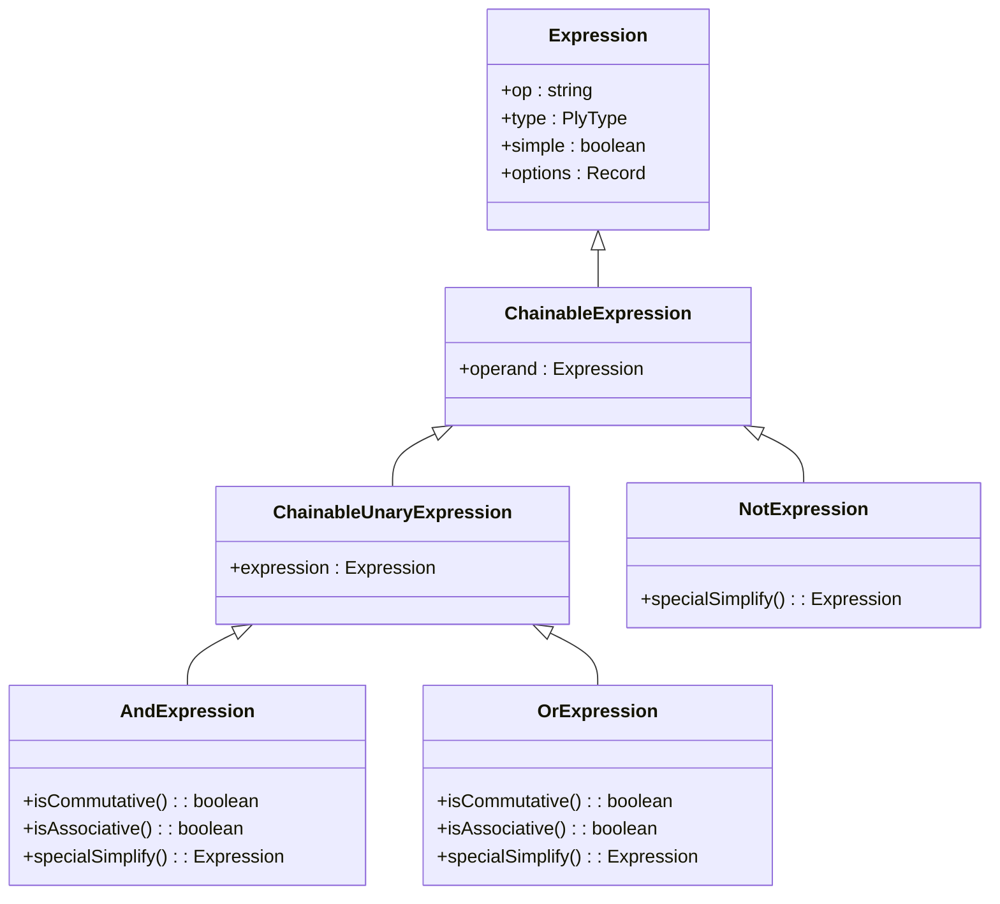

**图源**
- [baseExpression.ts](file://src/expressions/baseExpression.ts#L441-L2189)
- [andExpression.ts](file://src/expressions/andExpression.ts#L34-L127)
- [orExpression.ts](file://src/expressions/orExpression.ts#L25-L96)
- [notExpression.ts](file://src/expressions/notExpression.ts#L21-L51)

### 与操作 (And)
与操作通过`AndExpression`类实现，支持短路求值和表达式简化。当与操作的任一操作数为假时，整个表达式的结果为假。

```mermaid
sequenceDiagram
participant Client as "客户端"
participant AndExpr as "AndExpression"
participant Operand as "操作数"
Client->>AndExpr : and(expressions)
AndExpr->>AndExpr : specialSimplify()
loop 每个表达式
AndExpr->>Operand : calc(datum)
Operand-->>AndExpr : 布尔值
alt 值为false
AndExpr-->>Client : false (短路)
break
end
end
AndExpr-->>Client : true
```

**图源**
- [andExpression.ts](file://src/expressions/andExpression.ts#L34-L127)

### 或操作 (Or)
或操作通过`OrExpression`类实现，同样支持短路求值。当或操作的任一操作数为真时，整个表达式的结果为真。

```mermaid
sequenceDiagram
participant Client as "客户端"
participant OrExpr as "OrExpression"
participant Operand as "操作数"
Client->>OrExpr : or(expressions)
OrExpr->>OrExpr : specialSimplify()
loop 每个表达式
OrExpr->>Operand : calc(datum)
Operand-->>OrExpr : 布尔值
alt 值为true
OrExpr-->>Client : true (短路)
break
end
end
OrExpr-->>Client : false
```

**图源**
- [orExpression.ts](file://src/expressions/orExpression.ts#L25-L96)

### 非操作 (Not)
非操作通过`NotExpression`类实现，对单个操作数进行逻辑取反。

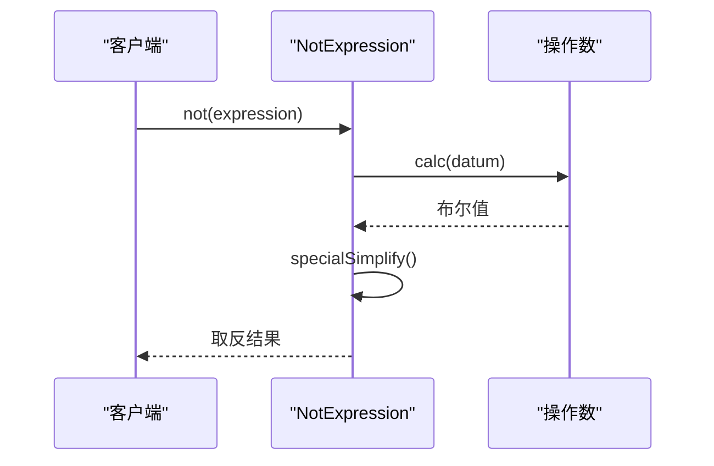

**图源**
- [notExpression.ts](file://src/expressions/notExpression.ts#L21-L51)

**本节源码**
- [andExpression.ts](file://src/expressions/andExpression.ts#L34-L127)
- [orExpression.ts](file://src/expressions/orExpression.ts#L25-L96)
- [notExpression.ts](file://src/expressions/notExpression.ts#L21-L51)

## 比较表达式

Plywood支持多种比较操作，包括大于、小于、等于、包含等。这些操作通过专门的表达式类实现，并在不同数据类型上提供一致的语义。

### 数值比较
数值比较操作包括大于（greaterThan）、小于（lessThan）、等于（is）等，通过相应的表达式类实现。

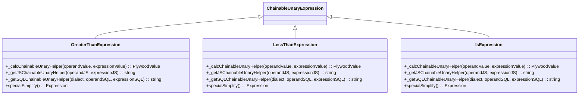

**图源**
- [greaterThanExpression.ts](file://src/expressions/greaterThanExpression.ts#L22-L64)
- [lessThanExpression.ts](file://src/expressions/lessThanExpression.ts#L22-L68)
- [isExpression.ts](file://src/expressions/isExpression.ts#L22-L136)

### 包含与在...之中
包含（contains）和在...之中（in）操作用于检查值是否存在于集合中。

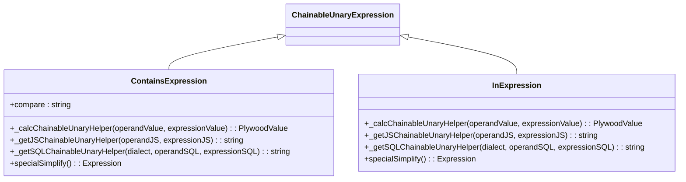

**图源**
- [containsExpression.ts](file://src/expressions/containsExpression.ts#L21-L138)
- [inExpression.ts](file://src/expressions/inExpression.ts#L22-L82)

### 范围与集合
Plywood使用`Set`和`Range`类来表示集合和范围，支持高效的包含检查和范围操作。

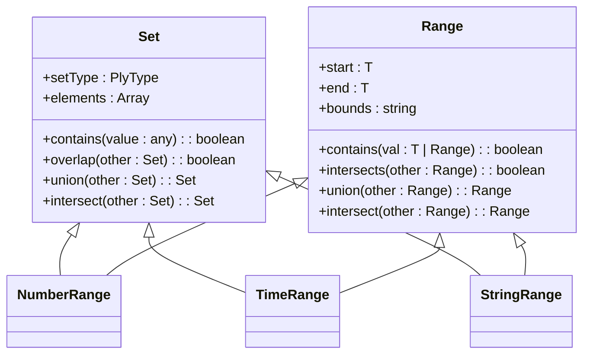

**图源**
- [set.ts](file://src/datatypes/set.ts#L53-L475)
- [range.ts](file://src/datatypes/range.ts#L30-L348)

**本节源码**
- [greaterThanExpression.ts](file://src/expressions/greaterThanExpression.ts#L22-L64)
- [lessThanExpression.ts](file://src/expressions/lessThanExpression.ts#L22-L68)
- [containsExpression.ts](file://src/expressions/containsExpression.ts#L21-L138)
- [inExpression.ts](file://src/expressions/inExpression.ts#L22-L82)
- [isExpression.ts](file://src/expressions/isExpression.ts#L22-L136)
- [set.ts](file://src/datatypes/set.ts#L53-L475)
- [range.ts](file://src/datatypes/range.ts#L30-L348)

## 链式调用与复合条件

Plywood通过链式调用来构建复杂的条件表达式，支持任意深度的嵌套和组合。

### 链式调用机制
链式调用通过`ChainableExpression`基类实现，允许在表达式之间建立链接关系。

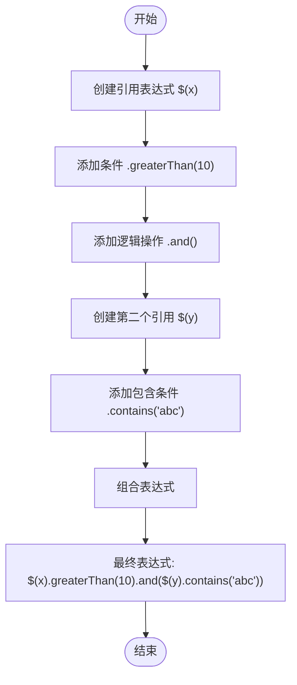

**图源**
- [baseExpression.ts](file://src/expressions/baseExpression.ts#L441-L2189)

### 复合条件构建
复合条件可以通过静态方法或实例方法构建，支持多种组合方式。

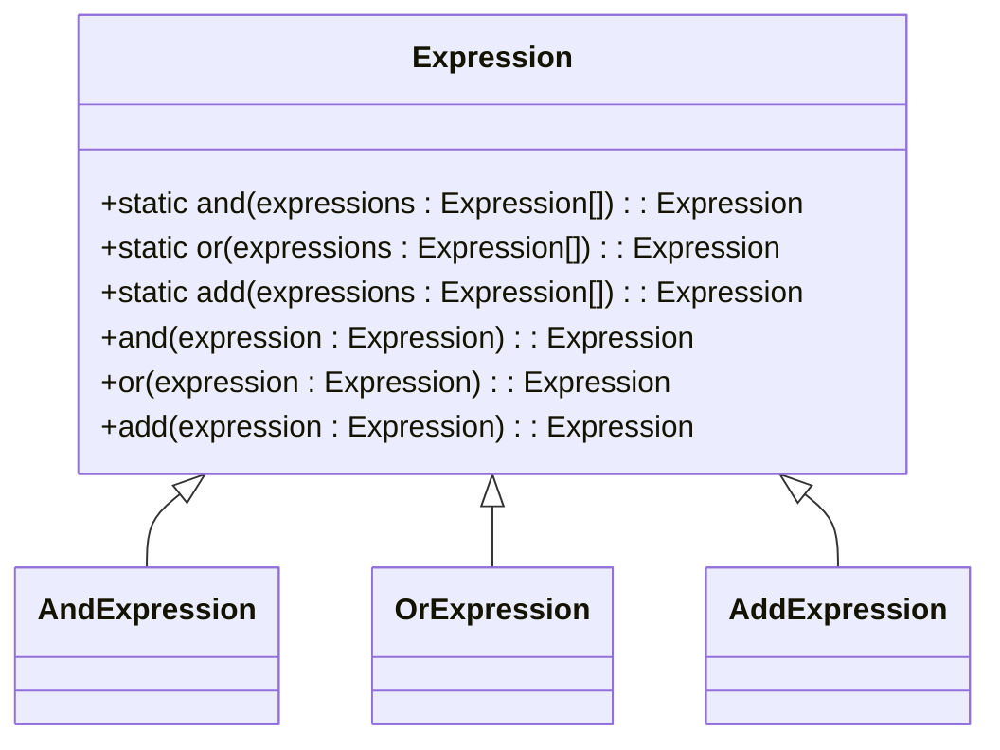

**图源**
- [baseExpression.ts](file://src/expressions/baseExpression.ts#L629-L673)

### 短路求值
Plywood实现了短路求值策略，当表达式的值可以提前确定时，跳过后续计算。

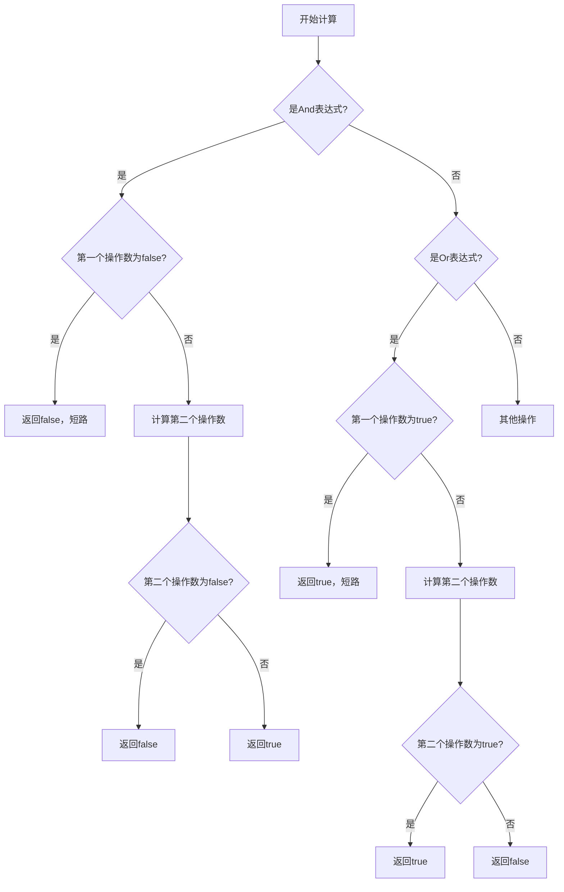

**图源**
- [andExpression.ts](file://src/expressions/andExpression.ts#L76-L129)
- [orExpression.ts](file://src/expressions/orExpression.ts#L74-L95)

**本节源码**
- [baseExpression.ts](file://src/expressions/baseExpression.ts#L629-L673)
- [andExpression.ts](file://src/expressions/andExpression.ts#L76-L129)
- [orExpression.ts](file://src/expressions/orExpression.ts#L74-L95)

## 空值处理与类型转换

Plywood对空值（null）和类型转换有明确的处理规则，确保表达式计算的可靠性和一致性。

### 空值处理
当操作数为null时，大多数比较和逻辑操作返回null，表示未知值。

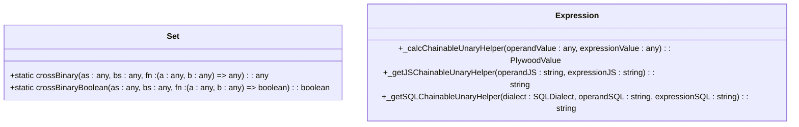

**图源**
- [set.ts](file://src/datatypes/set.ts#L90-L92)
- [baseExpression.ts](file://src/expressions/baseExpression.ts#L441-L2189)

### 类型转换规则
Plywood在不同类型之间进行转换时遵循特定的规则，确保语义一致性。

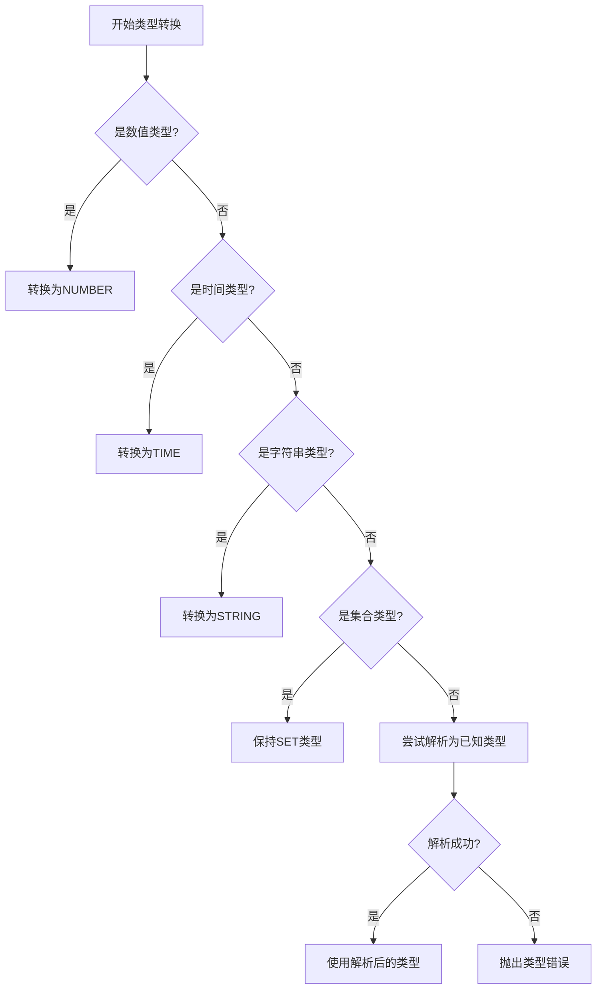

**图源**
- [baseExpression.ts](file://src/expressions/baseExpression.ts#L441-L2189)

**本节源码**
- [set.ts](file://src/datatypes/set.ts#L90-L92)
- [baseExpression.ts](file://src/expressions/baseExpression.ts#L441-L2189)

## 查询优化与德摩根定律

Plywood实现了多种查询优化策略，包括德摩根定律的应用和表达式简化。

### 德摩根定律
德摩根定律用于优化逻辑表达式，将复杂的否定操作转换为更简单的形式。

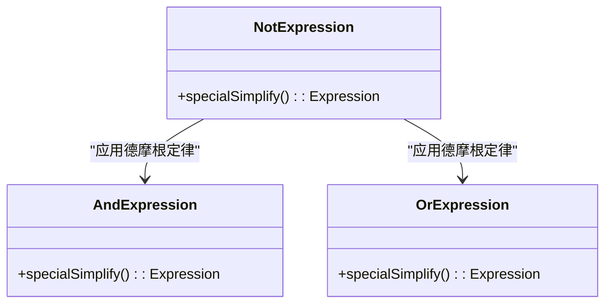

**图源**
- [notExpression.ts](file://src/expressions/notExpression.ts#L46-L50)
- [andExpression.ts](file://src/expressions/andExpression.ts#L76-L129)
- [orExpression.ts](file://src/expressions/orExpression.ts#L74-L95)

### 表达式简化
表达式简化通过`simplify()`方法实现，可以消除冗余操作和常量表达式。

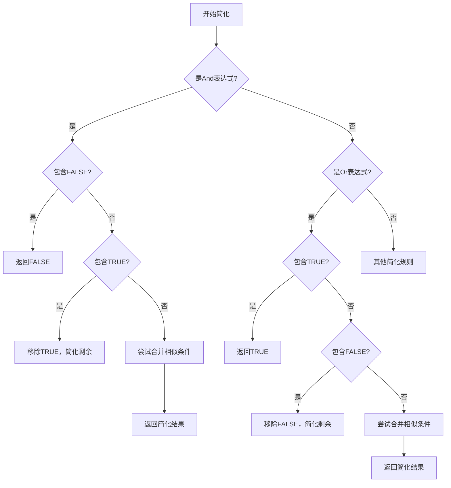

**图源**
- [andExpression.ts](file://src/expressions/andExpression.ts#L76-L129)
- [orExpression.ts](file://src/expressions/orExpression.ts#L74-L95)

**本节源码**
- [notExpression.ts](file://src/expressions/notExpression.ts#L46-L50)
- [andExpression.ts](file://src/expressions/andExpression.ts#L76-L129)
- [orExpression.ts](file://src/expressions/orExpression.ts#L74-L95)

## 数据库方言差异

Plywood支持多种数据库方言，每种方言对逻辑表达式的处理略有不同。

### 基本方言接口
所有数据库方言都继承自`SQLDialect`基类，实现特定的SQL生成方法。

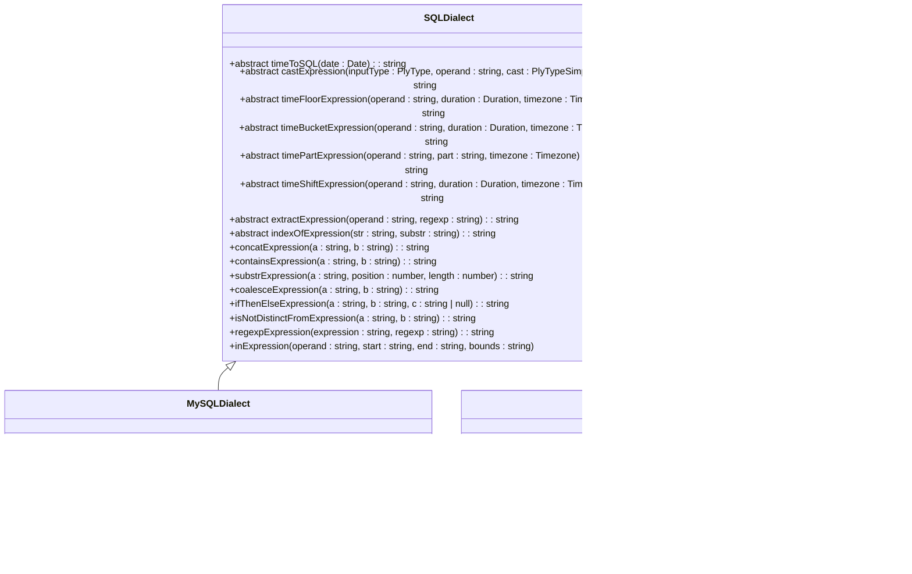

**图源**
- [baseDialect.ts](file://src/dialect/baseDialect.ts#L21-L172)
- [mySqlDialect.ts](file://src/dialect/mySqlDialect.ts#L22-L174)
- [clickHouseDialect.ts](file://src/dialect/clickHouseDialect.ts#L22-L163)

### 具体方言实现
不同数据库方言在逻辑表达式生成上有特定的实现差异。

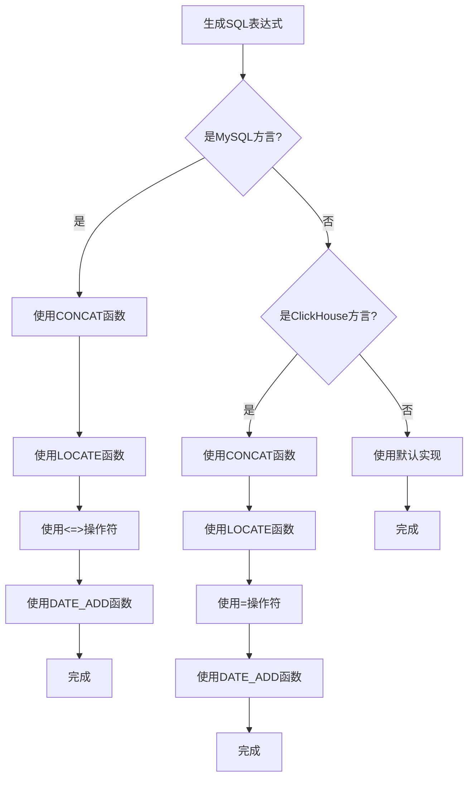

**图源**
- [mySqlDialect.ts](file://src/dialect/mySqlDialect.ts#L22-L174)
- [clickHouseDialect.ts](file://src/dialect/clickHouseDialect.ts#L22-L163)

**本节源码**
- [baseDialect.ts](file://src/dialect/baseDialect.ts#L21-L172)
- [mySqlDialect.ts](file://src/dialect/mySqlDialect.ts#L22-L174)
- [clickHouseDialect.ts](file://src/dialect/clickHouseDialect.ts#L22-L163)

## 应用场景

Plywood逻辑表达式在多种场景下都有广泛应用，包括数据过滤和条件聚合。

### 数据过滤
逻辑表达式主要用于数据过滤操作，通过`filter`方法应用条件。

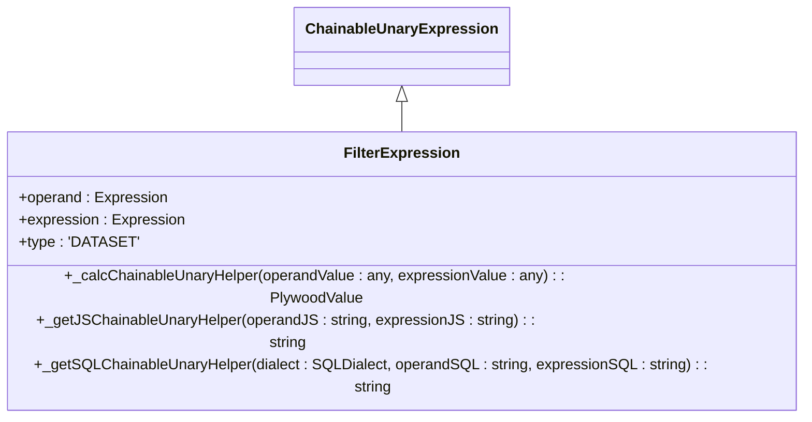

**图源**
- [filterExpression.ts](file://src/expressions/filterExpression.ts)

### 条件聚合
逻辑表达式也可用于条件聚合，根据条件对数据进行分组和统计。

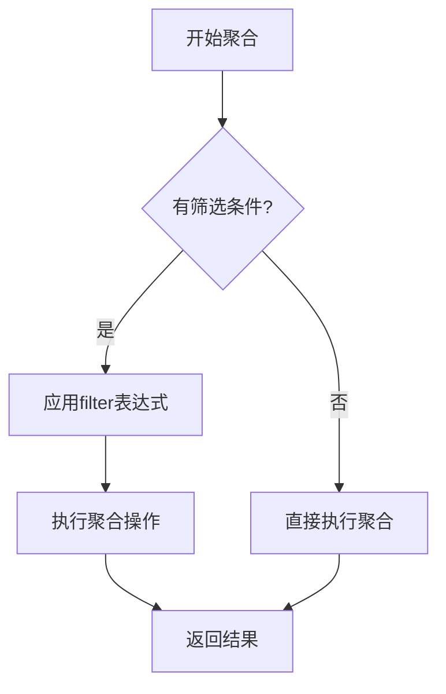

**图源**
- [filterExpression.ts](file://src/expressions/filterExpression.ts)

**本节源码**
- [filterExpression.ts](file://src/expressions/filterExpression.ts)

## 结论
Plywood逻辑表达式系统提供了一套完整、灵活且高效的条件判断机制。通过链式调用和表达式组合，可以构建复杂的查询条件。系统还实现了多种优化策略，包括短路求值、表达式简化和德摩根定律应用，确保查询性能。不同数据库方言的支持使得该系统可以在多种环境中使用，具有良好的可移植性。