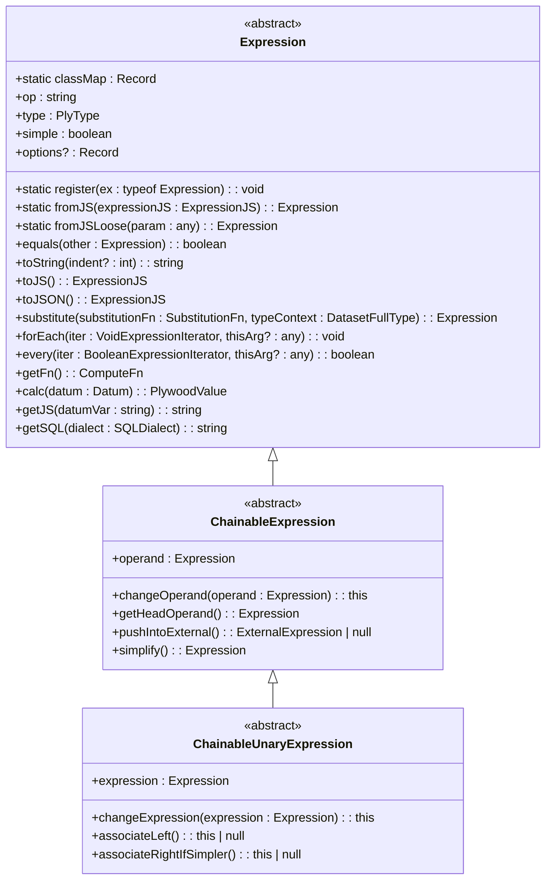
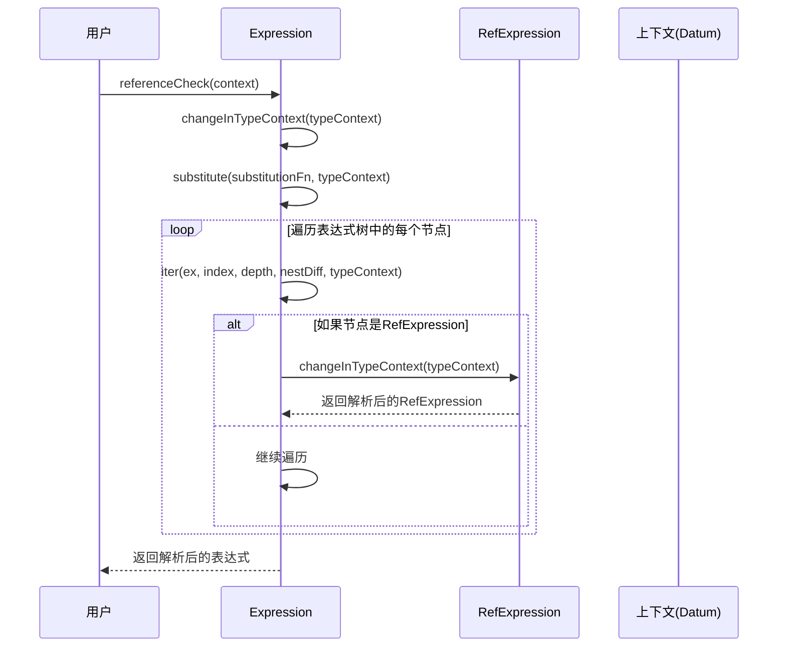
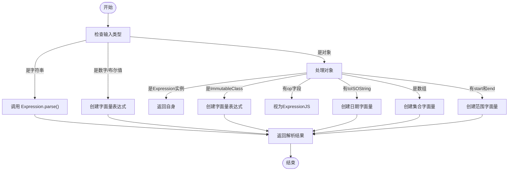

# 基础表达式

<cite>
**本文档中引用的文件**
- [baseExpression.ts](file://src/expressions/baseExpression.ts)
- [refExpression.ts](file://src/expressions/refExpression.ts)
- [literalExpression.ts](file://src/expressions/literalExpression.ts)
</cite>

## 目录
1. [简介](#简介)
2. [核心设计原理](#核心设计原理)
3. [表达式解析与序列化](#表达式解析与序列化)
4. [类型检查与上下文解析](#类型检查与上下文解析)
5. [链式调用机制](#链式调用机制)
6. [静态方法实现](#静态方法实现)
7. [操作符注册与Mixin机制](#操作符注册与mixin机制)
8. [继承关系与子类](#继承关系与子类)
9. [实际应用示例](#实际应用示例)
10. [结论](#结论)

## 简介
`baseExpression.ts` 文件定义了 Plywood 库中所有表达式的核心抽象基类 `Expression`。该基类为所有具体表达式（如算术、逻辑、聚合等）提供了统一的接口和基础功能，是整个表达式系统的基础。`Expression` 类采用抽象类设计，通过继承和多态机制，实现了丰富的表达式功能。它不仅支持表达式的创建、解析和序列化，还提供了类型检查、上下文解析、链式调用等高级特性。该设计使得 Plywood 能够以声明式的方式构建复杂的数据查询和转换逻辑，为上层应用提供了强大的数据处理能力。

**Section sources**
- [baseExpression.ts](file://src/expressions/baseExpression.ts#L0-L100)

## 核心设计原理
`Expression` 抽象基类的设计遵循了面向对象和函数式编程的混合范式。其核心设计原理体现在以下几个方面：首先，它通过 `op`（操作符）和 `type`（类型）属性来标识表达式的种类和数据类型，这是实现多态和类型安全的基础。其次，类的构造函数被设计为私有，强制要求通过静态工厂方法（如 `fromJS`）来创建实例，这保证了对象创建过程的统一性和可控性。此外，`Expression` 类实现了 `Instance` 接口，支持不可变性（immutability），所有修改操作都会返回新的表达式实例，而非修改原实例，这有助于避免副作用并简化状态管理。最后，通过 `substitute`、`forEach`、`every` 等高阶函数，该类提供了强大的表达式遍历和变换能力，为表达式的优化、简化和求值奠定了基础。

**Diagram sources**
- [baseExpression.ts](file://src/expressions/baseExpression.ts#L600-L3105)

## 表达式解析与序列化
`Expression` 类提供了完整的表达式解析与序列化能力。序列化通过 `toJS()` 和 `toJSON()` 方法实现，将表达式对象转换为标准的 JavaScript 对象表示（POJO），该对象可以被 `JSON.stringify` 安全地序列化。`toJS()` 方法返回一个包含 `op` 和 `options` 等元数据的简单对象，子类会重写此方法以包含其特有的属性。解析过程则由静态方法 `fromJS()` 和 `fromJSLoose()` 完成。`fromJS()` 是严格的解析方法，它接收一个符合 `ExpressionJS` 接口的 JSON 对象，根据 `op` 字段从 `classMap` 中查找对应的构造函数，并调用其 `fromJS` 方法来实例化具体的表达式。`fromJSLoose()` 则更为灵活，它能处理多种输入形式，如原始值（数字、字符串）、数组（转换为集合）、日期对象等，并能自动调用 `Expression.parse()` 来解析字符串形式的表达式，极大地简化了表达式的创建过程。

**Section sources**
- [baseExpression.ts](file://src/expressions/baseExpression.ts#L723-L772)
- [baseExpression.ts](file://src/expressions/baseExpression.ts#L538-L583)

## 类型检查与上下文解析
`Expression` 类内置了强大的类型检查和上下文解析机制。类型检查通过 `canHaveType()` 方法实现，它能判断一个表达式是否可能具有某种期望的类型，例如，当期望类型为 "SET" 时，任何集合类型（如 SET/STRING）都会被匹配。上下文解析是表达式求值的关键步骤，它确保表达式中的引用（`RefExpression`）在给定的数据上下文（`Datum`）中是有效且类型正确的。`referenceCheck()` 方法通过 `changeInTypeContext()` 和 `substitute()` 方法，遍历表达式树，将每个 `RefExpression` 替换为一个在当前上下文中解析后的、带有正确类型和嵌套层级的新引用。`resolve()` 方法则更进一步，它将表达式中的自由引用（free references）根据提供的上下文环境解析为具体的值（如字面量或外部数据源），从而将一个抽象的表达式转换为一个可以求值的具体表达式。

**Diagram sources**
- [baseExpression.ts](file://src/expressions/baseExpression.ts#L1705-L1784)
- [refExpression.ts](file://src/expressions/refExpression.ts#L234-L275)

## 链式调用机制
`Expression` 类通过继承 `ChainableExpression` 和 `ChainableUnaryExpression` 基类，实现了流畅的链式调用（fluent interface）API。`ChainableExpression` 代表一个以另一个表达式为操作数（`operand`）的表达式，它定义了 `add()`、`multiply()`、`filter()` 等一系列方法。这些方法的实现都依赖于私有的 `_mkChain()` 辅助函数。`_mkChain()` 函数接收一个目标表达式类（如 `AddExpression`）和一系列参数，然后以当前表达式为起点，逐个将参数包装成新的链式表达式实例，并将它们连接起来。例如，`$('x').add(1).add(2)` 的调用过程是：首先 `$('x')` 创建一个 `RefExpression`，然后第一次 `add(1)` 调用 `_mkChain(AddExpression, [1])`，创建一个 `AddExpression`，其 `operand` 指向 `$('x')`；第二次 `add(2)` 再次调用 `_mkChain(AddExpression, [2])`，创建一个新的 `AddExpression`，其 `operand` 指向前一个 `AddExpression`，从而形成一个链式结构。这种设计使得 API 调用非常直观和易读。

**Section sources**
- [baseExpression.ts](file://src/expressions/baseExpression.ts#L1198-L1253)
- [baseExpression.ts](file://src/expressions/baseExpression.ts#L2587-L2639)

## 静态方法实现
`Expression` 类提供了多个实用的静态方法，用于组合和创建表达式。`and()` 和 `or()` 方法用于逻辑组合，它们利用 `chainVia()` 函数，将一个表达式数组通过逻辑与（AND）或逻辑或（OR）操作符连接起来，分别以 `Expression.FALSE` 和 `Expression.TRUE` 作为初始值。`add()`、`subtract()`、`multiply()` 等算术方法同样使用 `chainVia()`，以 `Expression.ZERO` 或 `Expression.ONE` 为初始值进行组合。`chainVia()` 函数是这些方法的核心，它通过迭代数组，将前一个结果作为下一个操作的左操作数，从而实现链式组合。`parse()` 方法用于解析字符串形式的表达式，它会利用 PEG.js 生成的解析器将字符串转换为表达式对象。`fromJSLoose()` 方法则是一个“宽松”的反序列化方法，它能智能地处理各种输入类型，是创建表达式最常用的方式之一。

**Diagram sources**
- [baseExpression.ts](file://src/expressions/baseExpression.ts#L635-L675)
- [baseExpression.ts](file://src/expressions/baseExpression.ts#L538-L583)

## 操作符注册与mixin机制
`Expression` 类通过一个静态的 `classMap` 对象来管理所有具体表达式的注册。`classMap` 是一个以操作符（`op`）为键、以构造函数为值的映射表。`register()` 静态方法负责将新的表达式类注册到 `classMap` 中。当通过 `fromJS()` 反序列化时，系统会根据 JSON 对象中的 `op` 字段查找 `classMap`，从而确定应该实例化哪个具体的表达式类。这种设计实现了表达式的可扩展性，新的表达式类型可以独立开发并动态注册。此外，`Expression` 类还实现了 `applyMixins()` 静态方法，用于应用 Mixin 模式。该方法通过复制原型链上的方法，将一个或多个“特征类”（mixin）的功能混合到目标类中。这在 `mixins/` 目录下的 `aggregate.ts` 和 `hasTimezone.ts` 等文件中得到了应用，允许不同的表达式类复用通用的功能，而无需通过多重继承。

**Section sources**
- [baseExpression.ts](file://src/expressions/baseExpression.ts#L677-L721)

## 继承关系与子类
`Expression` 类是整个表达式体系的根节点，它通过多层继承形成了一个清晰的类层次结构。`ChainableExpression` 是 `Expression` 的直接子类，代表了所有可以链式调用的表达式，它引入了 `operand` 属性。`ChainableUnaryExpression` 则继承自 `ChainableExpression`，代表了那些除了 `operand` 外，还需要一个 `expression` 参数的表达式，如 `add`、`lessThan` 等。绝大多数具体的表达式类（如 `AddExpression`、`AndExpression`、`FilterExpression`）都直接或间接地继承自 `ChainableUnaryExpression`。`LiteralExpression` 和 `RefExpression` 是两个特殊的直接子类，它们不参与链式调用，而是作为表达式树的叶子节点存在。`LiteralExpression` 代表常量值，`RefExpression` 代表对数据源中某个字段的引用。这种继承关系确保了代码的高度复用和结构的清晰性。

```mermaid
classDiagram
Expression <|-- ChainableExpression
Expression <|-- LiteralExpression
Expression <|-- RefExpression
ChainableExpression <|-- ChainableUnaryExpression
ChainableUnaryExpression <|-- AddExpression
ChainableUnaryExpression <|-- AndExpression
ChainableUnaryExpression <|-- FilterExpression
ChainableUnaryExpression <|-- ApplyExpression
ChainableUnaryExpression <|-- SortExpression
ChainableUnaryExpression <|-- SplitExpression
ChainableUnaryExpression <|-- SumExpression
ChainableUnaryExpression <|-- AverageExpression
ChainableUnaryExpression <|-- CountExpression
ChainableUnaryExpression <|-- MaxExpression
ChainableUnaryExpression <|-- MinExpression
ChainableUnaryExpression <|-- TimeBucketExpression
ChainableUnaryExpression <|-- TimeFloorExpression
ChainableUnaryExpression <|-- TimeShiftExpression
ChainableUnaryExpression <|-- NumberBucketExpression
ChainableUnaryExpression <|-- CastExpression
ChainableUnaryExpression <|-- ConcatExpression
ChainableUnaryExpression <|-- ContainsExpression
ChainableUnaryExpression <|-- InExpression
ChainableUnaryExpression <|-- OverlapExpression
ChainableUnaryExpression <|-- IsExpression
ChainableUnaryExpression <|-- NotExpression
ChainableUnaryExpression <|-- GreaterThanExpression
ChainableUnaryExpression <|-- LessThanExpression
ChainableUnaryExpression <|-- GreaterThanOrEqualExpression
ChainableUnaryExpression <|-- LessThanOrEqualExpression
ChainableUnaryExpression <|-- TransformCaseExpression
ChainableUnaryExpression <|-- ExtractExpression
ChainableUnaryExpression <|-- SubstrExpression
ChainableUnaryExpression <|-- LengthExpression
ChainableUnaryExpression <|-- LookupExpression
ChainableUnaryExpression <|-- IndexOfExpression
ChainableUnaryExpression <|-- MultiplyExpression
ChainableUnaryExpression <|-- DivideExpression
ChainableUnaryExpression <|-- ModExpression
ChainableUnaryExpression <|-- PowerExpression
ChainableUnaryExpression <|-- LogExpression
ChainableUnaryExpression <|-- QuantileExpression
ChainableUnaryExpression <|-- CollectExpression
ChainableUnaryExpression <|-- CountDistinctExpression
ChainableUnaryExpression <|-- CardinalityExpression
ChainableUnaryExpression <|-- AbsoluteExpression
ChainableUnaryExpression <|-- JoinExpression
ChainableUnaryExpression <|-- LimitExpression
ChainableUnaryExpression <|-- SelectExpression
ChainableUnaryExpression <|-- ExternalExpression
ChainableUnaryExpression <|-- FallbackExpression
ChainableUnaryExpression <|-- ThenExpression
ChainableUnaryExpression <|-- CustomAggregateExpression
ChainableUnaryExpression <|-- CustomTransformExpression
ChainableUnaryExpression <|-- BitwiseAndExpression
```

**Diagram sources**
- [baseExpression.ts](file://src/expressions/baseExpression.ts#L600-L3105)
- [literalExpression.ts](file://src/expressions/literalExpression.ts#L26-L74)
- [refExpression.ts](file://src/expressions/refExpression.ts#L44-L88)

## 实际应用示例
以下示例展示了如何从基础表达式构建复杂的查询。首先，使用 `$()` 函数创建一个对 "count" 字段的引用 `RefExpression`。然后，通过链式调用 `.add(1)` 将其包装成一个 `AddExpression`。接着，使用 `.filter()` 方法添加一个过滤条件，该条件本身也是一个由 `$('time')` 和 `r(new Date())` 组成的 `LessThanExpression`。最后，通过 `.split()` 方法进行分组，`split` 方法接收一个包含多个 `Expression` 的对象，用于定义分组的维度。整个表达式最终会被求值或转换为底层数据源（如 Druid 或 SQL）的查询语句。这个例子清晰地展示了 `Expression` 基类如何通过组合和链式调用，将简单的操作符组合成一个复杂的数据处理管道。

**Section sources**
- [baseExpression.ts](file://src/expressions/baseExpression.ts#L1198-L1253)

## 结论
`Expression` 抽象基类是 Plywood 库的核心，它通过精心设计的面向对象架构，为构建复杂的数据查询语言提供了坚实的基础。其核心优势在于统一的接口、强大的类型系统、灵活的链式调用 API 以及可扩展的注册机制。通过 `fromJS`/`toJS` 实现的序列化能力，使得表达式可以在不同系统间安全传输。类型检查和上下文解析确保了查询的正确性。链式调用极大地提升了代码的可读性和开发效率。操作符注册机制则保证了系统的开放性和可维护性。总而言之，`baseExpression.ts` 中的设计模式是构建领域特定语言（DSL）的一个优秀范例，它将复杂的数据操作抽象为简洁、直观的代码，是 Plywood 能够高效处理大规模数据分析任务的关键所在。