# 字符串与时间表达式

<cite>
**本文档中引用的文件**  
- [concatExpression.ts](file://src/expressions/concatExpression.ts)
- [substrExpression.ts](file://src/expressions/substrExpression.ts)
- [containsExpression.ts](file://src/expressions/containsExpression.ts)
- [matchExpression.ts](file://src/expressions/matchExpression.ts)
- [transformCaseExpression.ts](file://src/expressions/transformCaseExpression.ts)
- [timeFloorExpression.ts](file://src/expressions/timeFloorExpression.ts)
- [timeBucketExpression.ts](file://src/expressions/timeBucketExpression.ts)
- [timeShiftExpression.ts](file://src/expressions/timeShiftExpression.ts)
- [timePartExpression.ts](file://src/expressions/timePartExpression.ts)
- [druidDialect.ts](file://src/dialect/druidDialect.ts)
- [mySqlDialect.ts](file://src/dialect/mySqlDialect.ts)
- [postgresDialect.ts](file://src/dialect/postgresDialect.ts)
- [clickHouseDialect.ts](file://src/dialect/clickHouseDialect.ts)
- [baseDialect.ts](file://src/dialect/baseDialect.ts)
- [baseExpression.ts](file://src/expressions/baseExpression.ts)
</cite>

## 目录
1. [简介](#简介)
2. [字符串表达式](#字符串表达式)
3. [时间表达式](#时间表达式)
4. [SQL方言差异](#sql方言差异)
5. [实际应用示例](#实际应用示例)
6. [结论](#结论)

## 简介

Plywood提供了一套强大的表达式系统，用于处理字符串和时间数据。本文档详细介绍了字符串操作（如concat、substr、contains、match、大小写转换）的实现机制，以及时间表达式（timeFloor、timeBucket、timeShift、timePart）如何处理时区和时间间隔。文档还说明了这些表达式在不同数据库方言（Druid、MySQL等）中的SQL生成差异。

**Section sources**
- [baseExpression.ts](file://src/expressions/baseExpression.ts#L1393-L1524)

## 字符串表达式

### 字符串连接 (concat)

`concat`表达式用于将两个或多个字符串连接在一起。该表达式是可结合的，意味着可以链式调用多个字符串进行连接。

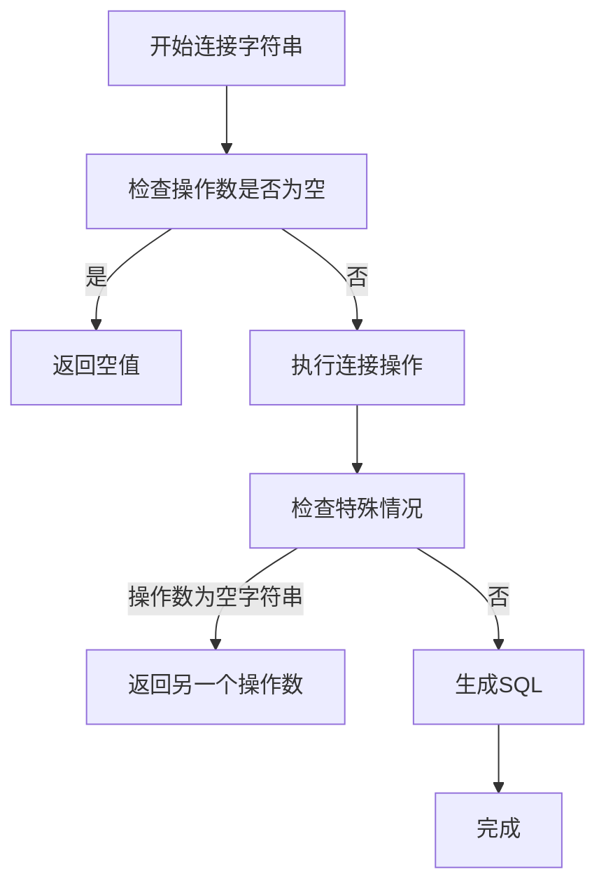

**Diagram sources**
- [concatExpression.ts](file://src/expressions/concatExpression.ts#L20-L62)
- [baseDialect.ts](file://src/dialect/baseDialect.ts#L102-L104)

**Section sources**
- [concatExpression.ts](file://src/expressions/concatExpression.ts#L20-L62)
- [baseDialect.ts](file://src/dialect/baseDialect.ts#L102-L104)

### 子字符串提取 (substr)

`substr`表达式用于从字符串中提取子字符串。它接受起始位置和长度作为参数。

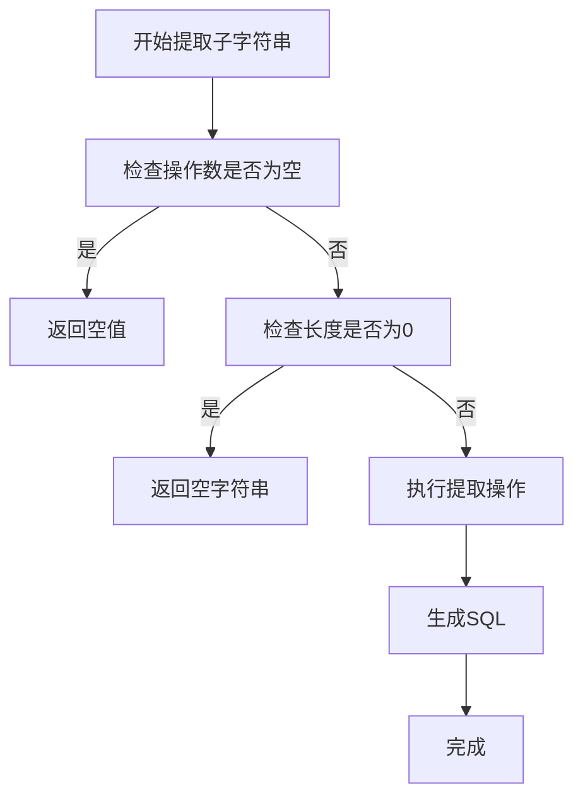

**Diagram sources**
- [substrExpression.ts](file://src/expressions/substrExpression.ts#L20-L89)
- [baseDialect.ts](file://src/dialect/baseDialect.ts#L106-L108)

**Section sources**
- [substrExpression.ts](file://src/expressions/substrExpression.ts#L20-L89)
- [baseDialect.ts](file://src/dialect/baseDialect.ts#L106-L108)

### 字符串包含 (contains)

`contains`表达式用于检查一个字符串是否包含另一个字符串。支持区分大小写和不区分大小写两种比较模式。

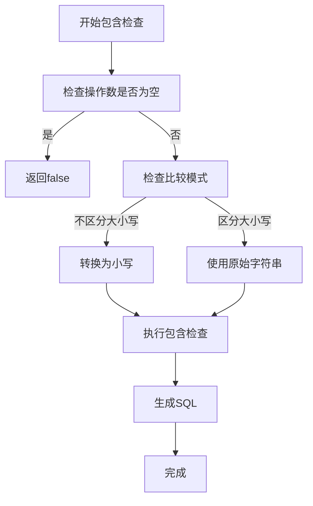

**Diagram sources**
- [containsExpression.ts](file://src/expressions/containsExpression.ts#L21-L138)
- [baseDialect.ts](file://src/dialect/baseDialect.ts#L110-L112)

**Section sources**
- [containsExpression.ts](file://src/expressions/containsExpression.ts#L21-L138)
- [baseDialect.ts](file://src/dialect/baseDialect.ts#L110-L112)

### 正则表达式匹配 (match)

`match`表达式用于检查字符串是否匹配指定的正则表达式。

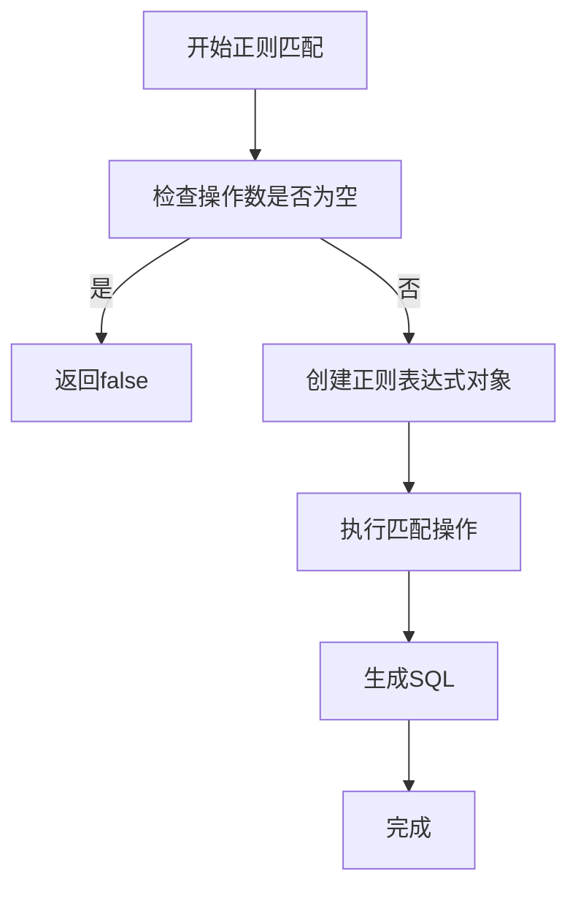

**Diagram sources**
- [matchExpression.ts](file://src/expressions/matchExpression.ts#L24-L103)
- [baseDialect.ts](file://src/dialect/baseDialect.ts#L161-L161)

**Section sources**
- [matchExpression.ts](file://src/expressions/matchExpression.ts#L24-L103)
- [baseDialect.ts](file://src/dialect/baseDialect.ts#L161-L161)

### 大小写转换 (transformCase)

`transformCase`表达式用于将字符串转换为大写或小写。

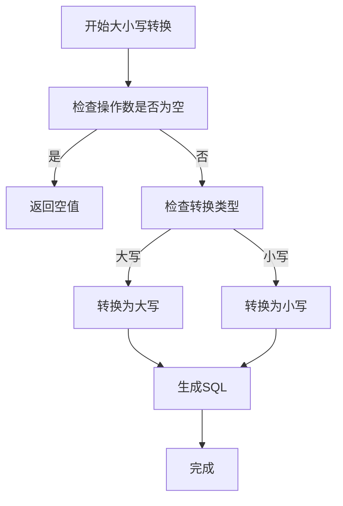

**Diagram sources**
- [transformCaseExpression.ts](file://src/expressions/transformCaseExpression.ts#L20-L84)
- [baseDialect.ts](file://src/dialect/baseDialect.ts#L163-L163)

**Section sources**
- [transformCaseExpression.ts](file://src/expressions/transformCaseExpression.ts#L20-L84)
- [baseDialect.ts](file://src/dialect/baseDialect.ts#L163-L163)

## 时间表达式

### 时间向下取整 (timeFloor)

`timeFloor`表达式用于将时间值向下取整到指定的时间间隔（如小时、天、周等）。

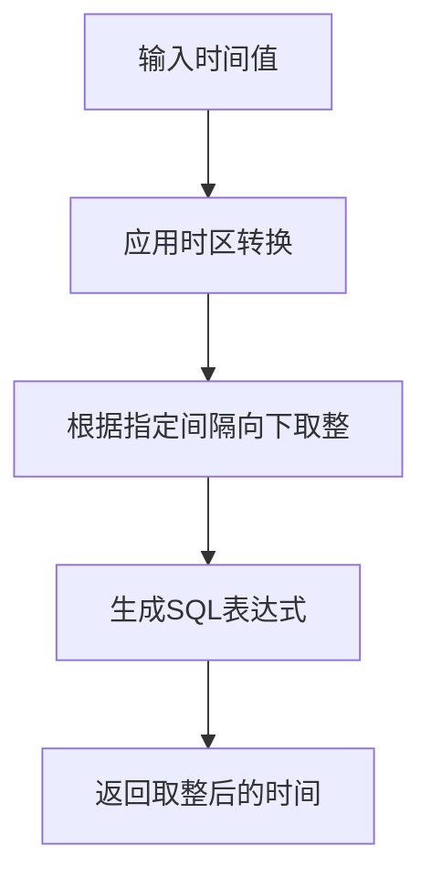

**Diagram sources**
- [timeFloorExpression.ts](file://src/expressions/timeFloorExpression.ts#L25-L130)
- [baseDialect.ts](file://src/dialect/baseDialect.ts#L165-L165)

**Section sources**
- [timeFloorExpression.ts](file://src/expressions/timeFloorExpression.ts#L25-L130)
- [baseDialect.ts](file://src/dialect/baseDialect.ts#L165-L165)

### 时间桶 (timeBucket)

`timeBucket`表达式用于创建时间范围，表示从给定时间开始的指定时间间隔。

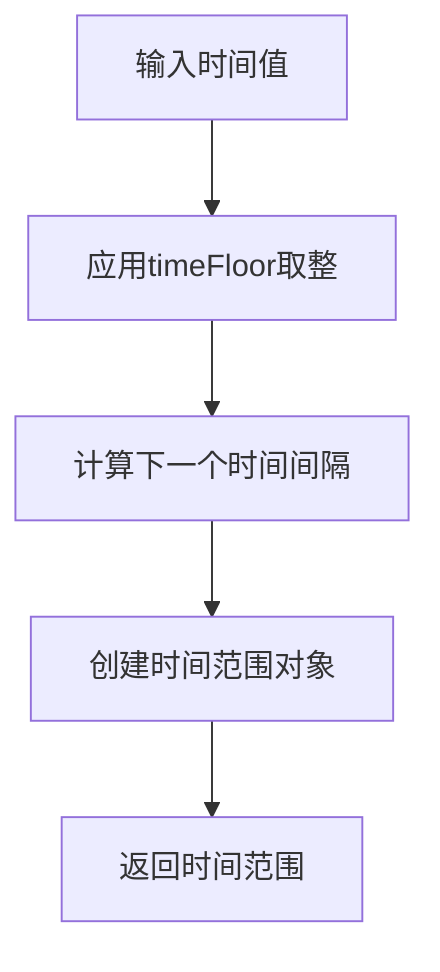

**Diagram sources**
- [timeBucketExpression.ts](file://src/expressions/timeBucketExpression.ts#L24-L93)
- [baseDialect.ts](file://src/dialect/baseDialect.ts#L167-L167)

**Section sources**
- [timeBucketExpression.ts](file://src/expressions/timeBucketExpression.ts#L24-L93)
- [baseDialect.ts](file://src/dialect/baseDialect.ts#L167-L167)

### 时间偏移 (timeShift)

`timeShift`表达式用于将时间值向前或向后移动指定的时间间隔。

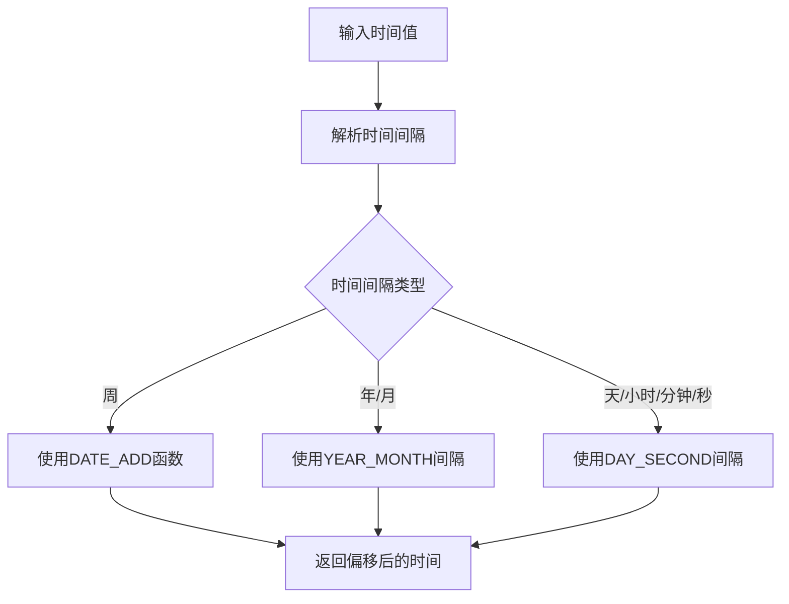

**Diagram sources**
- [timeShiftExpression.ts](file://src/expressions/timeShiftExpression.ts#L24-L121)
- [baseDialect.ts](file://src/dialect/baseDialect.ts#L167-L167)

**Section sources**
- [timeShiftExpression.ts](file://src/expressions/timeShiftExpression.ts#L24-L121)
- [baseDialect.ts](file://src/dialect/baseDialect.ts#L167-L167)

### 时间部分提取 (timePart)

`timePart`表达式用于从时间值中提取特定部分（如小时、分钟、星期几等）。

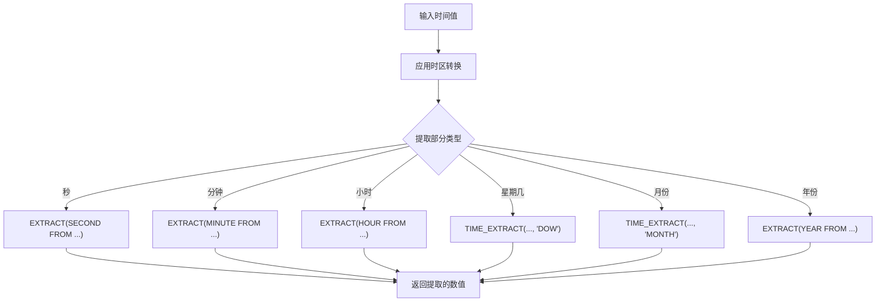

**Diagram sources**
- [timePartExpression.ts](file://src/expressions/timePartExpression.ts#L24-L164)
- [baseDialect.ts](file://src/dialect/baseDialect.ts#L167-L167)

**Section sources**
- [timePartExpression.ts](file://src/expressions/timePartExpression.ts#L24-L164)
- [baseDialect.ts](file://src/dialect/baseDialect.ts#L167-L167)

## SQL方言差异

### 字符串操作的SQL生成

不同数据库对字符串操作的SQL语法有不同的实现：

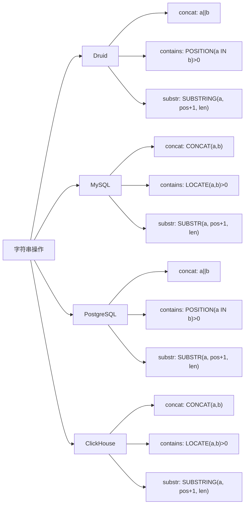

**Diagram sources**
- [druidDialect.ts](file://src/dialect/druidDialect.ts#L103-L117)
- [mySqlDialect.ts](file://src/dialect/mySqlDialect.ts#L95-L101)
- [postgresDialect.ts](file://src/dialect/postgresDialect.ts#L88-L94)
- [clickHouseDialect.ts](file://src/dialect/clickHouseDialect.ts#L91-L97)

**Section sources**
- [druidDialect.ts](file://src/dialect/druidDialect.ts#L103-L117)
- [mySqlDialect.ts](file://src/dialect/mySqlDialect.ts#L95-L101)
- [postgresDialect.ts](file://src/dialect/postgresDialect.ts#L88-L94)
- [clickHouseDialect.ts](file://src/dialect/clickHouseDialect.ts#L91-L97)

### 时间操作的SQL生成

不同数据库对时间操作的SQL语法也有差异：

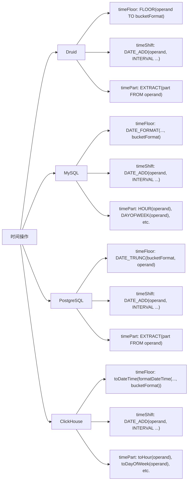

**Diagram sources**
- [druidDialect.ts](file://src/dialect/druidDialect.ts#L129-L161)
- [mySqlDialect.ts](file://src/dialect/mySqlDialect.ts#L123-L163)
- [postgresDialect.ts](file://src/dialect/postgresDialect.ts#L116-L148)
- [clickHouseDialect.ts](file://src/dialect/clickHouseDialect.ts#L119-L152)

**Section sources**
- [druidDialect.ts](file://src/dialect/druidDialect.ts#L129-L161)
- [mySqlDialect.ts](file://src/dialect/mySqlDialect.ts#L123-L163)
- [postgresDialect.ts](file://src/dialect/postgresDialect.ts#L116-L148)
- [clickHouseDialect.ts](file://src/dialect/clickHouseDialect.ts#L119-L152)

## 实际应用示例

### 时间窗口查询

构建时间窗口查询的示例：

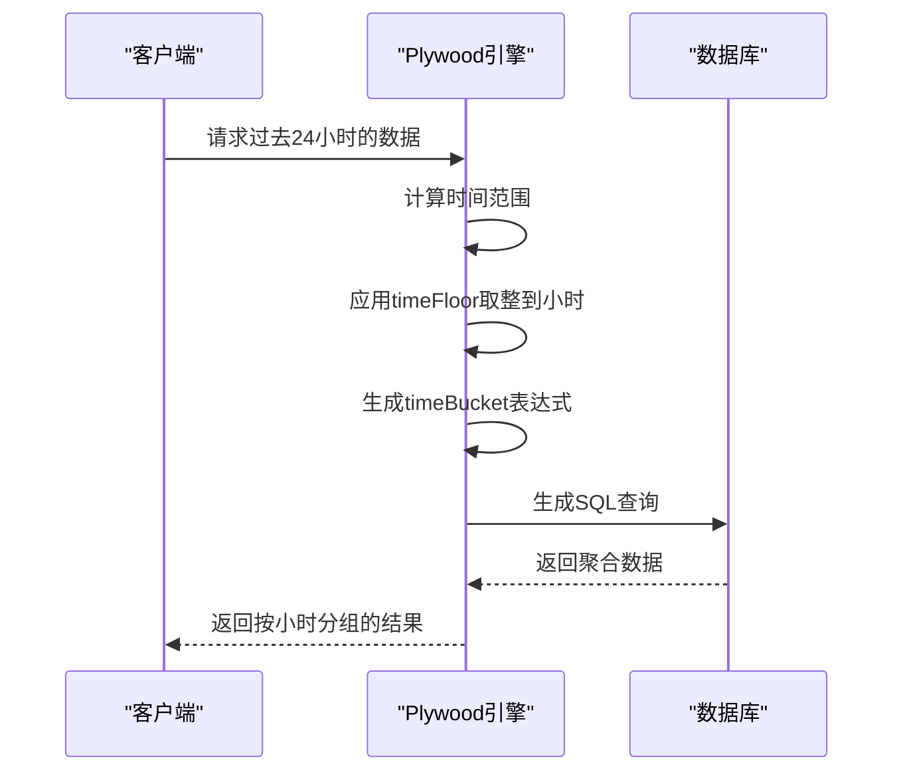

**Diagram sources**
- [timeFloorExpression.ts](file://src/expressions/timeFloorExpression.ts#L25-L130)
- [timeBucketExpression.ts](file://src/expressions/timeBucketExpression.ts#L24-L93)

### 字符串模式匹配

字符串模式匹配的示例：

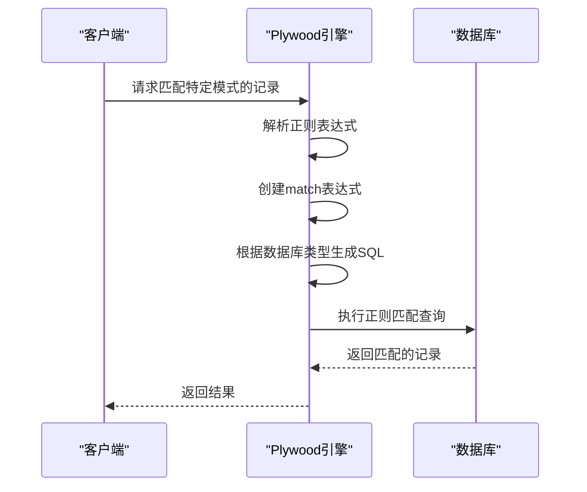

**Diagram sources**
- [matchExpression.ts](file://src/expressions/matchExpression.ts#L24-L103)
- [baseDialect.ts](file://src/dialect/baseDialect.ts#L161-L161)

## 结论

Plywood的字符串和时间表达式系统提供了强大而灵活的数据处理能力。通过统一的API，开发者可以轻松地进行字符串操作和时间序列分析，同时系统会根据目标数据库的方言自动生成相应的SQL语句。这种抽象层使得应用程序可以轻松地在不同的数据库系统之间迁移，而无需修改核心的查询逻辑。

**Section sources**
- [baseExpression.ts](file://src/expressions/baseExpression.ts#L1393-L1524)
- [baseDialect.ts](file://src/dialect/baseDialect.ts#L102-L167)