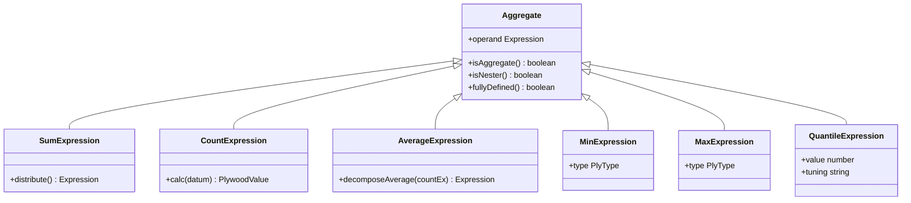
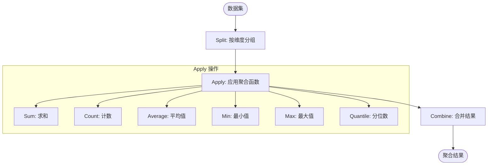
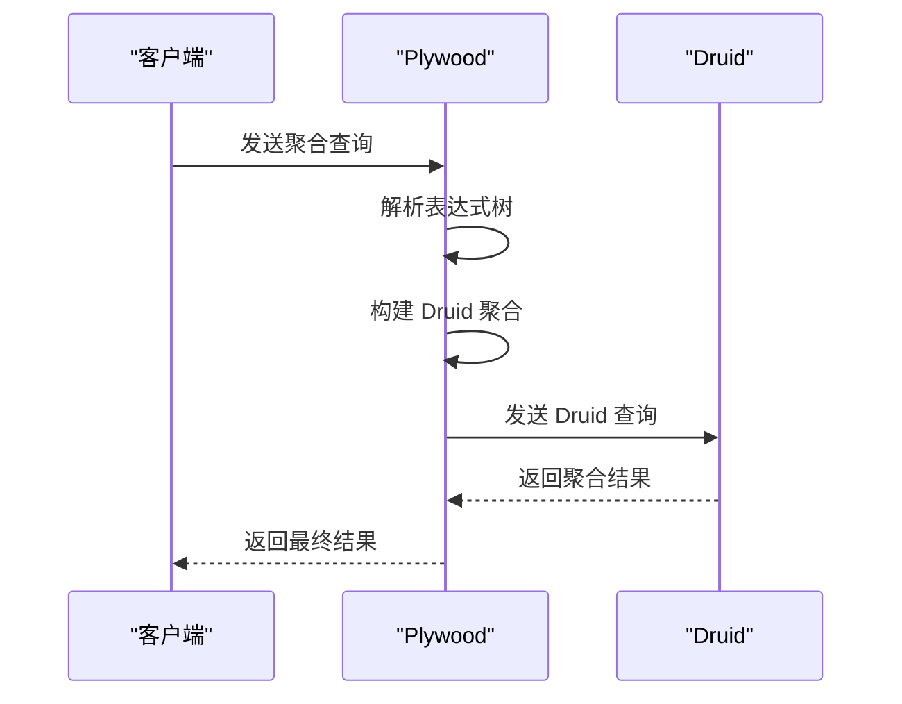
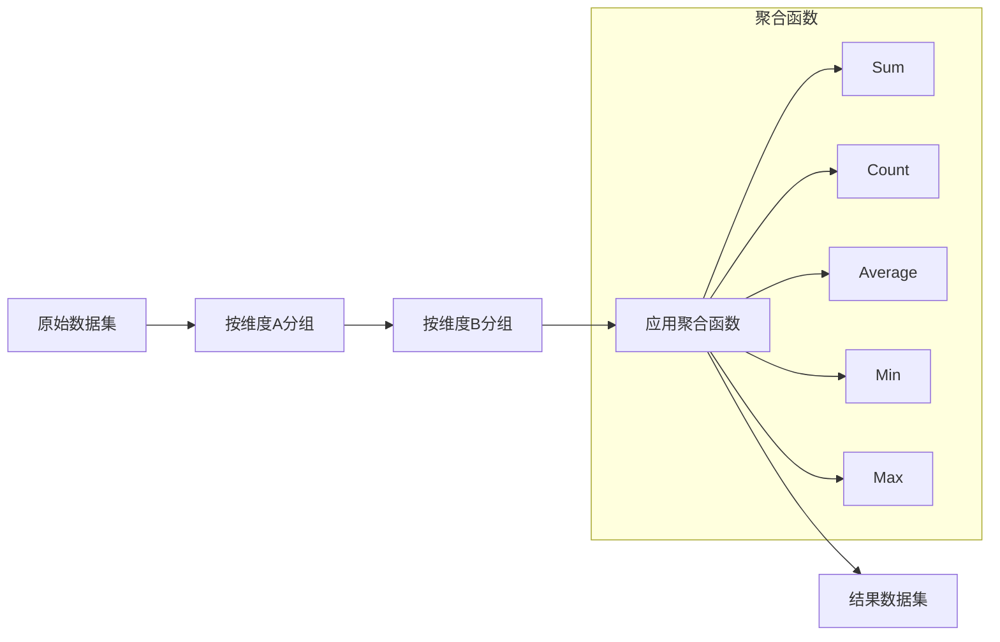

# 聚合表达式

<cite>
**本文档引用的文件**
- [sumExpression.ts](file://src/expressions/sumExpression.ts)
- [countExpression.ts](file://src/expressions/countExpression.ts)
- [averageExpression.ts](file://src/expressions/averageExpression.ts)
- [minExpression.ts](file://src/expressions/minExpression.ts)
- [maxExpression.ts](file://src/expressions/maxExpression.ts)
- [quantileExpression.ts](file://src/expressions/quantileExpression.ts)
- [cardinalityExpression.ts](file://src/expressions/cardinalityExpression.ts)
- [aggregate.ts](file://src/expressions/mixins/aggregate.ts)
- [dataset.ts](file://src/datatypes/dataset.ts)
- [druidAggregationBuilder.ts](file://src/external/utils/druidAggregationBuilder.ts)
- [druidExternal.ts](file://src/external/druidExternal.ts)
</cite>

## 目录
1. [引言](#引言)
2. [聚合函数实现机制](#聚合函数实现机制)
3. [Aggregate Mixin 通用能力](#aggregate-mixin-通用能力)
4. [Split-Apply-Combine 操作](#split-apply-combine-操作)
5. [与外部数据源集成](#与外部数据源集成)
6. [多维度聚合查询构建](#多维度聚合查询构建)
7. [类型推断与性能优化](#类型推断与性能优化)
8. [近似聚合使用场景](#近似聚合使用场景)

## 引言
Plywood 聚合表达式系统提供了一套强大的数据聚合功能，支持 sum、count、average、min、max、quantile 等多种聚合函数。该系统通过表达式树结构实现复杂的数据分析操作，能够在内存中对 Dataset 进行高效聚合计算，并支持与外部数据源（如 Druid）的集成。聚合表达式是 Plywood 数据分析能力的核心组成部分，为数据查询和分析提供了灵活而强大的工具。

## 聚合函数实现机制

### Sum 聚合函数
Sum 聚合函数用于计算数值表达式的总和。在 Plywood 中，SumExpression 类实现了该功能，继承自 ChainableUnaryExpression 并混入 Aggregate 特性。该函数通过遍历数据集中的每个数据项，对指定表达式求值并累加结果。在 SQL 生成中，它被转换为 SUM() 函数调用。SumExpression 还实现了 distribute() 方法，用于优化表达式，例如将 X.sum(lhs + rhs) 优化为 X.sum(lhs) + X.sum(rhs)。

**Section sources**
- [sumExpression.ts](file://src/expressions/sumExpression.ts#L25-L77)
- [dataset.ts](file://src/datatypes/dataset.ts#L792-L801)

### Count 聚合函数
Count 聚合函数用于计算数据集中的记录数量。CountExpression 类实现了这一功能，其计算逻辑简单直接，返回数据集的长度。在 SQL 生成中，当没有 WHERE 子句时使用 COUNT(*)，否则使用 SUM() 函数配合条件过滤。CountExpression 的实现考虑了性能优化，在简单情况下直接返回计数结果。

**Section sources**
- [countExpression.ts](file://src/expressions/countExpression.ts#L21-L42)
- [dataset.ts](file://src/datatypes/dataset.ts#L710-L712)

### Average 聚合函数
Average 聚合函数用于计算数值表达式的平均值。AverageExpression 类通过组合 sum 和 count 操作来实现平均值计算。其核心方法 decomposeAverage() 将平均值操作分解为 sum 除以 count 的表达式，这种分解方式使得平均值计算可以被优化和重写。在 SQL 生成中，它被转换为 AVG() 函数调用。

**Section sources**
- [averageExpression.ts](file://src/expressions/averageExpression.ts#L21-L47)
- [dataset.ts](file://src/datatypes/dataset.ts#L750-L759)

### Min 和 Max 聚合函数
Min 和 Max 聚合函数分别用于计算数值或时间表达式的最小值和最大值。MinExpression 和 MaxExpression 类实现了这些功能，它们遍历数据集并跟踪当前的最小值或最大值。这些函数支持 NUMBER 和 TIME 类型的数据，并在 SQL 生成中分别转换为 MIN() 和 MAX() 函数调用。

**Section sources**
- [minExpression.ts](file://src/expressions/minExpression.ts#L21-L42)
- [maxExpression.ts](file://src/expressions/maxExpression.ts#L21-L42)
- [dataset.ts](file://src/datatypes/dataset.ts#L771-L780)

### Quantile 聚合函数
Quantile 聚合函数用于计算数值表达式的分位数。QuantileExpression 类实现了这一功能，它首先收集所有非空值，然后对这些值进行排序，最后根据指定的分位数计算结果。该函数支持通过 tuning 参数进行性能调优，在与 Druid 集成时可以利用 Druid 的近似分位数算法。

**Section sources**
- [quantileExpression.ts](file://src/expressions/quantileExpression.ts#L20-L71)
- [dataset.ts](file://src/datatypes/dataset.ts#L817-L826)

## Aggregate Mixin 通用能力

**Diagram sources**
- [aggregate.ts](file://src/expressions/mixins/aggregate.ts#L18-L33)
- [sumExpression.ts](file://src/expressions/sumExpression.ts#L21-L42)
- [countExpression.ts](file://src/expressions/countExpression.ts#L21-L42)
- [averageExpression.ts](file://src/expressions/averageExpression.ts#L21-L47)
- [minExpression.ts](file://src/expressions/minExpression.ts#L21-L42)
- [maxExpression.ts](file://src/expressions/maxExpression.ts#L21-L42)
- [quantileExpression.ts](file://src/expressions/quantileExpression.ts#L20-L71)

Aggregate Mixin 为所有聚合表达式提供了通用的功能和接口。它定义了 isAggregate() 和 isNester() 方法，用于标识表达式类型和嵌套特性。该 Mixin 还提供了 fullyDefined() 方法，用于检查表达式是否完全定义，这对于表达式优化和简化至关重要。通过使用 Mixin 模式，Plywood 实现了聚合功能的代码复用和统一接口。

## Split-Apply-Combine 操作

**Diagram sources**
- [dataset.ts](file://src/datatypes/dataset.ts#L313-L1425)
- [splitExpression.ts](file://src/expressions/splitExpression.ts#L35-L292)

Split-Apply-Combine 是 Plywood 中处理聚合操作的核心模式。Split 阶段将数据集按指定维度分组，Apply 阶段对每个分组应用聚合函数，Combine 阶段将结果合并为最终的数据集。这种模式类似于 R 语言中的 plyr 包，为数据分析提供了直观而强大的抽象。在 Plywood 中，split() 方法负责分组操作，apply() 方法用于应用聚合函数。

## 与外部数据源集成

**Diagram sources**
- [druidAggregationBuilder.ts](file://src/external/utils/druidAggregationBuilder.ts#L74-L741)
- [druidExternal.ts](file://src/external/druidExternal.ts#L136-L2087)

Plywood 通过 DruidExternal 类与 Druid 数据源集成。DruidAggregationBuilder 负责将 Plywood 聚合表达式转换为 Druid 的聚合配置。对于精确聚合（如 sum、count），直接使用 Druid 的原生聚合；对于近似聚合（如 quantile），则使用 Druid 的近似算法。这种集成方式充分利用了 Druid 的分布式计算能力，同时保持了 Plywood 表达式的灵活性。

## 多维度聚合查询构建

**Diagram sources**
- [dataset.ts](file://src/datatypes/dataset.ts#L313-L1425)
- [splitExpression.ts](file://src/expressions/splitExpression.ts#L35-L292)

构建多维度聚合查询时，首先使用 split() 方法按多个维度分组，然后使用 apply() 方法应用所需的聚合函数。例如，可以按地区和产品类别分组，然后计算每个组合的销售额总和、订单数量和平均订单金额。这种查询构建方式直观且灵活，支持复杂的业务分析需求。

## 类型推断与性能优化

### 类型推断规则
Plywood 的类型推断系统确保聚合操作的类型安全。每个聚合函数都有明确的输入和输出类型：sum、count、average、min、max 和 quantile 都期望 NUMBER 类型的输入，输出也是 NUMBER 类型。类型推断在表达式构建时进行，确保只有兼容的表达式才能被聚合。这种静态类型检查有助于在早期发现错误，提高查询的可靠性。

### 性能优化策略
Plywood 实现了多种性能优化策略。对于 sum 操作，distribute() 方法可以将复杂的表达式分解为更简单的子表达式，便于优化。对于 count 操作，系统会直接返回数据集长度，避免不必要的遍历。在与外部数据源集成时，尽可能将聚合操作下推到数据源执行，减少数据传输量。此外，表达式简化和缓存机制也提高了查询性能。

**Section sources**
- [sumExpression.ts](file://src/expressions/sumExpression.ts#L25-L77)
- [countExpression.ts](file://src/expressions/countExpression.ts#L21-L42)
- [dataset.ts](file://src/datatypes/dataset.ts#L313-L1425)

## 近似聚合使用场景

### Cardinality 聚合
CardinalityExpression 类实现了基数（唯一值数量）的近似计算。在内部实现中，它利用 Druid 的 hyperUnique、thetaSketch 或 HLLSketch 等近似算法，在内存和精度之间取得平衡。这种近似聚合适用于大数据集的唯一值计数，如独立访客数（UV）统计。

### 使用限制
近似聚合的主要限制是精度和资源消耗。虽然近似算法可以显著减少内存使用和计算时间，但结果存在一定误差。此外，某些近似算法（如 hyperUnique）在数据集较小时可能不如精确计算高效。因此，在选择使用近似聚合时，需要权衡精度要求和性能需求。

**Section sources**
- [cardinalityExpression.ts](file://src/expressions/cardinalityExpression.ts#L20-L45)
- [druidAggregationBuilder.ts](file://src/external/utils/druidAggregationBuilder.ts#L284-L388)