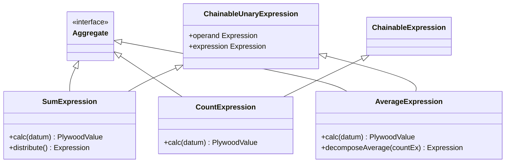
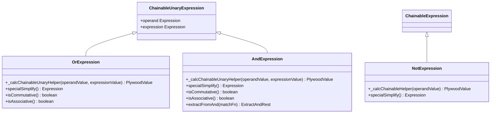
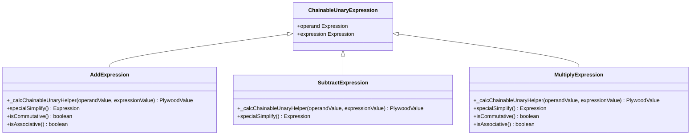
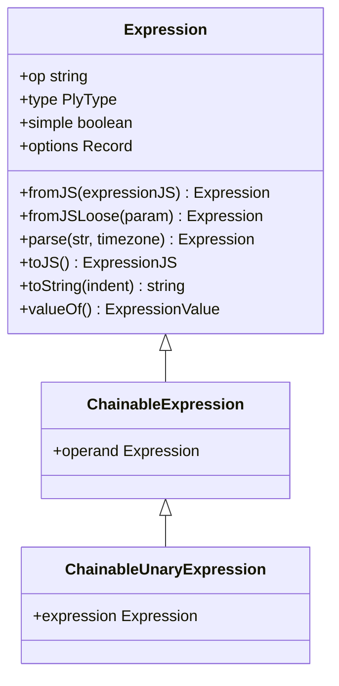
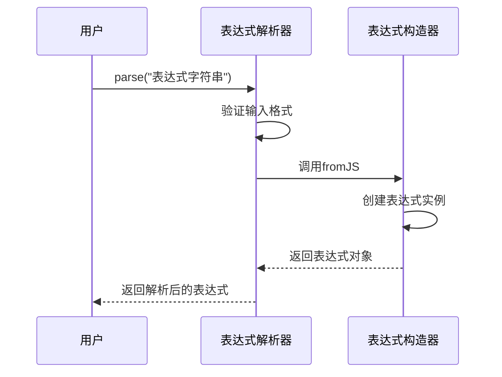
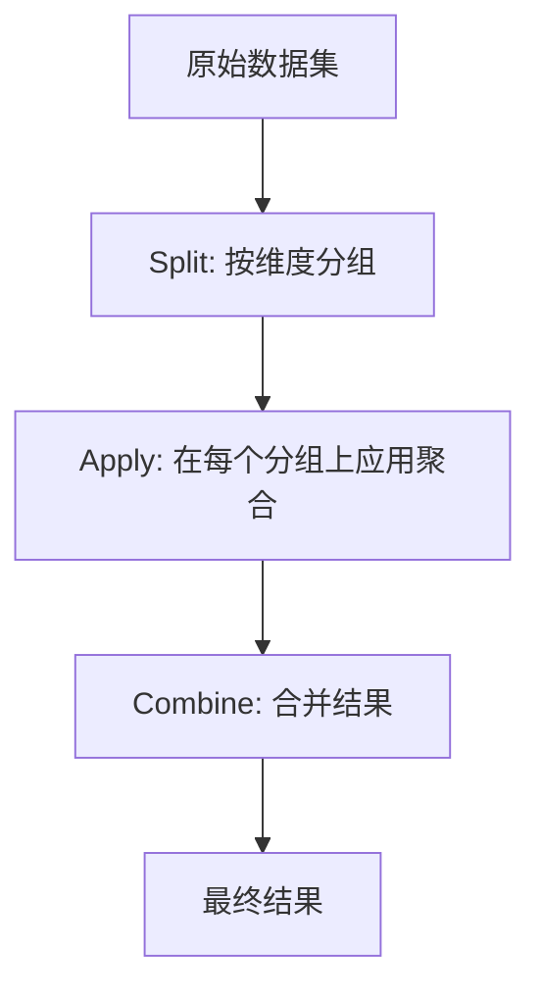
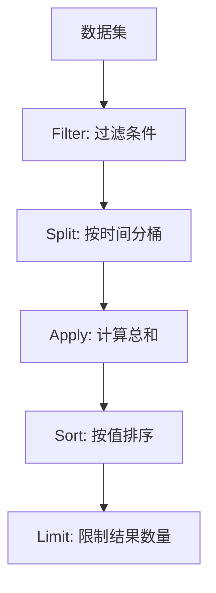
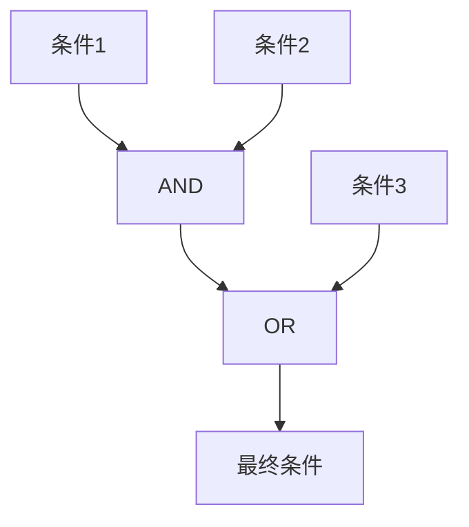
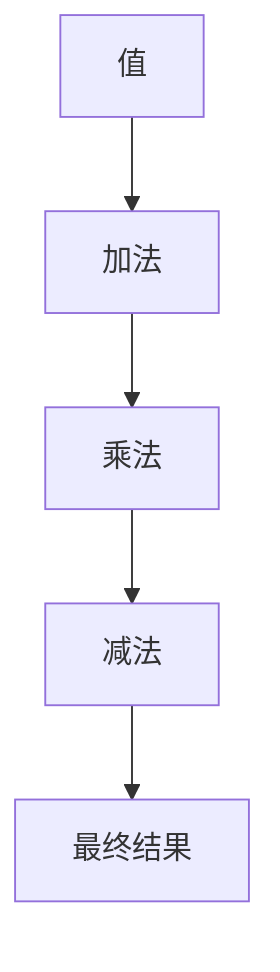

# 表达式系统

<cite>
**本文档中引用的文件**  
- [baseExpression.ts](file://src/expressions/baseExpression.ts)
- [sumExpression.ts](file://src/expressions/sumExpression.ts)
- [countExpression.ts](file://src/expressions/countExpression.ts)
- [averageExpression.ts](file://src/expressions/averageExpression.ts)
- [orExpression.ts](file://src/expressions/orExpression.ts)
- [andExpression.ts](file://src/expressions/andExpression.ts)
- [notExpression.ts](file://src/expressions/notExpression.ts)
- [addExpression.ts](file://src/expressions/addExpression.ts)
- [subtractExpression.ts](file://src/expressions/subtractExpression.ts)
- [multiplyExpression.ts](file://src/expressions/multiplyExpression.ts)
- [expressionParser.mocha.js](file://test/parser/expressionParser.mocha.js)
- [subtotalsSpecHelper.ts](file://src/expressions/subtotalsSpecHelper.ts)
</cite>

## 目录
1. [简介](#简介)
2. [表达式系统概述](#表达式系统概述)
3. [核心表达式类型](#核心表达式类型)
4. [基类设计与类型检查](#基类设计与类型检查)
5. [计算逻辑与执行机制](#计算逻辑与执行机制)
6. [表达式解析与序列化](#表达式解析与序列化)
7. [子总数规格优化](#子总数规格优化)
8. [链式调用与Split-Apply-Combine操作](#链式调用与split-apply-combine操作)
9. [表达式组合示例](#表达式组合示例)
10. [结论](#结论)

## 简介
Plywood表达式系统是该数据查询框架的核心查询语言，提供了一种强大而灵活的方式来构建复杂的数据分析查询。该系统通过链式调用方法，允许开发者以声明式的方式构建查询，支持从简单数据检索到复杂聚合分析的广泛操作。表达式系统的设计旨在提供类型安全、可组合性和可优化性，使查询既易于编写又高效执行。

## 表达式系统概述
Plywood表达式系统是一个面向对象的表达式语言，其中每个表达式都是一个对象，可以进行组合、转换和优化。系统以`Expression`抽象基类为核心，所有具体表达式类型都继承自该基类或其子类。表达式系统支持多种操作类型，包括基础表达式、聚合表达式、逻辑表达式和数学表达式，这些表达式可以通过链式调用来构建复杂的查询逻辑。

表达式系统的主要特点包括：
- **类型安全**：在编译时进行类型检查，确保表达式操作的类型正确性
- **可组合性**：表达式可以自由组合，形成复杂的查询逻辑
- **可优化性**：系统内置表达式简化和优化机制，提高查询执行效率
- **可序列化**：表达式可以序列化为JSON格式，便于存储和传输
- **可解析性**：支持从字符串解析表达式，提供灵活的查询构建方式

表达式系统作为核心查询语言，允许用户通过直观的API构建复杂的数据分析查询，而无需直接编写底层查询语言。

**Section sources**
- [baseExpression.ts](file://src/expressions/baseExpression.ts)

## 核心表达式类型
Plywood表达式系统包含多种表达式类型，每种类型对应特定的操作语义。这些表达式类型构成了查询语言的基础构建块，可以通过链式调用来组合成复杂的查询。

### 基础表达式
基础表达式是表达式系统的最基本类型，包括引用表达式（`RefExpression`）和字面量表达式（`LiteralExpression`）。引用表达式用于引用数据集中的字段，而字面量表达式表示常量值。这些基础表达式是构建更复杂表达式的起点。

### 聚合表达式
聚合表达式用于对数据集进行聚合操作，是数据分析查询的核心。主要聚合表达式包括：

**Diagram sources**
- [sumExpression.ts](file://src/expressions/sumExpression.ts)
- [countExpression.ts](file://src/expressions/countExpression.ts)
- [averageExpression.ts](file://src/expressions/averageExpression.ts)

`SumExpression`用于计算数值字段的总和，`CountExpression`用于计算数据集的行数，`AverageExpression`用于计算数值字段的平均值。这些聚合表达式都实现了`Aggregate`接口，并继承自`ChainableUnaryExpression`或`ChainableExpression`基类。

### 逻辑表达式
逻辑表达式用于构建布尔逻辑条件，支持AND、OR和NOT操作。这些表达式在数据过滤和条件判断中起着关键作用。

**Diagram sources**
- [orExpression.ts](file://src/expressions/orExpression.ts)
- [andExpression.ts](file://src/expressions/andExpression.ts)
- [notExpression.ts](file://src/expressions/notExpression.ts)

`OrExpression`实现逻辑或操作，`AndExpression`实现逻辑与操作，`NotExpression`实现逻辑非操作。这些表达式都具有简化优化功能，如`specialSimplify`方法，可以在编译时优化表达式树。

### 数学表达式
数学表达式用于执行数值计算，支持加、减、乘等基本数学运算。

**Diagram sources**
- [addExpression.ts](file://src/expressions/addExpression.ts)
- [subtractExpression.ts](file://src/expressions/subtractExpression.ts)
- [multiplyExpression.ts](file://src/expressions/multiplyExpression.ts)

这些数学表达式都继承自`ChainableUnaryExpression`，实现了相应的计算逻辑和优化规则。例如，`MultiplyExpression`的`specialSimplify`方法实现了乘法的零元素和单位元素优化。

**Section sources**
- [sumExpression.ts](file://src/expressions/sumExpression.ts)
- [countExpression.ts](file://src/expressions/countExpression.ts)
- [averageExpression.ts](file://src/expressions/averageExpression.ts)
- [orExpression.ts](file://src/expressions/orExpression.ts)
- [andExpression.ts](file://src/expressions/andExpression.ts)
- [notExpression.ts](file://src/expressions/notExpression.ts)
- [addExpression.ts](file://src/expressions/addExpression.ts)
- [subtractExpression.ts](file://src/expressions/subtractExpression.ts)
- [multiplyExpression.ts](file://src/expressions/multiplyExpression.ts)

## 基类设计与类型检查
`baseExpression.ts`文件定义了表达式系统的基类设计，是整个表达式系统的核心。`Expression`抽象类提供了所有表达式共享的基础功能和接口。

### 基类结构
`Expression`类是一个抽象基类，定义了表达式的基本属性和方法。每个表达式都有一个操作符（`op`）属性，用于标识表达式的类型。基类还定义了类型（`type`）属性，用于类型检查和推断。

**Diagram sources**
- [baseExpression.ts](file://src/expressions/baseExpression.ts)

`ChainableExpression`是`Expression`的子类，引入了`operand`属性，表示操作的操作数。`ChainableUnaryExpression`进一步扩展了`ChainableExpression`，添加了`expression`属性，用于二元操作。这种继承层次结构支持表达式的链式调用。

### 类型检查机制
表达式系统实现了严格的类型检查机制，确保表达式操作的类型安全性。基类提供了多种类型检查方法：

- `_checkOperandTypes`：检查操作数的类型
- `_checkExpressionTypes`：检查表达式的类型
- `_ensureOp`：确保操作符的正确性

这些方法在表达式构造时被调用，防止创建类型不匹配的表达式。例如，在`SumExpression`的构造函数中，会检查操作数类型是否为`DATASET`，表达式类型是否为`NUMBER`，并设置结果类型为`NUMBER`。

类型检查不仅在构造时进行，还在表达式简化和优化过程中持续进行，确保整个表达式树的类型一致性。

**Section sources**
- [baseExpression.ts](file://src/expressions/baseExpression.ts)

## 计算逻辑与执行机制
表达式系统的计算逻辑是其核心功能之一，决定了表达式如何被求值和执行。

### 计算方法
每个具体表达式类都实现了相应的计算方法，这些方法定义了表达式的求值逻辑。计算方法通常以`_calc`为前缀，如`_calcChainableHelper`和`_calcChainableUnaryHelper`。

对于链式表达式，计算逻辑通常涉及对操作数的递归求值，然后应用相应的操作。例如，`OrExpression`的`_calcChainableUnaryHelper`方法实现了逻辑或操作的计算逻辑，而`SumExpression`的`_calcChainableUnaryHelper`方法则委托给数据集的`sum`方法进行实际的聚合计算。

### 执行优化
表达式系统内置了多种执行优化机制，包括：

- **表达式简化**：通过`specialSimplify`方法在编译时简化表达式树
- **常量折叠**：将常量表达式提前计算
- **操作合并**：合并相同类型的操作以减少计算开销

这些优化机制显著提高了查询执行效率，特别是在处理复杂查询时。

**Section sources**
- [baseExpression.ts](file://src/expressions/baseExpression.ts)
- [sumExpression.ts](file://src/expressions/sumExpression.ts)
- [orExpression.ts](file://src/expressions/orExpression.ts)

## 表达式解析与序列化
表达式系统提供了强大的解析和序列化功能，支持表达式在不同表示形式之间的转换。

### 表达式解析
`Expression.parse`方法是表达式解析的核心，它将字符串形式的表达式转换为表达式对象树。解析器支持多种语法形式，包括：

- 直接表达式语法（如`$x + 1`）
- 方法调用语法（如`$x.add(1)`）
- 混合语法

解析器还支持时区参数，允许在特定时区上下文中解析日期字符串。

**Diagram sources**
- [baseExpression.ts](file://src/expressions/baseExpression.ts)
- [expressionParser.mocha.js](file://test/parser/expressionParser.mocha.js)

### 序列化机制
表达式系统支持完整的序列化和反序列化功能。`toJS`方法将表达式对象转换为JSON兼容的JavaScript对象，而`fromJS`方法则执行相反的转换。这种机制使得表达式可以轻松地在不同系统组件之间传输和存储。

序列化还支持宽松模式（`fromJSLoose`），可以处理多种输入格式，包括原始值、表达式对象和字符串。

**Section sources**
- [baseExpression.ts](file://src/expressions/baseExpression.ts)
- [expressionParser.mocha.js](file://test/parser/expressionParser.mocha.js)

## 子总数规格优化
表达式系统包含专门的子总数规格优化机制，用于优化特定类型的查询。

### SubtotalsSpec优化
`subtotalsSpecHelper.ts`文件提供了子总数规格的优化功能。这些优化主要针对分组聚合查询，通过预计算和缓存机制提高查询性能。

优化策略包括：
- 识别可优化的查询模式
- 重构表达式树以利用预计算结果
- 合并相似的聚合操作

这些优化在不影响查询语义的前提下，显著减少了计算开销和执行时间。

**Section sources**
- [subtotalsSpecHelper.ts](file://src/expressions/subtotalsSpecHelper.ts)

## 链式调用与Split-Apply-Combine操作
表达式系统的链式调用机制是其最强大的特性之一，特别适合构建Split-Apply-Combine模式的查询。

### 链式调用机制
链式调用允许将多个表达式操作串联在一起，形成流畅的查询构建语法。每个表达式方法返回一个新的表达式对象，使得可以连续调用多个方法。

这种设计模式不仅提高了代码的可读性，还支持复杂的查询构建。例如，可以轻松构建包含过滤、分组、聚合和排序的完整查询流程。

### Split-Apply-Combine模式
Split-Apply-Combine是一种常见的数据分析模式，表达式系统对此提供了原生支持。通过`split`、`apply`和`combine`等操作，可以轻松实现这种模式。

这种模式特别适合多维分析查询，允许对数据进行分组聚合，然后将结果组合成最终的分析报告。

**Section sources**
- [baseExpression.ts](file://src/expressions/baseExpression.ts)

## 表达式组合示例
表达式系统支持丰富的表达式组合方式，以下是一些典型的组合示例：

### 聚合查询组合

### 复合逻辑条件

### 数学计算链

这些示例展示了如何通过组合不同的表达式类型来构建复杂的查询逻辑。

**Section sources**
- [baseExpression.ts](file://src/expressions/baseExpression.ts)

## 结论
Plywood表达式系统是一个强大而灵活的查询语言框架，通过精心设计的基类结构、严格的类型检查、高效的计算逻辑和丰富的表达式类型，为数据分析提供了坚实的基础。系统的核心优势在于其链式调用机制和表达式组合能力，使得复杂的Split-Apply-Combine操作可以简洁而直观地表达。

表达式系统的模块化设计和可扩展性使其能够轻松支持新的表达式类型和优化策略。通过解析和序列化机制，表达式可以在不同表示形式之间无缝转换，提高了系统的互操作性和灵活性。

总体而言，Plywood表达式系统成功地平衡了表达能力、性能和易用性，为构建复杂的数据分析查询提供了一个优雅而高效的解决方案。