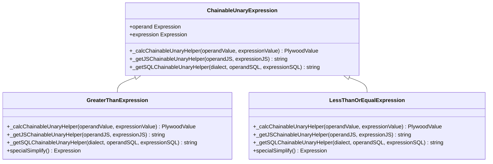
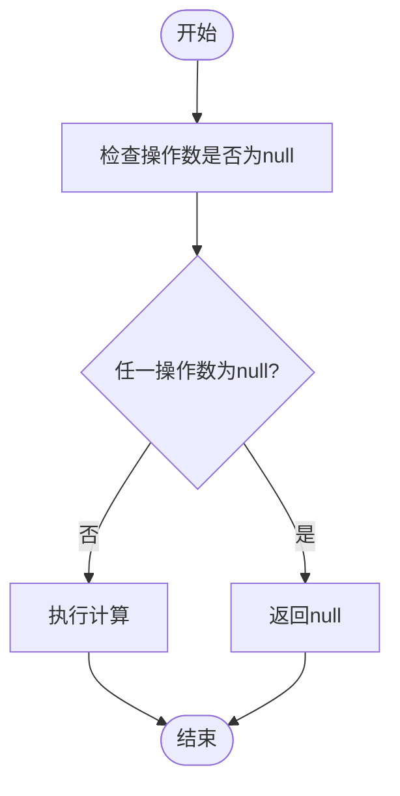

# 逻辑与数学表达式

<cite>
**本文档引用的文件**
- [andExpression.ts](file://src/expressions/andExpression.ts)
- [orExpression.ts](file://src/expressions/orExpression.ts)
- [notExpression.ts](file://src/expressions/notExpression.ts)
- [addExpression.ts](file://src/expressions/addExpression.ts)
- [subtractExpression.ts](file://src/expressions/subtractExpression.ts)
- [multiplyExpression.ts](file://src/expressions/multiplyExpression.ts)
- [divideExpression.ts](file://src/expressions/divideExpression.ts)
- [greaterThanExpression.ts](file://src/expressions/greaterThanExpression.ts)
- [lessThanOrEqualExpression.ts](file://src/expressions/lessThanOrEqualExpression.ts)
- [baseExpression.ts](file://src/expressions/baseExpression.ts)
- [set.ts](file://src/datatypes/set.ts)
</cite>

## 目录
1. [逻辑表达式](#逻辑表达式)
2. [数学表达式](#数学表达式)
3. [比较表达式](#比较表达式)
4. [复杂表达式组合](#复杂表达式组合)
5. [JavaScript空值安全处理](#javascript空值安全处理)

## 逻辑表达式

Plywood中的逻辑表达式通过`and`、`or`和`not`操作符实现，这些操作符分别对应`AndExpression`、`OrExpression`和`NotExpression`类。这些表达式继承自`ChainableExpression`基类，实现了链式调用和类型检查功能。

`and`和`or`表达式具有交换律和结合律特性，这意味着操作数的顺序不会影响最终结果。在实现上，`AndExpression`和`OrExpression`都通过`_getJSChainableUnaryHelper`方法生成JavaScript代码，分别使用`&&`和`||`操作符。对于SQL生成，它们使用`AND`和`OR`关键字。

`not`表达式通过`NotExpression`类实现，其`_calcChainableHelper`方法直接对操作数取反。在JavaScript代码生成中，使用`!`操作符，而在SQL中使用`NOT`关键字。

这些逻辑表达式在简化过程中会进行优化。例如，`and`表达式会检查是否与`FALSE`或`TRUE`进行运算，如果是，则直接返回相应结果。同样，`or`表达式也会进行类似的优化。

**逻辑表达式来源**
- [andExpression.ts](file://src/expressions/andExpression.ts#L34-L127)
- [orExpression.ts](file://src/expressions/orExpression.ts#L25-L96)
- [notExpression.ts](file://src/expressions/notExpression.ts#L21-L51)

## 数学表达式

Plywood的数学表达式包括`add`、`subtract`、`multiply`和`divide`操作，分别由`AddExpression`、`SubtractExpression`、`MultiplyExpression`和`DivideExpression`类实现。这些表达式都继承自`ChainableUnaryExpression`基类，确保了统一的接口和行为。

所有数学表达式都要求操作数为数字类型，并在构造函数中进行类型检查。`_calcChainableUnaryHelper`方法负责计算逻辑，使用`Set.crossBinary`方法处理集合运算。在JavaScript代码生成中，这些表达式直接使用相应的数学操作符（`+`、`-`、`*`、`/`）。

`add`和`multiply`表达式具有交换律和结合律特性，这在优化过程中被充分利用。例如，`multiply`表达式会检查是否与`0`或`1`相乘，如果是，则直接返回`0`或原操作数。`subtract`和`divide`表达式虽然不具有交换律，但也有类似的优化逻辑。

**数学表达式来源**
- [addExpression.ts](file://src/expressions/addExpression.ts#L20-L60)
- [subtractExpression.ts](file://src/expressions/subtractExpression.ts#L22-L54)
- [multiplyExpression.ts](file://src/expressions/multiplyExpression.ts#L22-L68)
- [divideExpression.ts](file://src/expressions/divideExpression.ts#L20-L61)

## 比较表达式

比较表达式如`greaterThan`和`lessThanOrEqual`通过`GreaterThanExpression`和`LessThanOrEqualExpression`类实现。这些表达式支持数字、时间和字符串类型的比较，并在构造函数中进行类型对齐检查。

`_calcChainableUnaryHelper`方法使用`Set.crossBinaryBoolean`函数处理集合间的比较运算。在JavaScript和SQL代码生成中，直接使用相应的比较操作符（`>`、`<=`等）。这些表达式还实现了简化优化，例如将`x > 7`转换为范围重叠检查。

类型安全检查机制通过`_checkOperandTypes`和`_checkExpressionTypes`方法实现，确保操作数类型一致。对于时间类型，还通过`_bumpOperandExpressionToTime`方法进行类型提升，确保比较的准确性。

**比较表达式来源**
- [greaterThanExpression.ts](file://src/expressions/greaterThanExpression.ts#L22-L64)
- [lessThanOrEqualExpression.ts](file://src/expressions/lessThanOrEqualExpression.ts#L22-L68)
- [baseExpression.ts](file://src/expressions/baseExpression.ts#L441-L2189)

## 复杂表达式组合

Plywood允许通过组合逻辑和数学表达式来构建复杂的过滤条件和计算字段。这种组合能力通过表达式的链式调用和嵌套实现。例如，可以创建一个表达式来计算满足特定条件的数值总和。

在实现上，`Expression`基类提供了`and`、`or`、`add`、`multiply`等方法，这些方法返回新的表达式实例，从而实现链式调用。`Set`类的`crossBinary`和`crossBinaryBoolean`方法支持集合间的运算，使得表达式能够处理复杂的多值情况。

复杂表达式的构建遵循特定的优化规则。例如，`and`表达式会尝试合并具有相同操作数的`is`或`overlap`表达式。这种优化通过`merge`静态方法实现，提高了表达式的执行效率。

**复杂表达式组合来源**
- [baseExpression.ts](file://src/expressions/baseExpression.ts#L441-L2189)
- [set.ts](file://src/datatypes/set.ts#L53-L475)

## JavaScript空值安全处理

JavaScript空值安全处理通过`jsNullSafetyBinary`静态方法实现。该方法在`baseExpression.ts`文件中定义，用于生成安全的JavaScript代码，避免因`null`值导致的运行时错误。

`jsNullSafetyBinary`方法接受两个操作数和一个组合函数，生成的代码会先检查操作数是否为`null`，只有在都不为`null`时才执行实际的计算。这种方法通过临时变量`_`和`_2`来存储操作数的值，避免重复计算。

性能影响方面，这种空值检查会增加额外的条件判断，但在大多数情况下，这种开销是可以接受的。对于已知非空的操作数，可以通过`lhsCantBeNull`和`rhsCantBeNull`参数来优化生成的代码，减少不必要的检查。

**JavaScript空值安全处理来源**
- [baseExpression.ts](file://src/expressions/baseExpression.ts#L583-L631)