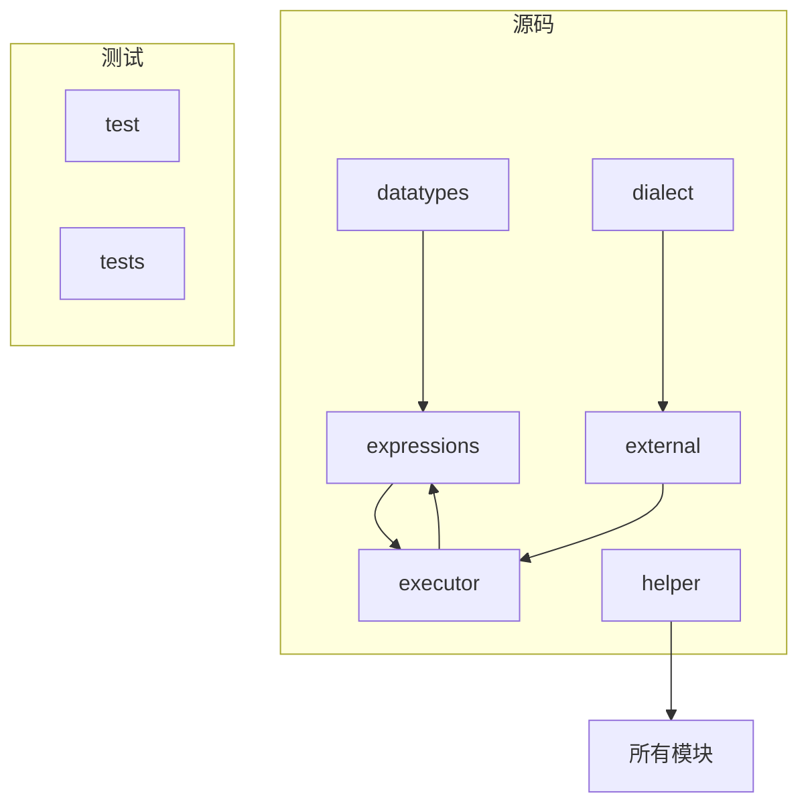
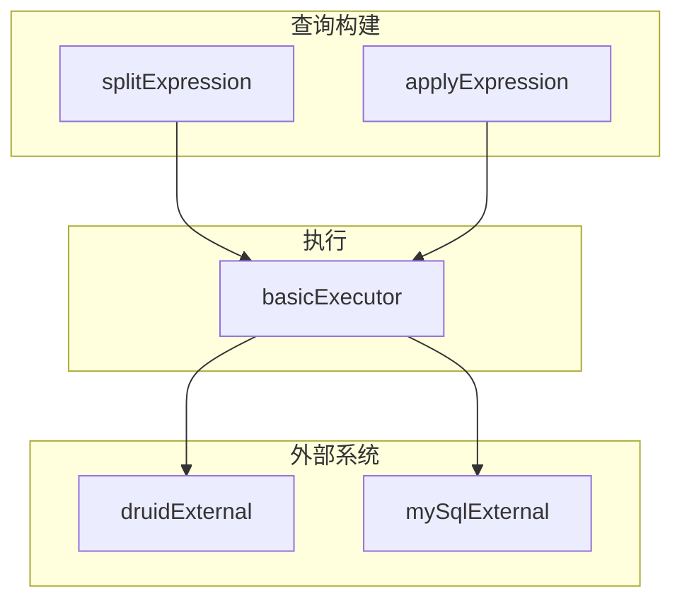
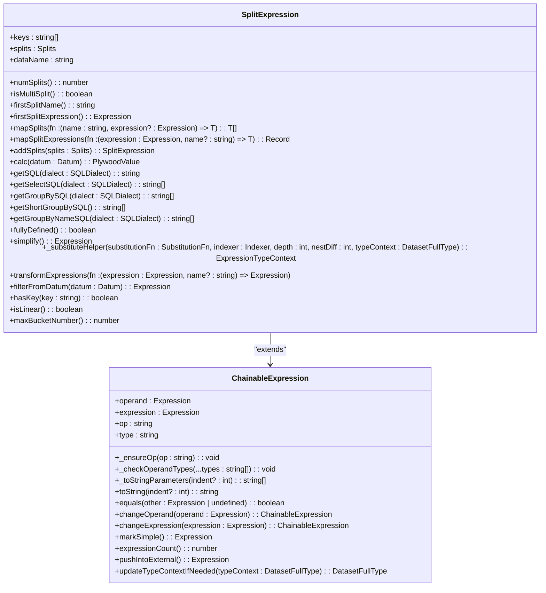
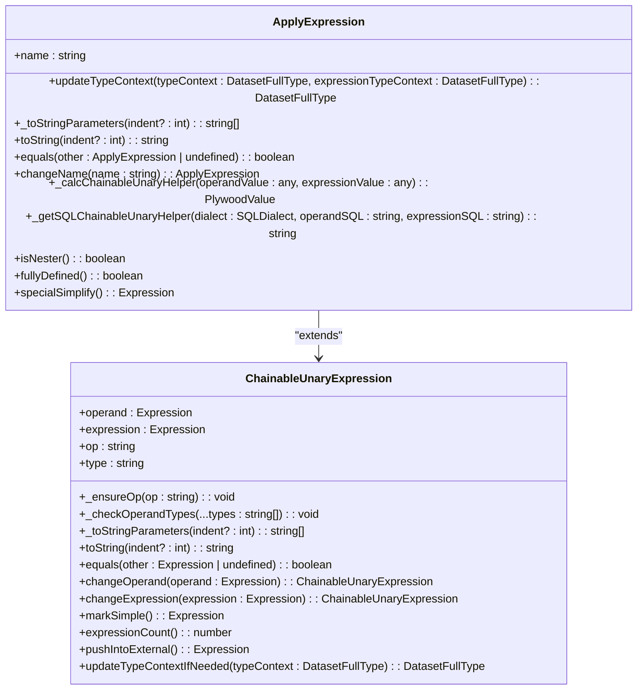
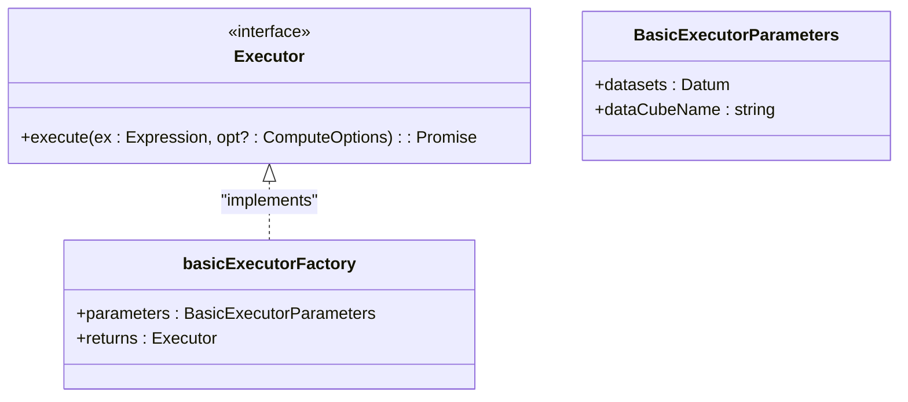
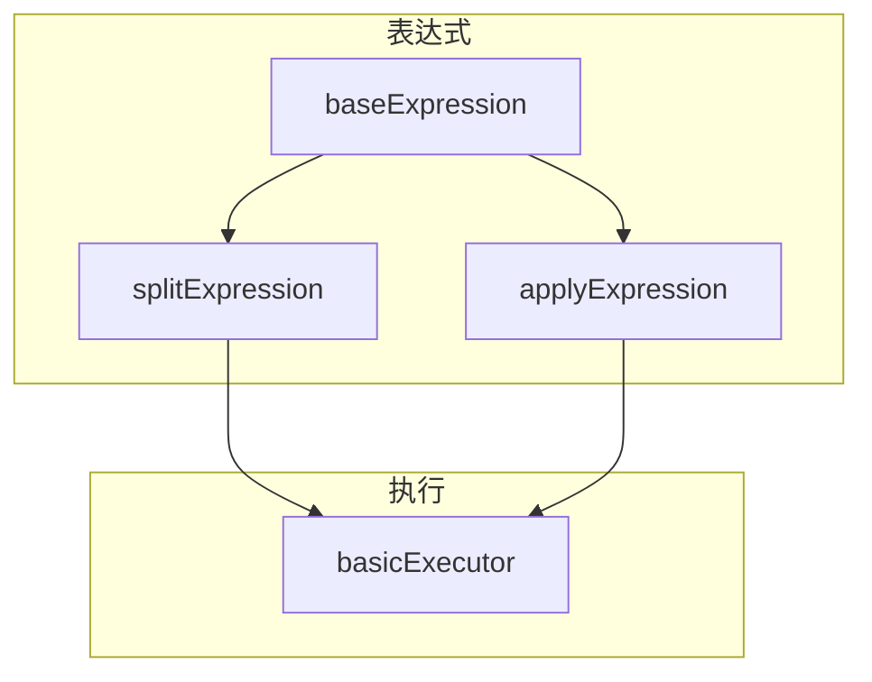

# 高级优化功能

<cite>
**本文档中引用的文件**   
- [splitExpression.ts](file://src/expressions/splitExpression.ts)
- [applyExpression.ts](file://src/expressions/applyExpression.ts)
- [basicExecutor.ts](file://src/executor/basicExecutor.ts)
- [simulateDruid.mocha.js](file://test/simulate/simulateDruid.mocha.js)
- [druidFunctional.mocha.js](file://test/functional/druidFunctional.mocha.js)
</cite>

## 目录
1. [简介](#简介)
2. [项目结构](#项目结构)
3. [核心组件](#核心组件)
4. [架构概述](#架构概述)
5. [详细组件分析](#详细组件分析)
6. [依赖分析](#依赖分析)
7. [性能考虑](#性能考虑)
8. [故障排除指南](#故障排除指南)
9. [结论](#结论)

## 简介
Plywood 是一个强大的数据分析库，提供高级查询优化功能，旨在通过减少数据库往返次数来提高复杂报表的性能。本文档重点介绍 subtotalsSpec 系统如何将多个相关查询合并为单个高效查询，以及 subtotalsSpecQueryBuilder、Executor 和 ResultProcessor 的协作机制。此外，还将详细阐述 split 和 apply 表达式在数据分组和转换中的核心作用，以及它们如何支持层次化聚合。

## 项目结构
Plywood 项目的目录结构清晰地组织了各个模块，便于维护和扩展。主要模块包括 datatypes、dialect、executor、expressions、external、helper 和 tests。

**Diagram sources**
- [src/expressions/splitExpression.ts](file://src/expressions/splitExpression.ts#L1-L297)
- [src/expressions/applyExpression.ts](file://src/expressions/applyExpression.ts#L1-L154)

**Section sources**
- [src/expressions/splitExpression.ts](file://src/expressions/splitExpression.ts#L1-L297)
- [src/expressions/applyExpression.ts](file://src/expressions/applyExpression.ts#L1-L154)

## 核心组件
Plywood 的核心组件包括 splitExpression、applyExpression 和 basicExecutor。这些组件共同实现了高级查询优化功能。

**Section sources**
- [src/expressions/splitExpression.ts](file://src/expressions/splitExpression.ts#L1-L297)
- [src/expressions/applyExpression.ts](file://src/expressions/applyExpression.ts#L1-L154)
- [src/executor/basicExecutor.ts](file://src/executor/basicExecutor.ts#L1-L44)

## 架构概述
Plywood 的架构设计旨在最大化查询性能和灵活性。核心组件通过紧密协作，实现了高效的查询优化。

**Diagram sources**
- [src/expressions/splitExpression.ts](file://src/expressions/splitExpression.ts#L1-L297)
- [src/expressions/applyExpression.ts](file://src/expressions/applyExpression.ts#L1-L154)
- [src/executor/basicExecutor.ts](file://src/executor/basicExecutor.ts#L1-L44)

## 详细组件分析
### splitExpression 分析
splitExpression 组件负责将数据集按指定维度进行分割。它支持多维度分割，并能生成相应的 SQL 查询语句。

#### 类图

**Diagram sources**
- [src/expressions/splitExpression.ts](file://src/expressions/splitExpression.ts#L1-L297)

**Section sources**
- [src/expressions/splitExpression.ts](file://src/expressions/splitExpression.ts#L1-L297)

### applyExpression 分析
applyExpression 组件用于在数据集上应用新的计算列。它可以处理聚合表达式和非聚合表达式，并支持嵌套操作。

#### 类图

**Diagram sources**
- [src/expressions/applyExpression.ts](file://src/expressions/applyExpression.ts#L1-L154)

**Section sources**
- [src/expressions/applyExpression.ts](file://src/expressions/applyExpression.ts#L1-L154)

### basicExecutor 分析
basicExecutor 组件负责执行查询并返回结果。它通过工厂函数创建，支持自定义选项。

#### 类图

**Diagram sources**
- [src/executor/basicExecutor.ts](file://src/executor/basicExecutor.ts#L1-L44)

**Section sources**
- [src/executor/basicExecutor.ts](file://src/executor/basicExecutor.ts#L1-L44)

## 依赖分析
Plywood 的各个组件之间存在紧密的依赖关系。splitExpression 和 applyExpression 依赖于基本的表达式类，而 basicExecutor 依赖于这些表达式组件来执行查询。

**Diagram sources**
- [src/expressions/splitExpression.ts](file://src/expressions/splitExpression.ts#L1-L297)
- [src/expressions/applyExpression.ts](file://src/expressions/applyExpression.ts#L1-L154)
- [src/executor/basicExecutor.ts](file://src/executor/basicExecutor.ts#L1-L44)

**Section sources**
- [src/expressions/splitExpression.ts](file://src/expressions/splitExpression.ts#L1-L297)
- [src/expressions/applyExpression.ts](file://src/expressions/applyExpression.ts#L1-L154)
- [src/executor/basicExecutor.ts](file://src/executor/basicExecutor.ts#L1-L44)

## 性能考虑
Plywood 通过将多个相关查询合并为单个高效查询，显著减少了数据库往返次数。这种优化策略特别适用于需要频繁访问相同数据集的复杂报表。

## 故障排除指南
在使用 Plywood 时，可能会遇到一些常见问题。以下是一些故障排除建议：

**Section sources**
- [test/simulate/simulateDruid.mocha.js](file://test/simulate/simulateDruid.mocha.js#L2336-L2388)
- [test/functional/druidFunctional.mocha.js](file://test/functional/druidFunctional.mocha.js#L3683-L3729)

## 结论
Plywood 的高级查询优化功能通过 subtotalsSpec 系统和 split、apply 表达式的协作，实现了高效的查询性能。这些功能不仅减少了数据库往返次数，还提高了复杂报表的响应速度。通过合理利用这些功能，可以显著提升数据分析应用的性能。