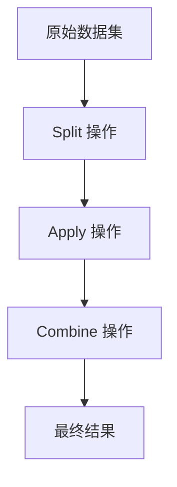
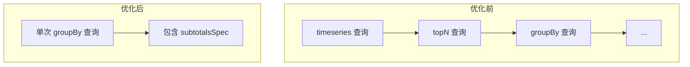

# 项目概述

<cite>
**本文档引用的文件**  
- [README.md](file://README.md)
- [src/expressions/splitExpression.ts](file://src/expressions/splitExpression.ts)
- [src/external/druidExternal.ts](file://src/external/druidExternal.ts)
- [src/dialect/baseDialect.ts](file://src/dialect/baseDialect.ts)
- [docs/features/README_SUBTOTALS.md](file://docs/features/README_SUBTOTALS.md)
</cite>

## 目录
1. [简介](#简介)
2. [核心架构原理](#核心架构原理)
3. [核心功能亮点](#核心功能亮点)
4. [主要用户群体](#主要用户群体)
5. [安装与使用](#安装与使用)
6. [技术愿景](#技术愿景)

## 简介

Plywood 是一个 JavaScript 库，旨在简化大型数据集的交互式可视化应用的构建。它作为数据可视化层与数据存储层之间的中间层，通过强大的表达式语言和高级查询规划能力，为前端开发者、数据工程师和可视化专家提供高效的数据处理解决方案。

Plywood 的核心设计思想是将复杂的多维数据分析任务分解为可管理的组件，通过统一的接口与底层数据存储系统（如 Apache Druid）进行交互。这种架构不仅提高了开发效率，还确保了查询性能的最优化。

**Section sources**
- [README.md](file://README.md#L1-L10)

## 核心架构原理

Plywood 的架构基于嵌套的 **Split-Apply-Combine** 算法，这是一种强大的分治算法，能够用于构建各种类型的数据可视化。该算法的核心思想是将数据集分割（Split）为多个子集，对每个子集应用（Apply）特定的计算操作，最后将结果合并（Combine）为最终的输出。

在 Plywood 中，`SplitExpression` 类是实现这一架构的关键组件。它负责定义如何将数据集按特定维度进行分割，并为每个分割维度生成相应的表达式。该类实现了 `Aggregate` 接口，确保了数据聚合操作的正确性和一致性。



**Diagram sources**
- [src/expressions/splitExpression.ts](file://src/expressions/splitExpression.ts#L35-L292)

**Section sources**
- [src/expressions/splitExpression.ts](file://src/expressions/splitExpression.ts#L35-L292)

## 核心功能亮点

Plywood 提供了多项核心功能，使其成为处理大型数据集的理想选择：

### 强大的表达式语言
Plywood 拥有自己独特的表达式语言，单个 Plywood 表达式可以转换为多个数据库查询。结果以嵌套数据结构返回，便于被 D3.js 等可视化库直接消费。

### 高级查询规划能力
Plywood 作为 Apache Druid 的高级查询规划器，能够确定执行 Druid 查询的最优方式。`DruidExternal` 类实现了与 Druid 的深度集成，提供了查询优化、结果转换和错误处理等关键功能。

### 多数据库方言支持
通过 `SQLDialect` 抽象类，Plywood 支持多种数据库方言，包括 ClickHouse、MySQL 和 PostgreSQL。这使得应用程序可以轻松地在不同数据库系统之间切换，而无需修改核心业务逻辑。

### subtotalsSpec 查询优化
利用 Apache Druid 的 `subtotalsSpec` 特性，Plywood 能够将多次查询合并为一次查询，大幅提升多维度分析的查询性能。根据测试数据，性能提升可达 60-90%。



**Diagram sources**
- [docs/features/README_SUBTOTALS.md](file://docs/features/README_SUBTOTALS.md#L1-L130)

**Section sources**
- [src/external/druidExternal.ts](file://src/external/druidExternal.ts#L136-L2087)
- [src/dialect/baseDialect.ts](file://src/dialect/baseDialect.ts#L1-L174)
- [docs/features/README_SUBTOTALS.md](file://docs/features/README_SUBTOTALS.md#L1-L130)

## 主要用户群体

Plywood 主要服务于以下三类用户：

### 前端开发者
前端开发者可以利用 Plywood 的表达式语言快速构建交互式数据可视化应用，而无需深入了解底层数据库的复杂性。

### 数据工程师
数据工程师可以使用 Plywood 作为数据管道的一部分，实现高效的数据处理和转换，确保数据质量和一致性。

### 可视化专家
可视化专家可以专注于设计和实现复杂的可视化效果，而将数据获取和处理的复杂性交给 Plywood 处理。

**Section sources**
- [README.md](file://README.md#L1-L10)

## 安装与使用

要使用 Plywood，可以通过 npm 安装：

```bash
npm install plywood
```

Plywood 可以在浏览器和 Node.js 环境中使用。对于需要启用 `subtotalsSpec` 优化的场景，可以在查询时添加相应的选项：

```javascript
const result = await expression.compute(context, {
  customOptions: {
    useSubtotalsSpec: true    // 启用 subtotalsSpec 优化
  }
});
```

**Section sources**
- [README.md](file://README.md#L11-L20)

## 技术愿景

Plywood 的技术愿景是成为连接数据可视化与数据存储的桥梁，通过统一的接口和强大的功能，降低构建复杂数据应用的门槛。未来的发展方向包括：

- 进一步优化查询性能，支持更多数据库系统
- 增强表达式语言的功能，支持更复杂的计算操作
- 提供更丰富的开发工具和调试支持
- 加强与其他数据处理框架的集成

通过持续的技术创新和社区支持，Plywood 致力于为开发者提供最高效、最可靠的数据处理解决方案。

**Section sources**
- [README.md](file://README.md#L1-L74)