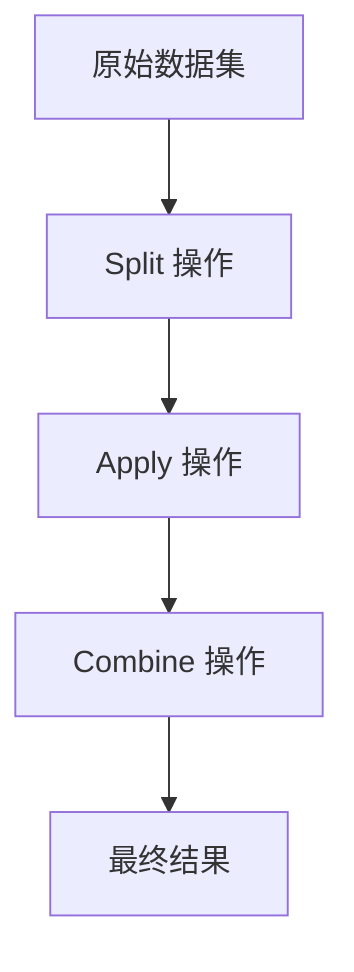

# Plywood 项目架构思想分析

## 1. 表达式系统与函数式编程

Plywood 的核心是其强大的表达式系统，它采用了函数式编程的思想来构建数据查询和转换操作。

### 链式调用与不可变性
Plywood 的表达式系统大量使用链式调用模式，这使得构建复杂的查询变得直观且易于理解：

```javascript
let ex = ply()
  .apply("diamonds", $('diamonds').filter($("color").is('D')))
  .apply('Count', $('diamonds').count())
  .apply('TotalPrice', $('diamonds').sum('$price'))
  .apply(
    'Cuts',
    $("diamonds").split("$cut", 'Cut')
      .apply('diamonds', $('diamonds').filter($('cut').is('$^Cut')))
      .apply('Count', $('diamonds').count())
      .sort('$Count', 'descending')
      .limit(2)
  );
```

每个操作都返回一个新的表达式对象，而不是修改原始对象，这体现了不可变性（Immutability）的设计原则。这种设计模式有以下优势：
- 线程安全：由于对象不可变，避免了并发访问时的数据竞争问题
- 易于调试：每次操作都产生新的对象，便于追踪状态变化
- 函数式组合：可以轻松地组合和复用不同的操作

### Split-Apply-Combine 范式
Plywood 的设计围绕 Split-Apply-Combine（SAC）范式展开，这是一种强大的分治算法：



这种模式的优势在于：
- 模块化：将复杂问题分解为更小、更易管理的部分
- 可组合性：Split、Apply 和 Combine 操作可以灵活组合
- 可优化性：系统可以对整个操作链进行优化，而不仅仅是单个操作

## 2. 抽象与多态设计

Plywood 通过抽象基类和具体实现的组合，实现了良好的扩展性。

### 外部数据源适配器模式
Plywood 使用抽象基类 `External` 来定义统一的外部数据源接口，不同的数据库（如 Druid、MySQL、PostgreSQL）通过继承这个基类来实现具体的功能：

```typescript
export abstract class External {
  // ... 抽象方法和属性定义
}

export class DruidExternal extends External {
  // ... Druid 特定的实现
}

export class MySQLExternal extends SQLExternal {
  // ... MySQL 特定的实现
}
```

这种设计模式的优势：
- 统一接口：所有外部数据源都遵循相同的接口，便于上层代码使用
- 易于扩展：添加新的数据源只需要继承基类并实现相关方法
- 可替换性：可以在运行时切换不同的数据源实现

### 查询方言系统
Plywood 还实现了 SQL 方言系统，不同的数据库使用不同的方言来生成 SQL 查询：

```typescript
export abstract class SQLDialect {
  // ... 抽象方法定义
}

export class MySQLDialect extends SQLDialect {
  // ... MySQL 特定的 SQL 生成逻辑
}

export class PostgresDialect extends SQLDialect {
  // ... PostgreSQL 特定的 SQL 生成逻辑
}
```

这种设计使得 Plywood 能够支持多种数据库，同时保持代码的清晰和可维护性。

## 3. 流式处理与大数据优化

Plywood 在处理大数据集时采用了流式处理机制，这对于前端开发人员来说是一个很好的学习点。

### 值流架构
Plywood 实现了基于 Node.js 流的值流机制，通过 `PlywoodValueBuilder` 和 `iteratorFactory` 来处理大数据集：

```typescript
export function iteratorFactory(value: PlywoodValue): PlywoodValueIterator {
  // ... 实现
}

export class PlywoodValueBuilder {
  public processBit(bit: PlyBit) {
    // ... 处理数据位
  }
  
  public getValue(): PlywoodValue {
    // ... 获取最终值
  }
}
```

这种流式处理的优势：
- 内存效率：避免将整个数据集加载到内存中
- 实时处理：可以边接收数据边处理，提高响应速度
- 背压处理：通过流的背压机制控制数据流动，防止内存溢出

## 4. 类型系统与类型安全

Plywood 实现了一套完整的类型系统，确保了表达式的类型安全：

```typescript
export type PlyType = PlyTypeSimple | 'DATASET';

export interface DatasetFullType {
  type: 'DATASET';
  datasetType: Record<string, FullType>;
  parent?: DatasetFullType;
}
```

这套类型系统的优势：
- 编译时检查：在编译时就能发现类型错误
- IDE 支持：提供更好的代码补全和错误提示
- 自文档化：类型本身就是一种文档，便于理解代码

## 5. 查询优化与执行计划

Plywood 实现了复杂的查询优化机制，特别是针对 Druid 的 `subtotalsSpec` 优化：

```typescript
// 通过 subtotalsSpec 将多次查询合并为一次，显著提升多维度分析性能
// 启用方式：在 compute 调用中设置 customOptions.useSubtotalsSpec = true
```

这种优化机制的优势：
- 性能提升：将多次查询合并为一次，减少网络开销
- 自动优化：系统自动识别可以优化的查询模式
- 可配置：用户可以选择是否启用特定的优化

## 6. 模块化与可测试性

Plywood 的代码结构清晰，模块划分合理，便于维护和测试：

```
src/
├── datatypes/          # 数据类型定义
├── dialect/            # SQL 方言实现
├── executor/           # 执行器
├── expressions/        # 表达式系统
├── external/           # 外部数据源适配器
└── helper/             # 辅助工具
```

这种模块化设计的优势：
- 职责分离：每个模块都有明确的职责
- 易于维护：修改某个功能时只需要关注相关模块
- 可测试性：每个模块都可以独立测试

## 总结

Plywood 项目展示了多种优秀的架构思想和设计模式，包括函数式编程、抽象与多态、流式处理、类型安全、查询优化和模块化设计。这些设计思想不仅提高了代码的质量和可维护性，也为处理复杂的数据查询和分析任务提供了强大的支持。作为前端开发人员，学习这些设计模式可以帮助你构建更加健壮和可扩展的应用程序。