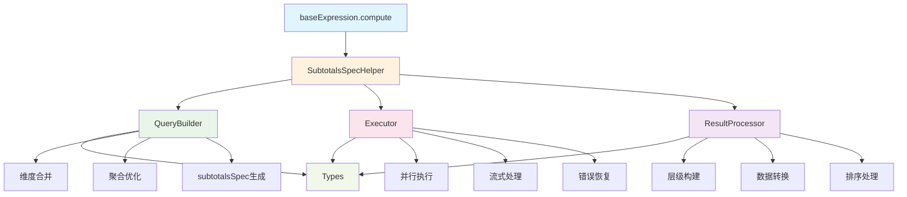
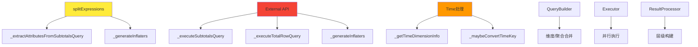
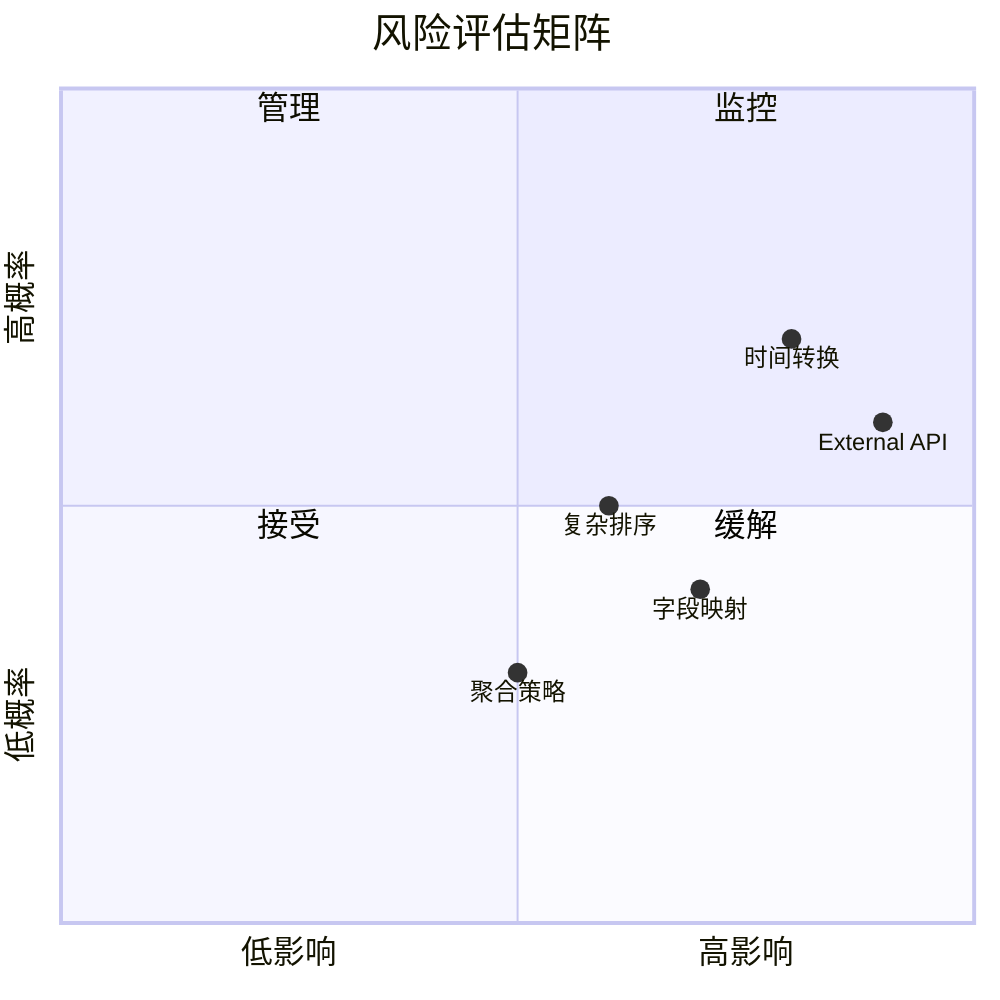

## 执行摘要

### 🎯 重构目标

将散落在 `src/expressions/baseExpression.ts` 中的 subtotalsSpec 逻辑重构为**模块化架构**，在不改变对外 API 与行为的前提下，实现清晰的分层设计。

### ✨ 核心价值

- **降低耦合度**：将大型文件拆分为职责单一的专业模块
- **提高可维护性**：每个模块独立测试，便于问题定位和修复
- **增强可扩展性**：新功能可以在对应模块中快速开发
- **保持稳定性**：所有现有测试必须通过，确保功能不变

### 📋 重构范围

**当前状态**：subtotalsSpec 逻辑全部集中在 `baseExpression.ts` 中（约 1500+ 行代码）

**目标架构**：
```
📁 src/expressions/subtotals/
├── 📄 subtotalsSpecQueryBuilder.ts     # 查询构建
├── 📄 subtotalsSpecExecutor.ts         # 查询执行
├── 📄 subtotalsSpecResultProcessor.ts  # 结果处理
├── 📄 subtotalsSpecTypes.ts            # 类型定义
└── 📄 ../subtotalsSpecHelper.ts        # 编排入口（保留）
```

### 🛡️ 安全策略

- **最小影响原则**：基于薄层包装 + 渐进迁移，维持现有 API 不变
- **分阶段可回滚**：每个阶段可独立编译测试，失败可快速回滚
- **零成本集成**：TypeScript 配置自动包含新文件，无需额外构建脚本


## 📊 Git 提交历史分析

### 📈 代码变更统计

基于提交 `14936d9099397d75c49e800db6dd2eaebb60f08b` 之后的主要变更：

| 提交 | 描述 | 代码变更 | 关键方法 |
|------|------|----------|----------|
| f6dc1add | feat: subtotalsSpec - JSON合并 | +265 −1 | `_computeWithSubtotalsSpec`, `_mergeQueriesWithSubtotalsSpec` |
| d1ed374f | feat: limitSpec.limit = 10000 | +5 −3 | limitSpec 统一设置 |
| 352c4fc | feat: 查询执行优化 | +49 −18 | `_executeSubtotalsQuery` 流式执行 |
| a19f73f | feat: 合并result为dataset | +344 −10 | `_buildHierarchicalDataset`, 结果处理 |
| 6e708ac | feat: __time格式化问题 | +92 −12 | `_getTimeDimensionInfo`, 时间转换 |
| d9e8b79 | feat: measure 排序 | +76 −0 | `_applySortingToSplitData` |
| ada1986 | fix: 支持split 排序 | +68 −8 | `_extractSplitExpressionsFromAlterations` |
| 122cf3e | fix: 创建两个独立表达式副本 | +327 −59 | 表达式状态管理优化 |
| 9a8a59b | fix: 拆分为两个请求 | +282 −101 | `_extractTimeseriesQuery`, 并行执行 |
| f2076a7 | fix: 解决/D数据为0的问题 | +153 −71 | 聚合选择，维度合并优化 |

### 🔍 关键里程碑

1. **基础架构** (f6dc1add) - 引入 subtotalsSpec 核心框架
2. **执行优化** (352c4fc) - 切换到流式执行模式
3. **数据处理** (a19f73f) - 实现层级 Dataset 构建
4. **时间处理** (6e708ac) - 解决 __time 格式化问题
5. **性能优化** (9a8a59b, f2076a7) - 实现并行查询和聚合优化


## 🏗️ 当前代码架构分析

### 📍 现状概览

**问题**：`baseExpression.ts` 承载了 subtotalsSpec 的**完整实现**，导致单个文件过于庞大（1500+ 行）。

**当前流程**：
```mermaid
flowchart TD
    A[compute()] --> B{useSubtotalsSpec?}
    B -->|Yes| C[_computeWithSubtotalsSpec]
    B -->|No| D[常规计算流程]

    C --> E[_mergeQueriesWithSubtotalsSpec]
    C --> F[_extractTimeseriesQuery]

    E --> G[_executeQueriesInParallel]
    F --> G

    G --> H[_executeSubtotalsQuery]
    G --> I[_executeTotalRowQuery]

    H --> J[_mergeTotalRowIntoSubtotalsResult]
    I --> J

    J --> K[_buildHierarchicalDataset]
    K --> L[_applySortingToSplitData]

    style A fill:#e1f5fe
    style C fill:#fff3e0
    style K fill:#e8f5e8
```

### 🎭 角色分工

| 组件 | 当前职责 | 存在问题 |
|------|----------|----------|
| **baseExpression.ts** | 🎯 全部实现 | 代码集中，难以维护 |
| **subtotalsSpecHelper.ts** | 📋 简单编排 | 仅作为调用代理，未真正解耦 |

### 🔄 调用链路

```typescript
// 入口点
compute()
  └─ useSubtotalsSpec
     └─ _computeWithSubtotalsSpec()
        ├─ 查询构建阶段
        │  ├─ _mergeQueriesWithSubtotalsSpec()
        │  └─ _extractTimeseriesQuery()
        ├─ 并行执行阶段
        │  ├─ _executeSubtotalsQuery()
        │  └─ _executeTotalRowQuery()
        └─ 结果处理阶段
           ├─ _mergeTotalRowIntoSubtotalsResult()
           ├─ _buildHierarchicalDataset()
           └─ _applySortingToSplitData()
```


## 🎯 目标架构设计

### 📁 模块化结构

```
📦 src/expressions/subtotals/
├── 🏗️ subtotalsSpecQueryBuilder.ts     # 查询构建专家
├── ⚡ subtotalsSpecExecutor.ts         # 查询执行引擎
├── 🎨 subtotalsSpecResultProcessor.ts  # 结果处理工厂
├── 📝 subtotalsSpecTypes.ts            # 类型定义中心
└── 🎼 ../subtotalsSpecHelper.ts        # 指挥家（编排入口）
```

### 🎭 模块职责分工

| 模块 | 主要职责 | 核心功能 | 优先级 |
|------|----------|----------|--------|
| **QueryBuilder** | 🔧 查询构建 | 维度合并、聚合优化、subtotalsSpec 生成 | 🔥 高 |
| **Executor** | ⚡ 查询执行 | 并行请求、流式处理、错误处理 | 🔥 高 |
| **ResultProcessor** | 🎨 结果处理 | 层级构建、数据转换、排序优化 | 🔥 高 |
| **Types** | 📝 类型定义 | 接口声明、常量定义、工具类型 | 🟡 中 |
| **Helper** | 🎼 编排指挥 | 流程协调、模块调用、状态管理 | 🟢 保留 |

### 🏛️ 架构蓝图



### 🔄 数据流向

```typescript
// 目标调用链
compute()
  └─ SubtotalsSpecHelper.computeWithSubtotalsSpec()
     ├─ QueryBuilder.buildMergedQuery()     // 查询构建
     ├─ Executor.executeQueries()           // 并行执行
     └─ ResultProcessor.buildDataset()      // 结果处理
```


## 📋 方法迁移规划

### 🔥 第一批：核心迁移（高优先）

| 原方法 | 目标模块 | 主要功能 | 风险等级 | 关键依赖 |
|--------|----------|----------|----------|----------|
| `_mergeQueriesWithSubtotalsSpec` | QueryBuilder | 查询合并与优化 | 🟡 中等 | 维度提取、virtualColumns |
| `_extractTimeseriesQuery` | QueryBuilder | 总计查询生成 | 🟡 中等 | 聚合选择逻辑 |
| `_executeSubtotalsQuery` | Executor | 子查询执行 | 🔴 高 | External 流式处理 |
| `_executeTotalRowQuery` | Executor | 总计行执行 | 🔴 高 | 并行控制机制 |
| `_executeQueriesInParallel` | Executor | 并行执行协调 | 🔴 高 | 错误处理、资源管理 |
| `_generateInflaters` | Executor | 数据膨胀器生成 | 🟡 中等 | 字段映射一致性 |

### 🟡 第二批：支持迁移（中优先）

| 原方法 | 目标模块 | 主要功能 | 风险等级 | 关键依赖 |
|--------|----------|----------|----------|----------|
| `_extractAttributesFromSubtotalsQuery` | ResultProcessor | 属性推导 | 🟡 中等 | splitExpressions |
| `_mergeTotalRowIntoSubtotalsResult` | ResultProcessor | 结果合并 | 🟡 中等 | 去重逻辑 |
| `_applySortingToSplitData` | ResultProcessor | 数据排序 | 🟢 低 | 复杂对象比较 |

### 🟢 第三批：工具迁移（低优先）

| 原方法 | 目标模块 | 主要功能 | 风险等级 | 备注 |
|--------|----------|----------|----------|------|
| `_stripDummyPrefix` | ResultProcessor | 前缀清理 | 🟢 低 | 字段名处理 |
| `_resolveActualKeyName` | ResultProcessor | 键名解析 | 🟢 低 | 映射关系 |
| `_getTimeDimensionInfo` | ResultProcessor | 时间维度信息 | 🟡 中等 | 时区处理 |
| `_maybeConvertTimeKey` | ResultProcessor | 时间键转换 | 🟡 中等 | 格式转换 |
| `_buildHierarchicalDataset` | ResultProcessor | 层级数据集构建 | 🟡 中等 | 树结构 |
| `_buildSimpleSplit` | ResultProcessor | 简单分割构建 | 🟢 低 | 数据分组 |
| `_extractDimensionName` | QueryBuilder | 维度名提取 | 🟢 低 | 工具函数 |
| `_extractDimensionOutputName` | QueryBuilder | 维度输出名提取 | 🟢 低 | 工具函数 |
| `_findDruidExternal` | Executor | Druid 外部查找 | 🟢 低 | 可保留在 base |

### ⚠️ 关键风险点

1. **🔴 高风险**：External API 调用链、流式处理错误恢复
2. **🟡 中风险**：时间格式转换、复杂对象排序、字段映射一致性
3. **🟢 低风险**：工具函数迁移、数据清理操作

### 🧩 依赖关系图




## 🚀 分阶段实施计划

### 📋 阶段概览

**重构时间轴**：

```
准备阶段：
├── 阶段 0: 基线确认          (0.5天) ✅

实施阶段：
├── 阶段 1: 模块骨架搭建       (0.5天) ✅
├── 阶段 2: QueryBuilder 迁移  (1.0天) ✅
├── 阶段 3: Executor 迁移      (1.5天) ✅
└── 阶段 4: ResultProcessor 迁移 (1.5天) ✅

收尾阶段：
└── 阶段 5: 清理优化          (0.5天) ✅

总计：~5.5 天
```

### 🔍 阶段 0：基线确认（0.5 天）

**目标**：建立稳定的测试基准

**操作清单**：
- [ ] 运行 `npm run compile` 确保编译通过
- [ ] 执行 `npm run full-test` 获取完整测试报告
- [ ] 记录关键测试执行时间
- [ ] 保存当前日志用于后续对比

**验收标准**：
- ✅ 编译零错误
- ✅ 所有测试通过
- ✅ 性能基准记录完成

**回滚方案**：无需回滚（基线状态）

---

### 🏗️ 阶段 1：模块骨架搭建（0.5 天）

**目标**：建立新模块的基本框架

**操作清单**：
- [ ] 创建 `src/expressions/subtotals/` 目录
- [ ] 创建四个核心模块文件（空实现）
- [ ] 定义基础接口和类型
- [ ] 保持现有调用链不变

**文件结构**：
```typescript
// subtotalsSpecQueryBuilder.ts
export class SubtotalsSpecQueryBuilder {
  // TODO: 实现查询构建逻辑
}

// subtotalsSpecExecutor.ts
export class SubtotalsSpecExecutor {
  // TODO: 实现查询执行逻辑
}

// subtotalsSpecResultProcessor.ts
export class SubtotalsSpecResultProcessor {
  // TODO: 实现结果处理逻辑
}

// subtotalsSpecTypes.ts
export interface SubtotalsQueryPlan {
  // TODO: 定义查询计划类型
}
```

**验收标准**：
- ✅ 编译通过
- ✅ 所有现有测试通过
- ✅ 新模块可正常导入

**回滚方案**：删除新增文件和目录

---

### 🔧 阶段 2：QueryBuilder 迁移（1.0 天）

**目标**：迁移查询构建相关逻辑

**核心迁移**：
- `_mergeQueriesWithSubtotalsSpec` → `QueryBuilder.buildMergedQuery`
- `_extractTimeseriesQuery` → `QueryBuilder.buildTimeseriesQuery`
- `_extractDimensionName` → `QueryBuilder.extractDimensionName`

**操作清单**：
- [ ] 实现 QueryBuilder 核心方法
- [ ] 在 baseExpression 中添加委托调用
- [ ] 运行重点测试验证
- [ ] 性能对比测试

**重点测试**：
```bash
# 核心功能测试
mocha test/subtotals/test_subtotals_optimization.js
mocha test/subtotals/test_split_attributes_issue.js

# 回归测试
mocha test/overall/subtotals_e2e_timeRange.mocha.js
```

**验收标准**：
- ✅ 核心测试通过
- ✅ 查询构建逻辑正确
- ✅ 性能无显著下降

**回滚方案**：恢复 baseExpression 中的原有实现

---

### ⚡ 阶段 3：Executor 迁移（1.5 天）

**目标**：迁移查询执行相关逻辑

**核心迁移**：
- `_executeSubtotalsQuery` → `Executor.executeSubtotalsQuery`
- `_executeTotalRowQuery` → `Executor.executeTotalRowQuery`
- `_executeQueriesInParallel` → `Executor.executeQueriesInParallel`
- `_generateInflaters` → `Executor.generateInflaters`

**操作清单**：
- [x] 实现 Executor 执行引擎
- [x] 处理 External API 调用
- [x] 实现并行执行逻辑
- [x] 添加错误处理机制

**重点测试**：
```bash
# 端到端测试
mocha test/overall/subtotals_e2e_timeRange.mocha.js
mocha test/overall/timeRange_inflater_subtotals.mocha.js

# 执行器专项测试
mocha test/subtotals/test_execution_flow.js
```

**验收标准**：
- ✅ E2E 测试通过
- ✅ 并行执行正常工作
- ✅ 错误处理机制有效

**回滚方案**：恢复原有执行逻辑

---

### 🎨 阶段 4：ResultProcessor 迁移（1.5 天）

**目标**：迁移结果处理相关逻辑

**核心迁移**：
- `_buildHierarchicalDataset` → `ResultProcessor.buildHierarchicalDataset`
- `_applySortingToSplitData` → `ResultProcessor.applySorting`
- 时间处理相关方法
- 数据清理和转换方法

**操作清单**：
- [x] 实现层级数据构建逻辑
- [x] 处理时间格式转换
- [x] 实现数据排序机制
- [x] 优化内存使用

**重点测试**：
```bash
# 结果处理测试
mocha test/subtotals/test_hierarchical_dataset.js
mocha test/subtotals/test_time_conversion.js
mocha test/subtotals/test_data_sorting.js
```

**验收标准**：
- ✅ 层级结构正确
- ✅ 时间转换准确
- ✅ 排序逻辑正常

**回滚方案**：恢复原有结果处理逻辑

---

### 🧹 阶段 5：清理优化（0.5 天）

**目标**：清理冗余代码，优化架构

**操作清单**：
- [x] 删除 baseExpression 中已迁移的方法
- [x] 优化模块间依赖关系
- [x] 更新导入导出语句
- [x] 完善 TypeScript 类型定义
- [x] 性能最终对比

**已完成变更摘要**：
- 移除 baseExpression.ts 中以下已迁移且未再引用的方法：`_stripDummyPrefix`、`_resolveActualKeyName`、`_extractAttributesFromSubtotalsQuery`、`_getTimeDimensionInfo`、`_maybeConvertTimeKey`、`_buildHierarchicalDataset`、`_buildSimpleSplit`、`_applySortingToSplitData`、`_buildTopLevelAttributes`、`_buildSplitAttributes`、`_generateInflaters`
- 保留供外部调用的方法：`_computeWithSubtotalsSpec`、`_findDruidExternal`、`_extractSplitExpressionsFromExternals`


**验收标准**：
- ✅ 代码结构清晰
- ✅ 所有测试通过
- ✅ 性能保持或提升
- ✅ 文档更新完成

**回滚方案**：Git revert 当前阶段提交

### 🛡️ 安全保障机制

**Feature Flag 机制**：
```typescript
// 在 SubtotalsSpecHelper 中保留开关
const USE_NEW_MODULES = process.env.USE_SUBTOTALS_MODULES === 'true';

if (USE_NEW_MODULES) {
  return NewModule.execute();
} else {
  return host._oldMethod();
}
```

**快速回滚流程**：
1. 设置 `USE_SUBTOTALS_MODULES=false`
2. 重新编译测试
3. 如问题仍未解决，则 Git revert

### 📊 进度跟踪

| 阶段 | 状态 | 预计时间 | 实际时间 | 备注 |
|------|------|----------|----------|------|
| 0: 基线确认 | ✅ | 0.5天 | - | 已完成（记录：关键 e2e 通过；全量存在历史已知 16 例失败） |
| 1: 模块骨架 | ✅ | 0.5天 | - | 新模块创建 + rrollup 集成完成 |
| 2: QueryBuilder | ✅ | 1.0天 | - | 提取 _extractTimeseriesQuery/_mergeQueriesWithSubtotalsSpec 并通过 e2e |
| 3: Executor | ✅ | 1.5天 | - | 已完成（executeQueriesInParallel/executeSubtotalsQuery/executeTotalRowQuery + inflaters 迁移；关键 e2e 通过） |
| 4: ResultProcessor | ✅ | 1.5天 | - | 已完成（extractAttributes/mergeTotalRow/buildHierarchicalDataset/applySorting 迁移并接入；关键 e2e 通过） |
| 5: 清理优化 | ⏳ | 0.5天 | - | 待开始 |

**总计**：~5.5 天（含缓冲时间）


## 🧪 测试策略与验证

### 📊 现有测试覆盖

| 测试类型 | 测试文件 | 覆盖功能 | 重要程度 |
|----------|----------|----------|----------|
| **E2E 测试** | `test/overall/subtotals_e2e_timeRange.mocha.js` | 时间桶 + 层级结构 | 🔥 关键 |
| **转换测试** | `test/overall/timeRange_inflater_subtotals.mocha.js` | inflater 与 TimeRange | 🔥 关键 |
| **优化测试** | `test/subtotals/test_subtotals_optimization.js` | subtotalsSpec 优化 | 🔥 关键 |
| **属性测试** | `test/subtotals/test_split_attributes_issue.js` | 属性提取问题 | 🟡 重要 |
| **其他** | `test/subtotals/*` | 维度去重、真实数据等 | 🟢 一般 |

### 🎯 测试执行策略

**快速验证**（开发阶段）：
```bash
# 核心功能快速检查
mocha test/overall/subtotals_e2e_timeRange.mocha.js

# 编译检查
npm run compile
```

**完整验证**（阶段完成）：
```bash
# 全量测试套件
npm run full-test

# 或者分步骤执行
npm run compile && npm test
```

**专项测试**（问题排查）：
```bash
# 特定模块测试
mocha test/subtotals/*.js
mocha test/overall/*subtotals*.js
```

### 🆕 建议新增单元测试

#### QueryBuilder 模块测试
```typescript
describe('SubtotalsSpecQueryBuilder', () => {
  it('应该正确合并查询维度', () => {
    // 测试维度去重逻辑
  });

  it('应该保持 outputName 顺序', () => {
    // 测试输出名顺序
  });

  it('应该正确处理 virtualColumns 合并', () => {
    // 测试虚拟列合并
  });
});
```

#### Executor 模块测试
```typescript
describe('SubtotalsSpecExecutor', () => {
  it('应该生成一致的 inflaters', () => {
    // 测试字段映射一致性
  });

  it('应该正确处理并行执行', () => {
    // 测试并发查询
  });
});
```

#### ResultProcessor 模块测试
```typescript
describe('SubtotalsSpecResultProcessor', () => {
  it('应该正确构建层级结构', () => {
    // 测试多层 SPLIT
  });

  it('应该正确转换时间格式', () => {
    // 测试 __time 转换
  });
});
```

### 📈 性能基准测试

**测试指标**：
- 查询执行时间
- 内存使用情况
- 并发处理能力
- 错误恢复时间

**基准对比**：
```bash
# 重构前基准
npm run benchmark > baseline_performance.log

# 重构后对比
npm run benchmark > new_performance.log

# 差异分析
diff baseline_performance.log new_performance.log
```


## ⚠️ 风险评估与缓解策略

### 🔴 高风险点

| 风险项 | 风险描述 | 影响 | 缓解策略 |
|--------|----------|------|----------|
| **时间转换复杂性** | `__time -> TimeRange` 涉及 period/timeZone 解析 | 数据准确性 | 增加数据驱动测试，覆盖各种时区场景 |
| **External API 依赖** | 流式处理和错误恢复机制复杂 | 系统稳定性 | 保留原有调用链，逐步迁移 |
| **复杂对象排序** | TimeRange/NumberRange/Date 的稳定比较 | 结果一致性 | 实现专用比较器，充分测试 |
| **字段映射一致性** | inflaters 与查询字段的 '***' 前缀处理 | 数据完整性 | 严格校验字段映射关系 |

### 🟡 中等风险点

| 风险项 | 风险描述 | 影响 | 缓解策略 |
|--------|----------|------|----------|
| **聚合合并策略** | `__VALUE__` 规避和具名度量优先级 | 查询性能 | 详细测试不同聚合场景 |
| **TypeScript 版本兼容** | TS 3.5.3 限制新语法使用 | 开发效率 | 严格遵循现有语法规范 |
| **并行执行复杂性** | 多查询协调和资源管理 | 系统资源 | 实现资源限制和超时机制 |

### 🛡️ 通用缓解策略

#### 1. 渐进式迁移
```typescript
// 保留原有实现作为备选
if (process.env.USE_LEGACY_SUBTOTALS === 'true') {
  return this._legacyImplementation();
} else {
  return this._newImplementation();
}
```

#### 2. 充分测试覆盖
- 每个方法迁移后立即运行对应测试
- 重点测试边界条件和异常情况
- 性能回归测试确保无显著下降

#### 3. 严格的代码审查
- 保持函数签名不变
- 详细记录迁移决策和权衡
- 代码注释解释复杂逻辑

#### 4. 监控和日志
```typescript
// 添加详细的执行日志
logger.debug('SubtotalsSpec execution started', {
  stage: 'query_building',
  queryPlan: simplifiedQueryPlan
});
```

### 🚨 应急预案

**快速回滚流程**：
1. **环境变量回滚**：设置 `USE_SUBTOTALS_MODULES=false`
2. **代码回滚**：Git revert 特定提交
3. **数据验证**：运行核心测试确保数据正确性

**问题排查清单**：
- [ ] 检查 TypeScript 编译错误
- [ ] 验证测试失败原因
- [ ] 对比重构前后输出结果
- [ ] 分析性能差异原因

### 📊 风险矩阵




## ⏱️ 工作量与时间估算

### 📅 详细时间分解

| 阶段 | 主要任务 | 预估时间 | 风险系数 | 调整后时间 |
|------|----------|----------|----------|------------|
| **阶段 0** | 环境确认、基线测试 | 0.5天 | 1.0 | 0.5天 |
| **阶段 1** | 模块骨架、接口定义 | 0.5天 | 1.2 | 0.6天 |
| **阶段 2** | QueryBuilder 迁移 + 测试 | 1.0天 | 1.3 | 1.3天 |
| **阶段 3** | Executor 迁移 + 测试 | 1.5天 | 1.4 | 2.1天 |
| **阶段 4** | ResultProcessor 迁移 + 测试 | 1.5天 | 1.4 | 2.1天 |
| **阶段 5** | 代码清理、文档更新 | 0.5天 | 1.2 | 0.6天 |

### 📊 时间分布图

```
📊 工作量分布
┌─────────────────────────────────────────┐
│ Executor 迁移       ████████████████ 32% │
│ ResultProcessor 迁移 ████████████████ 32% │
│ QueryBuilder 迁移   ██████████     20% │
│ 阶段 1: 模块骨架     ████           9%  │
│ 阶段 0: 基线确认     ████           9%  │
│ 阶段 5: 清理优化     ███            5%  │
└─────────────────────────────────────────┘
```

### ⏰ 总体估算

**保守估计**：7.2 天
**乐观估计**：5.5 天
**推荐预留**：8 天（包含 20% 缓冲时间）

### 👥 人力资源配置

**推荐配置**：
- **主开发者**：1 人，负责核心模块迁移
- **测试支持**：0.5 人，负责测试用例编写和验证
- **代码审查**：0.3 人，负责架构审查和质量把控

### 🎯 关键里程碑

- **第 1 天**：完成阶段 0-1，基础框架就绪
- **第 3 天**：完成阶段 2，查询构建模块可用
- **第 6 天**：完成阶段 3，执行引擎迁移完成
- **第 8 天**：完成阶段 4-5，整体重构完成

### 📈 并行工作机会

为了缩短总时间，可以考虑以下并行工作：

1. **测试用例准备**（与阶段 1 并行）
2. **文档更新**（与各阶段并行进行）
3. **性能测试脚本**（与阶段 2 并行）


## 📚 附录

### 🔍 关键代码摘录

#### 当前入口点（baseExpression.ts）
```typescript
// compute() 方法中的 subtotalsSpec 切换逻辑
if (customOptions && customOptions.useSubtotalsSpec) {
  return readyExpression1._computeWithSubtotalsSpec(
    introspectedContext,
    options,
    readyExpression2
  );
}
```

#### 编排入口（subtotalsSpecHelper.ts）
```typescript
export class SubtotalsSpecHelper {
  public static computeWithSubtotalsSpec(host: any, context: Datum, options: any, expr2: any) {
    const queryPlan = (expr2 as any).simulateQueryPlan(context, options);
    const merged = (host as any)._mergeQueriesWithSubtotalsSpec(queryPlan);
    return (host as any)._executeQueriesInParallel(null, merged, context, options, new Map());
  }
}
```

### 🛠️ 构建与集成

#### 自动编译配置
```json
// tsconfig.json 已包含
{
  "include": ["src/**/*.ts"],
  // 新增的 subtotals/ 目录会自动参与编译
}
```

#### 构建脚本
```bash
# 完整编译（包含 PEG.js + TypeScript）
./compile

# 仅编译 TypeScript
./compile-tsc

# 仅编译 PEG.js
./compile-pegjs
```

#### rrollup 集成变更（已完成）
在 concat 列表中加入新模块，确保打包到 build/plywood.js：

<augment_code_snippet path="rrollup" mode="EXCERPT">
````bash
# Full Plywood
  build/expressions/subtotalsSpecHelper.js \
  build/expressions/subtotals/subtotalsSpecTypes.js \
  build/expressions/subtotals/subtotalsSpecQueryBuilder.js \
  build/expressions/subtotals/subtotalsSpecExecutor.js \
  build/expressions/subtotals/subtotalsSpecResultProcessor.js \
  build/expressions/baseExpression.js \
````
</augment_code_snippet>

并在 Lite 版本同样加入上述 4 个模块，以保持一致性。


### ⚡ 快速验证命令

#### 开发阶段快速检查
```bash
# 核心功能验证
npm run compile
mocha test/overall/subtotals_e2e_timeRange.mocha.js

# 编译检查
npm run pretest
```

#### 完整回归测试
```bash
# 标准测试套件
npm test

# 完整测试套件
npm run full-test
```

#### 性能监控
```bash
# 编译时间监控
time npm run compile

# 测试执行时间监控
time npm test
```

### 📋 检查清单模板

#### 阶段完成检查
```markdown
- [ ] 编译无错误无警告
- [ ] 核心测试通过
- [ ] 性能无显著下降
- [ ] 代码审查完成
- [ ] 文档更新完成
- [ ] 回滚方案验证
```

#### 发布前检查
```markdown
- [ ] 所有测试通过
- [ ] 性能基准对比
- [ ] 代码覆盖率检查
- [ ] 文档完整性验证
- [ ] 向后兼容性确认
```

### 🔄 迁移决策记录

#### 重要技术决策
1. **模块化策略**：选择功能导向的模块划分，而非层次划分
2. **迁移顺序**：先迁移核心执行逻辑，后迁移辅助工具方法
3. **兼容性保证**：保持 API 接口不变，内部实现逐步替换

#### 权衡考虑
- **复杂度 vs 可维护性**：增加少量复杂度换取显著的可维护性提升
- **性能 vs 清晰度**：在保证性能的前提下，优先考虑代码清晰度
- **进度 vs 质量**：每个阶段都确保充分测试，不牺牲质量换取进度

### 📞 支持与联系

**技术支持**：
- 代码审查：@core-team
- 测试支持：@qa-team
- 架构咨询：@architect-team

**紧急联系**：
如遇到阻塞性问题，请立即联系项目维护者。

---

**文档版本**：v2.0
**最后更新**：2024年
**文档维护**：项目团队


